<h1 class="title">通用 Service 集群部署框架设计</h1>

<p class="subtitle">v0_20 · 20260826</p>

<style>
body {
  font-family: "Microsoft YaHei";
  font-size: 16px;
  line-height: 1.75;
  color: #24292f;
}
.title {
  font-family: "Microsoft YaHei";
  font-size: 32px;
  line-height: 1.30;
  font-weight: 700;
  text-align: center;
}
.subtitle {
  font-family: "Microsoft YaHei";
  font-size: 18px;
  line-height: 1.50;
  font-weight: 400;
  text-align: center;
}
h1 {
  font-family: "Microsoft YaHei";
  font-size: 28px;
  line-height: 1.40;
  font-weight: 700;
}
h2 {
  font-family: "Microsoft YaHei";
  font-size: 22px;
  line-height: 1.40;
  font-weight: 700;
}
h3 {
  font-family: "Microsoft YaHei";
  font-size: 18px;
  line-height: 1.50;
  font-weight: 700;
}
h4 {
  font-family: "Microsoft YaHei";
  font-size: 16px;
  line-height: 1.50;
  font-weight: 700;
}
p, li {
  font-family: "Microsoft YaHei";
  font-size: 16px;
  line-height: 1.75;
}
.figure-caption,
.formula-caption {
  font-family: "Microsoft YaHei";
  font-size: 14px;
  line-height: 1.50;
  font-weight: 600;
  text-align: center;
  margin: 0.65em 0 0.35em 0;
}
.table-caption {
  font-family: "Microsoft YaHei";
  font-size: 13px;
  line-height: 1.40;
  font-weight: 500;
  text-align: center;
  margin: 0.65em 0 0.35em 0;
}
.mermaid,
.mermaid text,
.mermaid .label {
  font-family: "Microsoft YaHei" !important;
  font-size: 14px !important;
  line-height: 1.20;
}
table {
  width: 100%;
  border-collapse: collapse;
  font-family: "Microsoft YaHei";
  font-size: 13px;
  line-height: 1.45;
}
table th,
table th p,
table th li {
  font-family: "Microsoft YaHei";
  font-size: 13px;
  line-height: 1.40;
  font-weight: 600;
}
table td,
table td p,
table td li {
  font-family: "Microsoft YaHei";
  font-size: 13px;
  line-height: 1.45;
  font-weight: 400;
}
table th,
table td {
  padding: 0.40em 0.60em;
  vertical-align: top;
}
code, pre {
  font-family: "Cascadia Code";
  font-size: 14px;
  line-height: 1.50;
}
p code, li code, td code {
  color: #24292f;
  background: #f3f4f6;
  padding: 0.08em 0.28em;
  border-radius: 3px;
}
pre {
  color: #c9d1d9;
  background: #0d1117;
  padding: 1em;
  border-radius: 6px;
  overflow-x: auto;
}
pre code {
  color: inherit;
  background: transparent;
  padding: 0;
}
.hljs-comment, .hljs-quote,
.token.comment, .token.prolog, .token.doctype, .token.cdata {
  color: #8b949e;
  font-style: italic;
}
.hljs-keyword, .hljs-selector-tag, .hljs-literal,
.token.keyword, .token.boolean { color: #ff7b72; }
.hljs-string, .hljs-doctag, .hljs-regexp,
.token.string, .token.char, .token.regex { color: #a5d6ff; }
.hljs-number, .token.number { color: #79c0ff; }
.hljs-title, .hljs-function, .token.function { color: #d2a8ff; }
.hljs-title.class_, .hljs-type, .hljs-built_in,
.token.class-name, .token.builtin { color: #ffa657; }
.hljs-variable, .hljs-attr, .hljs-property,
.token.variable, .token.property, .token.attr-name { color: #7ee787; }
.hljs-operator, .hljs-punctuation,
.token.operator, .token.punctuation { color: #c9d1d9; }
</style>

---

## 目录

1. [文档约定](#1-文档约定)  
2. [文档定位与使用方式](#2-文档定位与使用方式)  
3. [部署对象、集群模型与运行机制](#3-部署对象集群模型与运行机制)  
4. [总体架构原则](#4-总体架构原则)  
5. [系统上下文、协调拓扑与主要用例](#5-系统上下文协调拓扑与主要用例)  
6. [模块架构与职责边界](#6-模块架构与职责边界)  

---

# 1. 文档约定

本章是全文的固定排版与表达规范。文档修订、补充和派生版本均应遵守本章，不再根据个人习惯调整字体、字号、行距、图题、表题、公式或代码样式。

本文开头的 `<style>...</style>` 是 HTML `style` 元素，其中包含内部 CSS 样式表，本文简称为 **CSS 样式块**。第 1.1～1.4 节规定目标样式；CSS 样式块通过 `h1`、`h2`、`p`、`table`、`th`、`td`、`pre`、`code` 等选择器，将规范应用到 Markdown 渲染后生成的 HTML 元素。

## 1.1 字体约定

<p class="table-caption">表 1-1 文档字体与排版规范</p>

| 文档元素 | 字体 | 字号 | 行间距/行高 | 字重 | 对齐方式 |
|---|---|---:|---:|---:|---|
| 文档标题 | Microsoft YaHei | 32 px | 1.30 | 700 | 居中 |
| 文档副标题 | Microsoft YaHei | 18 px | 1.50 | 400 | 居中 |
| 一级标题 | Microsoft YaHei | 28 px | 1.40 | 700 | 左对齐 |
| 二级标题 | Microsoft YaHei | 22 px | 1.40 | 700 | 左对齐 |
| 三级标题 | Microsoft YaHei | 18 px | 1.50 | 700 | 左对齐 |
| 四级标题 | Microsoft YaHei | 16 px | 1.50 | 700 | 左对齐 |
| 正文 | Microsoft YaHei | 16 px | 1.75 | 400 | 左对齐 |
| 图题 | Microsoft YaHei | 14 px | 1.50 | 600 | 居中 |
| 图内文字 | Microsoft YaHei | 14 px | 1.20 | 400 | 按图形布局 |
| 表题 | Microsoft YaHei | 13 px | 1.40 | 500 | 居中 |
| 表头 | Microsoft YaHei | 13 px | 1.40 | 600 | 左对齐 |
| 表格正文 | Microsoft YaHei | 13 px | 1.45 | 400 | 左对齐 |
| 公式题 | Microsoft YaHei | 14 px | 1.50 | 600 | 居中 |
| 代码文字 | Cascadia Code | 14 px | 1.50 | 400 | 左对齐 |

以上规范已经通过本文开头的 CSS 样式块固定。其中，正文为 `16 px`；表题、表头和表格正文均为 `13 px`。表头字重为 `600`，低于标题字重；表格正文行高为 `1.45`，因此表格在字号、字重和行距上均明显弱于正文。英文业务对象、数据库对象和程序标识符仍按所在文本元素的字号排版，但使用行内代码形式，例如 `Asset`、`Connection`、`task_id`。

## 1.2 绘图约定

1. 上下文图、第 0 层及更深层 DFD、总体流程图和关系流程图统一使用 Mermaid。
2. 每一个 Mermaid 图都必须在 Mermaid 代码块第一行加入初始化配置，统一只设置 `useMaxWidth: true`。初始化配置格式为：

```text
%%{init: {"<Mermaid 图类型配置域>": {"useMaxWidth": true}}}%%
```

其中 `<Mermaid 图类型配置域>` 必须根据实际 Mermaid 图类型替换，不得固定写成 `flowchart`，也不得使用与实际图类型不匹配的配置域。

<p class="table-caption">表 1-2 Mermaid 图类型与初始化配置</p>

| Mermaid 图类型 | 图声明 | 第一行初始化配置 |
|---|---|---|
| Flowchart | `flowchart TB/LR/...` | `%%{init: {"flowchart": {"useMaxWidth": true}}}%%` |
| Sequence Diagram | `sequenceDiagram` | `%%{init: {"sequence": {"useMaxWidth": true}}}%%` |
| State Diagram | `stateDiagram-v2` | `%%{init: {"state": {"useMaxWidth": true}}}%%` |
| Class Diagram | `classDiagram` | `%%{init: {"class": {"useMaxWidth": true}}}%%` |

若后续使用其他 Mermaid 图类型，也必须遵守同一规则：

```text
实际图类型
    ↓
确定该图类型对应的 Mermaid 配置域
    ↓
第一行写入：
%%{init: {"对应配置域": {"useMaxWidth": true}}}%%
```

不得额外加入 `wrap` 等非统一配置；如确有特殊需要，应在对应图的局部设计说明中单独论证。

3. 每张图必须有图编号和图题，编号采用“章节号-本章图序号”，例如“图 7-2”。
4. 图题必须使用普通图题样式，不得使用 Markdown 标题。统一写法为：

```html
<p class="figure-caption">图 7-2 图题</p>
```

5. 图中的过程、外部实体、数据存储和数据流使用业务语言，不得直接使用函数名、SQL、API 路径、类名或界面控件名称代替业务概念。
6. DFD 层级和过程编号固定如下：
   - **第 0 层 DFD**：只包含整个系统、外部实体以及系统边界输入输出；整个系统编号为 `0`。
   - **第 1 层 DFD**：对整个系统进行总体功能分解，过程编号为 `1.0`、`2.0`、`3.0`……；不再绘制外部实体框，但必须保留第 0 层的外部输入输出。
   - **第 2 层 DFD**：选择第 1 层中的一个过程单独下钻，例如将 `1.0` 分解为 `1.1`、`1.2`、`1.3`……；不绘制外部实体框，但必须保留父过程的全部边界输入输出。
   - **第 3 层及以下 DFD**：继续按父过程编号扩展，例如将 `1.2` 分解为 `1.2.1`、`1.2.2`……；继续遵守父子图输入输出平衡原则。
7. 第 1 层及更深层 DFD 中，外部输入输出使用无形边界端点表达。无形端点不是过程、数据存储或外部实体，只用于保留跨图边界的数据流。
8. 子层图可以增加父过程内部的数据流，但不得丢失、篡改或无依据地新增父过程的边界输入输出。

## 1.3 公式约定

1. 行内公式使用单美元符号，例如 `$E_1$`。
2. 独立公式使用双美元符号，例如：

```text
$$
\mathrm{Entity}=E_1\land(E_2\lor E_3\lor E_4)\land E_5
$$
```

3. 正式公式不得放入代码块。
4. 不使用 `\[` 与 `\]` 作为公式定界符。
5. 变量下标统一写成 `E_1`、`R_1`；逻辑“与”和“或”统一写成 `\land`、`\lor`。
6. 公式必须使用 LaTeX，不使用普通文本模拟数学符号。
7. 需要编号的公式使用“式（章节号-本章公式序号）”，式题采用普通公式题样式：

```html
<p class="formula-caption">式（8-1）实体判断逻辑</p>
```

## 1.4 代码约定

1. 多行代码必须使用带语言标识的围栏代码块，例如 `python`、`sql`、`json`、`yaml`、`mermaid` 或 `text`。
2. 单个标识符、字段名、命令和短代码使用行内代码，例如 `PRIMARY KEY`、`Connection`。
3. 伪代码必须明确标记为 `text` 或在正文中说明“以下为伪代码”；不得使读者误认为它可以直接运行。
4. 代码块统一使用深色背景，颜色为 `#0D1117`；普通代码文字颜色为 `#C9D1D9`。
5. 语法高亮统一采用表 1-2 的配色。Markdown 渲染器应使用 Highlight.js 或 Prism 可识别的语言标识；渲染器不支持高亮时，至少保留代码背景色和普通代码文字颜色。

<p class="table-caption">表 1-3 代码语法高亮配色</p>

| 语法元素 | 颜色 | 十六进制 |
|---|---|---|
| 代码背景 | 深黑蓝 | `#0D1117` |
| 普通文字、运算符和标点 | 浅灰 | `#C9D1D9` |
| 注释 | 灰色 | `#8B949E` |
| 关键字和布尔值 | 红色 | `#FF7B72` |
| 字符串和正则表达式 | 浅蓝 | `#A5D6FF` |
| 数值 | 蓝色 | `#79C0FF` |
| 函数名 | 紫色 | `#D2A8FF` |
| 类型、类名和内置对象 | 橙色 | `#FFA657` |
| 变量、属性和字段 | 绿色 | `#7EE787` |

---

# 2. 文档定位与使用方式

## 2.1 适用对象

本文用于定义 `/abc/deploy` 的通用 Service 部署与集群运行框架。目标对象是能够长期运行、具有明确启动与停止生命周期的 `Service`，包括 Web/API 服务、消息消费服务、后台调度服务和自定义循环后台服务。

本文聚焦通用部署框架本身，不绑定 BlueCrystal 具体业务模块，也不把 FastAPI、APScheduler、Kafka、Redis 等具体框架或产品写入核心模型。具体运行框架和协调后端通过 Port / Adapter 接入。

本文当前不以一次性执行的 `Job`、`Batch Job`、数据迁移脚本或临时报表脚本作为核心部署对象。此类对象后续如需纳入，应单独扩展，不破坏本文的长期运行 Service 模型。

## 2.2 目标

本文目标是形成一套统一、可复用、可扩展的 Service 集群部署架构：

1. 明确 `/abc/deploy` 的核心目标对象为 `Service`。
2. 统一 Service 分类及生命周期语义。
3. 采用 Port / Adapter 隔离具体 Service 框架和 Coordination Backend。
4. 取消 `Standalone`、`Active-Standby`、`Dual-Active`、`Cluster` 四种互斥运行模式，统一为一个 Cluster 模型。
5. 将单节点、主备、双活、多主、全活表达为同一模型下不同的 Activation Policy。
6. 明确 Service 生命周期、激活状态、Service Ownership、Lease、Epoch/Fencing 等控制语义。
7. 以目标状态与实际状态收敛为 Cluster Runtime 的核心运行机制。
8. 明确上下文边界、主要用例、模块职责和关键类设计，为后续 Python 实现提供稳定设计基础。

本文对应 BlueCrystal `main` 分支基线：

```text
8375353d87de05204310411b4e8db9bec4ddd1f6
```

该提交已经删除旧 `/abc/deploy` 运行时骨架，本文以重新收敛后的通用 Cluster 架构作为后续实现基准。

---

# 3. 部署对象、集群模型与运行机制

## 3.1 ManagedService 定义与真实运行体

`/abc/deploy` 的直接管理对象定义为 `ManagedService`。

本文将 `ManagedService` 定义为：

> 对一个真实长期运行程序进行生命周期封装，并向宿主程序或 Deploy Runtime 提供统一启动、激活、停用、停止、等待退出和状态观察能力的受管运行单元。

`ManagedService` 不是 Uvicorn、APScheduler、Kafka Consumer 或自定义后台循环本身。它负责封装并管理内部的**真实运行体（Underlying Runtime）**。

典型关系如下：

```text
ManagedService
    │
    ├── 统一生命周期接口
    ├── 统一 Activation 接口
    ├── 状态观察 / 异常退出感知
    │
    └── 管理 Underlying Runtime
            ├── uvicorn.Server
            ├── AsyncIOScheduler
            ├── Kafka Consumer
            └── asyncio Worker Loop
```

因此，Deploy Runtime 的控制边界固定为：

```text
Deploy Runtime
      ↓
ManagedService
      ↓
Underlying Runtime
```

Deploy Runtime **不直接调用** Underlying Runtime 的框架 API。

`ManagedService` 必须满足两个运行场景：

1. **独立运行**：宿主程序可以直接创建并驱动 `ManagedService`，不经过 `/abc/deploy`；
2. **Deploy 托管**：同一个 `ManagedService` 实例可以注册给 Deploy Runtime，由 Deploy Runtime 统一控制生命周期与 Active / Inactive 状态。

独立运行的最小语义可以表达为：

```text
Host Program
    ↓
ManagedService.start()
    ↓
ManagedService.activate(...)
    ↓
ManagedService.wait()
    ↓
ManagedService.deactivate()
    ↓
ManagedService.stop()
```

Deploy 托管时则由 `ClusterRuntime` 通过 `ManagedService Management` 执行同一组契约。

`run()` 可以作为某些具体 `ManagedService` 的便利接口，但不是 `/abc/deploy` 所要求的基础契约，避免把完整生命周期折叠为一个不可编排的方法。

一次性执行后自然结束的程序更适合归类为 `Job` 或 `Batch Job`，不属于本文核心管理对象。

## 3.2 ManagedService 分类

`ManagedService` 按“下一次业务执行由谁驱动”分类，而不是按第三方框架分类。

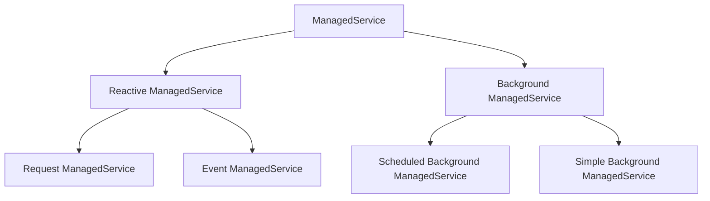

<p class="figure-caption">图 3-1 ManagedService 分类</p>

### 3.2.1 Reactive ManagedService

`Reactive ManagedService` 的 Underlying Runtime 由外部输入触发业务执行。

#### Request ManagedService

Request ManagedService 封装请求—响应型运行体：

```text
Client → Request → Underlying Runtime → Response → Client
```

典型 Underlying Runtime 包括 HTTP、RPC、gRPC Server。

#### Event ManagedService

Event ManagedService 封装发布—消费型运行体：

```text
Producer → Event / Message → Broker → Underlying Runtime
```

典型 Underlying Runtime 包括 Kafka Consumer、RabbitMQ Consumer、Redis Stream Consumer。

Request 与 Event 的本质区别是交互语义，不是同步函数与异步函数的区别。

<p class="table-caption">表 3-1 Request ManagedService 与 Event ManagedService 对比</p>

| 比较项 | Request ManagedService | Event ManagedService |
|---|---|---|
| 交互语义 | Request → Response | Publish → Consume |
| 调用方是否通常等待本次结果 | 是 | 否 |
| 时间耦合 | 较强 | 较弱 |
| 缓冲与重试 | 通常依赖调用链 | 常由 Broker 提供 |
| 一对多 | 不是主要语义 | 常见 |
| 典型 Underlying Runtime | HTTP / RPC / gRPC Server | Kafka / RabbitMQ / Redis Stream Consumer |

### 3.2.2 Background ManagedService

`Background ManagedService` 的 Underlying Runtime 主要由自身运行机制触发业务执行。

#### Scheduled Background ManagedService

Scheduled Background ManagedService 封装具有独立调度模型的运行体：

```text
Scheduler → Trigger → Job
```

是否“周期执行”不是判据；真正的判据是是否存在独立 Scheduler / Trigger / Job 调度层。

APScheduler 属于该类的典型 Underlying Runtime。

#### Simple Background ManagedService

`Simple Background ManagedService` 表示：

> 不使用独立 Scheduler，而由 Underlying Runtime 自己实现循环、等待、条件判断和业务执行节奏的后台常驻运行单元。

典型用途包括设备轮询、数据采集循环、控制循环、状态扫描和周期同步。

## 3.3 ManagedService 生命周期与激活状态

`ManagedService` 对 Underlying Runtime 的具体状态进行归一化，并向 Deploy Runtime 暴露稳定的两维状态。

第一维是 **Lifecycle State**：

```text
STOPPED
STARTING
RUNNING
STOPPING
FAILED
```

第二维是 **Activation State**：

```text
INACTIVE
ACTIVATING
ACTIVE
DEACTIVATING
```

两者正交：

```text
RUNNING ≠ ACTIVE
```

例如主备场景中，备用 `ManagedService` 可以已经完成 Underlying Runtime 初始化并保持 `RUNNING`，但处于 `INACTIVE`。主节点失效后只进行 Ownership 切换和 `activate()`，通常比重新初始化整个 Underlying Runtime 更快。

`ManagedService` 对 Deploy Runtime 至少提供以下稳定行为语义：

```text
start
activate
deactivate
stop
wait
snapshot
```

其中：

- `start`：启动或建立 Underlying Runtime，使 `ManagedService` 进入可运行生命周期；
- `activate`：允许业务执行；Deploy 托管模式下应接收当前有效的 Ownership / Fencing 上下文；
- `deactivate`：停止发起新的 Active 业务行为；
- `stop`：停止 Underlying Runtime 并释放其本地资源；
- `wait`：等待 Underlying Runtime 正常结束或异常退出；
- `snapshot`：返回 Deploy 控制所需的最小 `ManagedServiceSnapshot`。

`ManagedService` 必须能够感知 Underlying Runtime 的异常退出，并把该事实反映为 `FAILED` 或对应错误信息。第一阶段至少要求 `wait()` 和 `snapshot()` 能够支持该能力；状态变化主动通知可以作为后续触发 Reconciliation 的优化机制，但不是第一阶段正确性的必要条件。

对于没有独立 Activation 语义的 Underlying Runtime，具体 `ManagedService` 可以把 Activate / Deactivate 映射为底层框架可实现的启停、暂停/恢复或 activation gate，但 Deploy Runtime 的两维状态模型保持不变。

独立运行模式与 Deploy 托管模式使用同一套生命周期契约。区别仅在于“谁调用这些方法”以及 Deploy 托管模式下 `activate()` 是否携带 Ownership / Fencing 上下文。

## 3.4 统一 Cluster 模型

本文取消以下互斥 Deployment Mode：

```text
Standalone
Active-Standby
Dual-Active
Cluster
```

统一定义：

> 所有 Deploy 托管部署都是 Cluster；单节点只是 Cluster 的退化形式。

“独立运行”是 `ManagedService` 自身的一种启动方式，不是 `/abc/deploy` 的另一套 Runtime 类型。

Cluster 的核心静态对象包括：

- `Node`；
- `ManagedServiceSpec`；
- `ManagedServiceSpec` 与 Node 的放置约束；
- 每个 `ManagedServiceSpec` 的 Activation Policy。

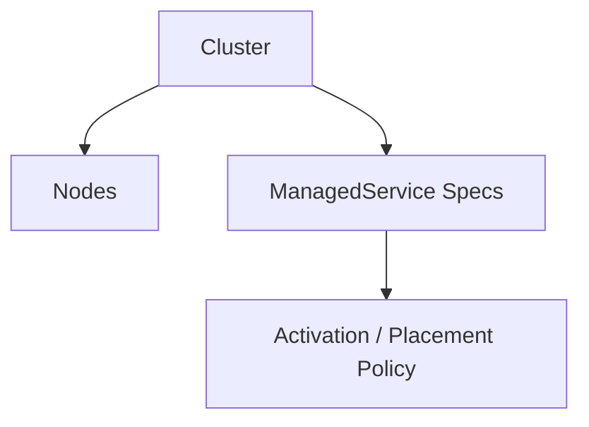

<p class="figure-caption">图 3-2 统一 Cluster 基本模型</p>

`ManagedServiceSpec` 描述“应该被部署和托管的运行单元”，`ManagedService` 是宿主程序实际注册给 Deploy Runtime 的可运行对象，两者不能混为同一概念。

### 3.4.1 单节点

```text
nodes = 1
active_replicas = 1
coordination = local
```

不需要 `StandaloneRuntime`。

### 3.4.2 主备

```text
nodes >= 2
active_replicas = 1
priority 不同
failover = automatic
```

若 `failback = automatic`，首选节点恢复后重新接管。

### 3.4.3 双活与多活

```text
active_replicas = 2
```

可表达双活；

```text
1 < active_replicas < eligible_node_count
```

可表达部分多活；

```text
active_replicas = eligible_node_count
```

可表达全活。

Deploy 只负责 `ManagedService` 的生命周期 / Activation 与 Ownership。业务能否安全多活，还依赖业务层幂等、分区、去重、并发控制和外部资源 Fencing。

## 3.5 Activation Policy

`Activation Policy` 定义：

> 在给定 Cluster Model 与当前运行事实下，某个 ManagedService 期望在哪些 Node 上处于 Active 状态。

建议以 `ManagedServiceSpec` 为主要作用域，并允许 Cluster 级默认值。

### 3.5.1 Active Replicas

`active_replicas` 表示期望同时处于 Active 状态的实例数量。

它只规定数量，不能单独完整表达主备行为。

### 3.5.2 Node Priority

`Node Priority` 决定符合条件的 Node 之间谁优先获得 Ownership。

```text
node-01 priority = 100
node-02 priority = 50
```

Priority 是静态偏好，不是永久角色。

### 3.5.3 Failover Policy

Failover 表示当前 Active Owner 失效后，把 Ownership 转移到其他符合条件节点。

典型步骤：

```text
发现当前 Owner 失效
    ↓
确认 Lease 已失效或 Ownership 可重新分配
    ↓
依据 Placement + Priority 选择候选节点
    ↓
获得新的 Ownership
    ↓
生成新的 Epoch / Fencing
    ↓
激活 ManagedService
```

### 3.5.4 Failback Policy

Failback 表示首选节点恢复后是否重新接管。

<p class="table-caption">表 3-2 Failback Policy</p>

| Policy | 含义 |
|---|---|
| Automatic | 首选节点恢复且满足条件后自动重新接管 |
| Manual | 保持当前 Active，显式操作后才回切 |
| Disabled | 不主动回切 |

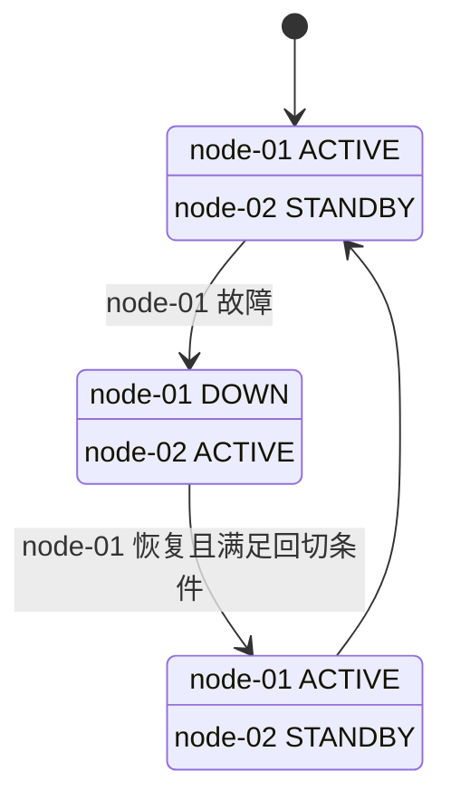

<p class="figure-caption">图 3-3 主备自动 Failover 与 Failback</p>

实际回切不应仅以“节点进程重新出现”为条件，还应考虑恢复稳定时间、`ManagedService` 准备状态和必要的数据一致性条件。

### 3.5.5 Placement Policy

Placement Policy 决定某个 `ManagedServiceSpec` **能不能**放到某个 Node：

- 允许或禁止节点；
- 标签约束；
- 区域约束；
- 资源约束；
- ManagedService 亲和与反亲和。

Placement 决定候选集合，Priority 决定候选集合中的优先顺序。

## 3.6 Runtime State

Deploy Runtime 做控制决策所依赖的 Actual Facts 至少包括：

- Node 可用状态；
- ManagedService Lifecycle State；
- ManagedService Activation State；
- ManagedService Ownership；
- Lease；
- Epoch；
- Fencing Token。

这些事实具有不同权威来源，不由 Deploy Runtime 统一“拥有”：

- `ManagedService` 生命周期与 Activation 事实由 `ManagedService.snapshot()` 提供；
- Membership、Ownership、Lease、Epoch / Fencing 由 Coordination Backend 提供；
- Deploy Runtime 只维护自己的生命周期及内部控制单元状态。

### 3.6.1 Node State

Node State 描述节点是否能够参与运行，例如：

```text
JOINING
READY
UNAVAILABLE
LEAVING
DOWN
```

### 3.6.2 ManagedService Lifecycle State

```text
STOPPED
STARTING
RUNNING
STOPPING
FAILED
```

该状态由 `ManagedService` 归一化 Underlying Runtime 的真实生命周期后向 Deploy Runtime 提供。

### 3.6.3 ManagedService Activation State

```text
INACTIVE
ACTIVATING
ACTIVE
DEACTIVATING
```

Lifecycle State 与 Activation State 是正交状态。

### 3.6.4 ManagedService Ownership

Ownership 表示：

> 当前哪个 Node 被授权拥有某个 ManagedService Replica Slot 的有效业务执行权。

单活 `ManagedService` 同一 Replica Slot 同一时刻只能存在一个有效 Ownership；多活可以存在多个 Replica Slot，但每个 Slot 都必须有明确身份和有效期。

### 3.6.5 Lease

Lease 表示 Ownership 在有限时间内有效。

Owner 必须持续续租。节点一旦**不能确认 Lease 仍然有效**，就不得继续把本地 Ownership 视为可信，应立即进入 **Fail-Closed**：

```text
Lease 无法确认有效
        ↓
禁止发起新的 Active 业务
        ↓
ManagedService.deactivate()
        ↓
本地 Ownership 不再可信
        ↓
等待重新获得有效 Ownership
```

但 Lease 只能约束协调系统中的 Ownership 有效性，不能保证旧 Owner 一定能够及时执行 `deactivate()`。网络分区时，旧 Owner 可能已经无法访问 Coordination Backend，但其 Underlying Runtime 仍然能够访问数据库、消息系统或现场设备。

因此 Lease 不是最终的防脑裂机制。

### 3.6.6 Epoch 与 Fencing

每次 Ownership 变更必须产生新的、单调递增的 Epoch。

`fencing_token` 表示当前 Ownership 的执行代次，默认可以直接使用 Epoch。它用于让具有副作用的下游资源判断请求是否来自最新 Owner。

例如：

```text
node-01 → epoch 10
node-01 与 Coordination Backend 失联
node-01 的 Lease 到期
node-02 接管 → epoch 11
node-01 恢复但仍持有旧状态 → epoch 10
```

旧节点可能仍然运行，但其业务请求携带：

```text
fencing_token = 10
```

新节点请求携带：

```text
fencing_token = 11
```

受保护的下游边界只接受当前最新代次：

```text
token < current_fencing_token
→ reject
```

因此：

- Lease 回答“当前 Ownership 是否还被协调系统承认”；
- Epoch/Fencing 回答“旧 Owner 的副作用是否仍然允许生效”。

**Fencing 是强安全场景中的核心约束，不是可选的观测字段。**

## 3.7 Coordination

Coordination 是多节点 Cluster 的控制面协调机制。

其核心能力包括：

- Cluster 成员事实；
- Ownership；
- Lease；
- Epoch / Fencing；
- 原子竞争；
- 必要的协调状态读取与变更。

单节点 Cluster 使用 Local Coordination，从而保持与多节点相同的 Core 模型。

### 3.7.1 防脑裂安全模型

多节点 Cluster 必须假设以下情况可能发生：

```text
旧 Active Node 仍然存活
        +
旧节点无法访问 Coordination Backend
        +
新节点已经取得新的 Ownership
```

因此防脑裂不能只依赖“旧节点主动退出”。

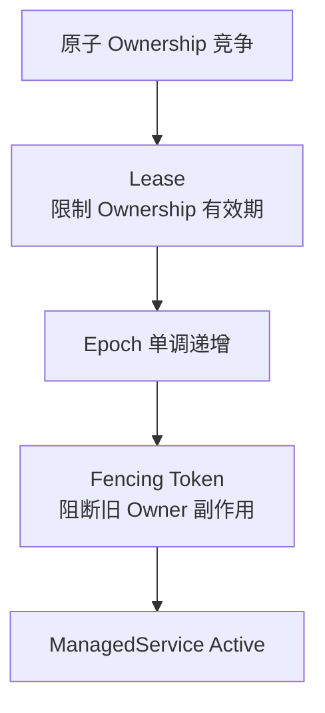

<p class="figure-caption">图 3-4 Ownership、Lease 与 Fencing 安全链</p>

必须同时满足：

1. 同一 Replica Slot 不能被 Coordination Backend 同时授予两个**有效** Ownership；
2. Ownership 必须有有限 Lease；
3. Ownership 每次转移产生更大的 Epoch；
4. 旧 Owner 的续租和释放不能影响新的 Ownership；
5. 节点无法证明 Lease 有效时必须 Fail-Closed；
6. 对可能跨越 Lease 失效窗口的关键副作用，最终由 Fencing Token 裁决。

### 3.7.2 Coordination Backend 能力等级

<p class="table-caption">表 3-3 Coordination Backend 能力定位</p>

| 类型 | 典型实现 | 适用定位 |
|---|---|---|
| Local Coordination | 进程内实现 | 单节点 Cluster，不涉及分布式脑裂 |
| Consensus-based Coordination | etcd；Consul 的强一致协调能力 | 强 HA 控制面，优先用于严格单活和关键控制场景 |
| Redis-based Coordination | Redis + 原子脚本 + TTL + Epoch | 可实现工程化 HA，但安全能力取决于 Redis 部署拓扑及故障语义 |
| Platform Coordination | Kubernetes Lease 等 | 适用于运行在对应平台内的节点协调 |

普通 Redis 主从切换不应被视为严格线性一致的防脑裂保证。对于“绝不能出现两个有效控制者”的强安全场景，应优先选择具有明确强一致控制面语义的 Backend，并继续使用 Fencing 保护下游副作用。

本文中的 Coordination 不包括广义 HA 基础设施中的 Load Balancer、数据库复制、存储冗余、VIP 等能力。

## 3.8 Cluster Runtime

`ClusterRuntime` 是 `/abc/deploy` 的核心运行对象。

主要输入：

```text
Cluster Model
Activation Policy
CoordinationSnapshot
ManagedServiceSnapshot
```

主要输出：

```text
ManagedService Start / Stop
ManagedService Activate / Deactivate
Ownership Acquire / Release
Lease Renew
Runtime Event
```

`ClusterRuntime` 不直接管理 Underlying Runtime。所有 Underlying Runtime 操作必须通过已注册的 `ManagedService` 完成。

## 3.9 状态收敛机制

Cluster Runtime 持续执行：

> Desired State 与 Actual Facts 的比较和收敛。

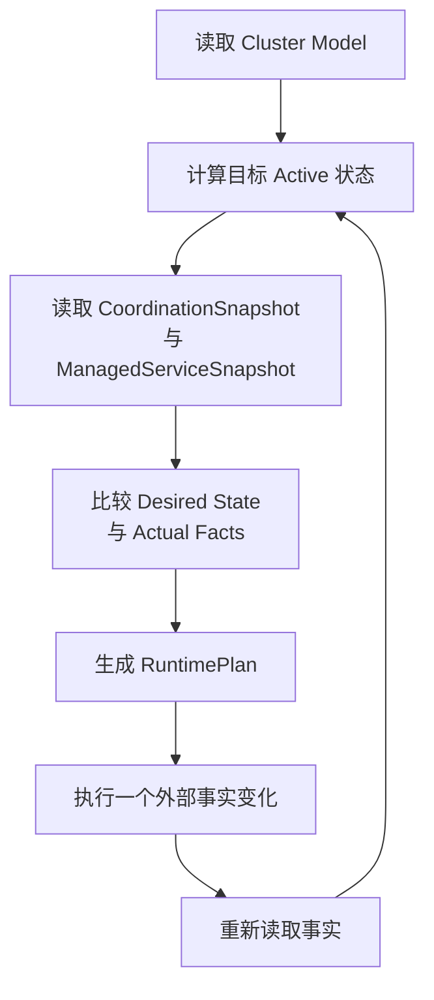

<p class="figure-caption">图 3-5 Cluster Runtime 状态收敛循环</p>

对会改变外部事实的关键动作，一次 Reconciliation 阶段只推进一个变化，再重新读取权威事实。例如：

```text
Acquire Ownership
    ↓
重新读取 CoordinationSnapshot
    ↓
ManagedService.activate()
```

以及：

```text
ManagedService.deactivate()
    ↓
重新读取 ManagedServiceSnapshot
    ↓
Release Ownership
```

## 3.10 典型部署场景

<p class="table-caption">表 3-4 典型部署场景</p>

| 场景 | Nodes | Active Replicas | Priority | Failback | Coordination |
|---|---:|---:|---|---|---|
| 单节点托管 | 1 | 1 | 无特殊要求 | 不适用 | Local |
| 主备自动回切 | 2+ | 1 | 有 | Automatic | Distributed |
| 主备不自动回切 | 2+ | 1 | 有 | Manual / Disabled | Distributed |
| 双活 | 2+ | 2 | 可选 | 视业务而定 | Distributed |
| 多节点部分激活 | N | 2～N-1 | 可选 | 视业务而定 | Distributed |
| 全活 | N | N | 通常无必要 | 不适用 | Distributed |

`ManagedService` 的独立运行不属于上述 Cluster Deployment Scenario，它只是同一管理对象脱离 Deploy Runtime 后由宿主程序直接驱动的运行方式。

---

# 4. 总体架构原则

## 4.1 管理边界原则

`/abc/deploy` 只对真实外部边界建立稳定契约，不为每个内部对象增加抽象层。

当前边界分为两类：

1. **ManagedService 管理边界**：Deploy Runtime 直接持有和调用 `ManagedService` 契约；
2. **基础设施 Port / Adapter 边界**：Coordination Backend 与可选 Runtime Event Output 使用 Port / Adapter 隔离具体基础设施。

核心原则：

> Deploy Runtime 只依赖 `ManagedService` 稳定契约、`CoordinationPort` 和可选 `RuntimeEventPort`，不依赖 Uvicorn、APScheduler、Kafka、Redis、etcd 等具体实现。

`ManagedService` 本身已经是 Underlying Runtime 的生命周期封装，因此不再在 Deploy Core 与 `ManagedService` 之间额外加入 `ServicePort → ServiceAdapter` 层。

## 4.2 ManagedService 契约

`ManagedService` 是 Deploy Runtime 的直接管理接口，同时也是目标对象能够独立运行的公共生命周期接口。

基础能力定义为：

```text
start
activate
deactivate
stop
wait
snapshot
```

语义要求：

- `start()` 完成 Underlying Runtime 的启动或异步启动建立；
- `activate()` 允许业务执行，Deploy 托管模式下接收有效 Ownership / Fencing 上下文；
- `deactivate()` 停止发起新的 Active 业务；
- `stop()` 完成 Underlying Runtime 的有序停止；
- `wait()` 在 Underlying Runtime 正常结束或异常退出时结束等待；
- `snapshot()` 返回当前 `ManagedServiceSnapshot`。

`ManagedService` 必须负责把 Underlying Runtime 的框架特有状态映射为统一 Lifecycle / Activation State。

典型实现关系：

```text
UvicornManagedService
    └── uvicorn.Server

APSchedulerManagedService
    └── AsyncIOScheduler

KafkaConsumerManagedService
    └── Kafka Consumer

BackgroundManagedService
    └── asyncio Worker Loop
```

这些具体 `ManagedService` 可以位于目标业务模块或后续独立 integration package 中，但不属于 `/abc/deploy` Core 的基础设施 Adapter。

## 4.3 独立运行与 Deploy 托管

同一个具体 `ManagedService` 应同时支持两种装配方式。

独立运行：

```text
Host Program
      ↓
ManagedService
      ↓
Underlying Runtime
```

Deploy 托管：

```text
Host Program
      ↓ 注册
ClusterRuntime
      ↓
ManagedService Management
      ↓
ManagedService
      ↓
Underlying Runtime
```

因此 Deploy 托管不是另一套 Service 实现，而只是把原来由宿主程序直接调用的生命周期控制权交给 `ClusterRuntime`。

独立运行时，宿主程序自行决定何时 `start / activate / deactivate / stop`；Deploy 托管时，Activation 必须服从 Ownership、Lease 和 Reconciliation。

## 4.4 Coordination Port / Adapter

Coordination Port 隔离具体协调后端。

Core 面向的稳定语义包括：

- join / leave；
- 获取成员快照；
- 原子尝试获得 Ownership；
- renew Lease；
- release Ownership；
- 获取最新 Ownership / Epoch / Fencing；
- 判断 Coordination 是否仍可用于证明本地 Ownership 有效。

Port 的安全契约必须保证：

- `try_acquire()` 原子化；
- 新 Ownership 的 Epoch 单调递增；
- `renew()` 必须校验 Owner、Lease ID 和 Epoch；
- `release()` 必须校验 Owner、Lease ID 和 Epoch；
- 旧 Owner 不能续租或删除新 Owner 的 Ownership。

具体 Redis、etcd、Consul、Kubernetes Lease API 不应泄露到 Deploy Core。

## 4.5 Runtime Event Port

Runtime Event Port 是可选事实输出边界，用于把已发生的 Runtime 事实通知给宿主应用或其他扩展模块。

例如：

```text
ManagedServiceStarted
ManagedServiceFailed
OwnershipChanged
LeaseLost
FailoverCompleted
FailbackCompleted
```

Event 输出失败不能影响 Ownership、Failover 和 ManagedService 生命周期控制。

## 4.6 依赖方向

依赖方向固定为：

```text
Host / Business Module
      │
      ├── 创建具体 ManagedService
      │          ↓
      │      Underlying Runtime
      │
      └── 注册 ManagedService
                 ↓
             /abc/deploy
                 ↓
          ClusterRuntime / Core
                 ↓
       CoordinationPort / EventPort
                 ↑
        Infrastructure Adapters
```

`/abc/deploy` Core 不依赖具体 `ManagedService` 实现；它只依赖 `ManagedService` 公共契约。

具体 `ManagedService` 也不依赖 `ClusterRuntime`。因此它可以脱离 Deploy Runtime 独立运行。

---

# 5. 系统上下文、协调拓扑与主要用例

## 5.1 系统边界

本章的主要研究对象是**当前 Node 上运行的 Deploy Runtime**：

> Current Node Deploy Runtime

该系统负责当前节点上的 `ManagedService` 托管、Active / Inactive 切换、Coordination 参与以及 Reconciliation 驱动。

当前 Node Deploy Runtime 的外部环境包括：

- **宿主程序（Host Program）**：创建 Cluster 配置和具体 `ManagedService`，把 `ManagedService` 注册给 Deploy Runtime，并启动 / 停止 Deploy Runtime；
- **ManagedService**：Deploy Runtime 的直接管理对象；负责封装 Underlying Runtime 并向 Deploy 暴露统一生命周期、Activation 和状态观察能力；
- **Underlying Runtime**：真正执行长期运行工作的程序，如 Uvicorn Server、APScheduler、Kafka Consumer 或 asyncio Worker Loop；它只由所属 `ManagedService` 管理，Deploy Runtime 不直接访问；
- **Coordination Backend**：提供 Node Membership、Ownership、Lease、Epoch / Fencing 等共享协调能力；
- **其他 Cluster Node**：运行自己的 Deploy Runtime 和本地 `ManagedService`，通过同一个 Coordination Backend 与当前节点形成 Cluster 协同。

系统边界遵循以下原则：

1. Deploy Runtime 只直接管理本节点已注册的 `ManagedService`；
2. Deploy Runtime 不直接控制 Underlying Runtime；
3. 当前设计不建立 Deploy Runtime 之间的 Node-to-Node 控制面通信；
4. ManagedService 之间、Underlying Runtime 之间是否存在业务通信属于业务系统设计，不属于 `/abc/deploy` 控制面；
5. Coordination Backend 在逻辑上属于外部基础设施，即使其进程物理上与某个 Cluster Node 同机部署，也不改变系统边界。

## 5.2 C4 System Context Diagram

图 5-1 用于明确 Deploy Runtime 与外部环境之间的直接关系，并特别强调 `Deploy Runtime → ManagedService → Underlying Runtime` 的控制链。

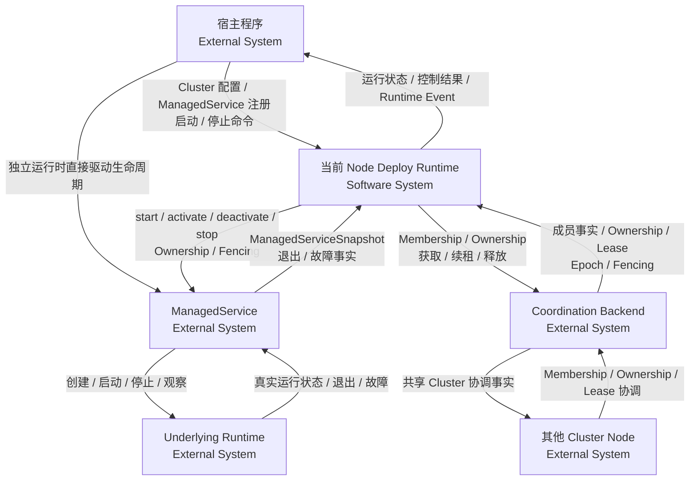

<p class="figure-caption">图 5-1 当前 Node Deploy Runtime 系统上下文图</p>

图 5-1 中不存在：

```text
Deploy Runtime → Underlying Runtime
```

Deploy Runtime 只操作 `ManagedService`。具体框架生命周期由 `ManagedService` 负责。

其他 Cluster Node 与当前 Deploy Runtime 也没有直接控制面连线。Cluster 协同关系仍然是：

```text
Node-01 Deploy Runtime
        ↓
Coordination Backend
        ↑
Node-02 Deploy Runtime
```

## 5.3 Coordination Backend 与 etcd 通信拓扑

`Coordination Backend` 是 Cluster 共享控制状态与仲裁服务，至少需要支撑：

- Node Membership；
- Ownership 原子获取、续租与释放；
- Lease / TTL；
- Epoch 单调演进；
- Fencing Token；
- 一致的 Coordination Snapshot。

Local、Redis、etcd、Consul、Kubernetes Lease 等均可作为 `CoordinationPort` 的不同实现。其中 etcd 是典型的独立分布式协调服务。

以 etcd 为例，需要区分：

- **Client API，默认端口 `2379`**：Deploy Runtime 作为 etcd client 执行读写、事务、Lease 等操作；
- **Peer 通信，默认端口 `2380`**：etcd Member 之间执行 Raft 复制、选主和一致性协议，该通道属于 etcd 内部。

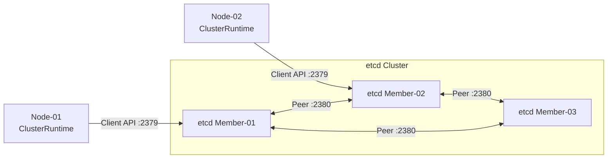

<p class="figure-caption">图 5-2 Deploy Runtime 与 etcd Cluster 通信拓扑</p>

图 5-2 中的 Client 连线只用于简化图形，不表示固定绑定。一个 Deploy Runtime 可以持有多个 etcd Client Endpoint。

etcd Member 可以与业务 Node 同机，也可以独立部署；该部署选择不影响 `/abc/deploy` Core。

## 5.4 主要用例

<p class="table-caption">表 5-1 `/abc/deploy` 主要用例</p>

| 编号 | 用例 | 主要参与者 | 触发条件 | 成功结果 |
|---|---|---|---|---|
| UC-01 | 装配 Cluster Runtime | 宿主程序 | 应用启动准备 | Cluster Model、Policy、Ports 和 ManagedService 注册完成 |
| UC-02 | 启动 Cluster Runtime | 宿主程序、Coordination Backend、ManagedService | Runtime 启动 | 本节点建立 Membership，ManagedService 启动，控制循环开始状态收敛 |
| UC-03 | 维持目标 Active 副本 | Coordination Backend、ManagedService | 状态变化、事件触发或周期校验 | Actual Facts 持续向 Desired State 收敛 |
| UC-04 | 执行 Failover | Coordination Backend、ManagedService | 当前 Ownership 失效或 Owner 不可用 | 新节点取得合法 Ownership，并在后续 Reconciliation 中激活本地 ManagedService |
| UC-05 | 执行 Failback | Coordination Backend、ManagedService | 首选节点恢复且 Policy 允许 | Ownership 按安全切换顺序回到首选节点 |
| UC-06 | 处理 ManagedService / Underlying Runtime 异常退出 | ManagedService | Underlying Runtime 异常退出 | ManagedService 暴露 FAILED / 错误事实并触发重新收敛 |
| UC-07 | 优雅停止 Cluster Runtime | 宿主程序、Coordination Backend、ManagedService | 应用退出 | 停止新 Ownership 竞争，停用/停止 ManagedService，释放 Ownership，退出 Membership |
| UC-08 | 维持多 Active 副本 | Coordination Backend、ManagedService | `active_replicas > 1` | 有效 Active Replica Slot 数量和放置满足 Policy |

其他 Cluster Node 不作为当前 Deploy Runtime 的直接调用 Actor。

## 5.5 UC-03 维持目标 Active 副本

### 前置条件

- Cluster Runtime 已启动；
- Cluster Model 与 Policy 有效；
- 本节点需要托管的 `ManagedService` 已注册；
- Coordination Port 能读取当前 `CoordinationSnapshot`，或明确报告协调不可用。

### 主流程

1. 读取 Cluster Model、Activation Policy 和 Placement Policy；
2. 从已注册 `ManagedService` 读取 `ManagedServiceSnapshot`；
3. 通过 `CoordinationPort` 读取 `CoordinationSnapshot`；
4. Reconciler 根据 Desired State 与当前事实计算本轮 `RuntimePlan`；
5. Cluster Runtime 只执行本节点相关 Action；
6. 对会改变外部事实的关键控制动作，一轮只推进一个安全阶段；
7. 动作完成后不把预期结果当作实际状态，而是在下一轮重新读取 `ManagedServiceSnapshot` 或 `CoordinationSnapshot`；
8. 若状态尚未收敛，继续下一轮 Reconciliation。

### 后置条件

Actual Facts 的权威来源保持唯一：

- ManagedService Lifecycle / Activation 事实由 `ManagedService` 提供；
- Underlying Runtime 的框架特有状态由 `ManagedService` 负责归一化；
- Membership、Ownership、Lease、Epoch / Fencing 由 Coordination Backend 提供；
- Cluster Runtime 只维护自身生命周期和内部控制单元状态。

## 5.6 UC-04 Failover

Failover 按以下安全阶段推进：

1. Coordination Maintenance 或 Reconciliation 发现当前 Owner / Lease 不再能够被证明有效；
2. 本节点不得继续基于不可信 Ownership 启动新的 Active 业务，进入 Fail-Closed；
3. Coordination Backend 根据 Lease 和原子条件决定旧 Ownership 是否已经可以被重新竞争；
4. 候选节点依据 Placement、Priority 和当前 Coordination Snapshot 形成本地竞争决策；
5. 候选节点原子竞争对应 Replica Slot；
6. 一个节点取得新的 Ownership、Lease、Epoch 与 Fencing Token；
7. 本轮到此结束，不直接假定 ManagedService 已 Active；
8. 下一轮重新读取 Ownership，确认本节点仍为合法 Owner；
9. 调用本地 `ManagedService.activate()` 并传入当前 Ownership / Fencing 上下文；
10. 再次读取 `ManagedServiceSnapshot`，确认实际 Activation State；
11. 必要时发布 Failover 完成事件。

核心顺序是：

```text
合法 Ownership 成立
      ↓
重新读取并确认
      ↓
ManagedService.activate()
```

## 5.7 UC-05 Failback

第一阶段采用 **break-before-make**：

1. 首选节点恢复，并通过 Membership / `ManagedServiceSnapshot` 确认具备接管条件；
2. Activation Policy 判断允许回切；
3. 当前 Owner 先执行 `ManagedService.deactivate()`；
4. 下一轮重新读取 `ManagedServiceSnapshot`，确认当前 Owner 已不再 Active；
5. 当前 Owner 释放旧 Ownership；
6. 下一轮重新读取 Coordination Snapshot，确认旧 Ownership 已释放；
7. 首选节点竞争并取得新的 Ownership 代次以及新的 Epoch / Fencing；
8. 下一轮重新确认 Ownership；
9. 首选节点执行 `ManagedService.activate()`；
10. 再次读取 `ManagedServiceSnapshot`，确认首选节点实际 Active。

只有当具体 ManagedService、Underlying Runtime 及下游系统能够证明支持并发切换以及 Fencing 校验时，才进一步研究 make-before-break。

---

# 6. 模块架构与职责边界

## 6.1 逻辑视图与模块划分

本章采用 4+1 架构视图中的**逻辑视图**描述 `/abc/deploy` 的系统组成。

当前 Deploy Runtime 逻辑上划分为三个一级模块：

1. **Runtime Core（运行核心模块）**：负责 Deploy Runtime 自身生命周期、Desired State 计算、Reconciliation、Failover / Failback 决策以及本地控制动作编排；
2. **ManagedService Management（受管 Service 管理模块）**：负责本节点 `ManagedService` 的注册、生命周期控制、Activation 控制和状态观察；
3. **Cluster Coordination（集群协调模块）**：负责 Node Membership、Ownership、Lease、Epoch / Fencing 以及 Coordination Backend 交互。

`ManagedService` 是一级模块之外的受管对象，不是 Deploy Runtime 内部子模块；Underlying Runtime 则进一步位于 `ManagedService` 之后。

## 6.2 逻辑模块架构

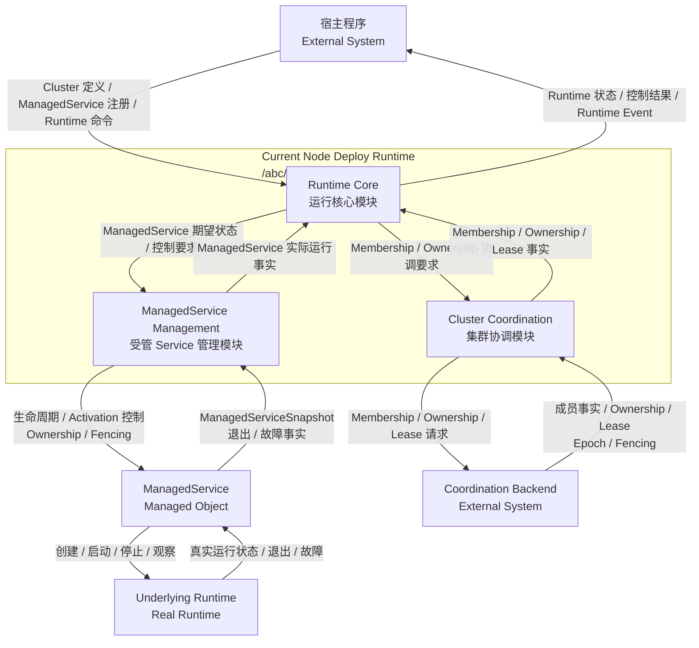

<p class="figure-caption">图 6-1 Deploy Runtime 逻辑模块架构</p>

职责边界固定为：

- Runtime Core 决定**要达到什么状态以及下一步做什么**；
- ManagedService Management 只负责**操作已注册的 ManagedService 并读取其事实**；
- Cluster Coordination 只负责**Cluster 共享协调事实和 Ownership 安全语义**；
- ManagedService 负责**把统一控制动作翻译为 Underlying Runtime 的真实生命周期操作**。

因此 Runtime Core 与 ManagedService Management 都不直接调用 Uvicorn、APScheduler、Kafka 等框架 API。

## 6.3 模块职责

<p class="table-caption">表 6-1 一级逻辑模块职责</p>

| 模块 | 核心职责 | 典型内部机制 | 明确不负责 |
|---|---|---|---|
| Runtime Core | Runtime 生命周期；Desired State；Reconciliation；Failover / Failback 决策；Action 编排 | `ClusterRuntime`、Reconciliation Control、`Reconciler`、`RuntimePlan` | Underlying Runtime 框架 API；具体 Coordination SDK |
| ManagedService Management | ManagedService 注册；生命周期控制；Activation 控制；状态观察；异常退出事实接收 | ManagedService Registry、Lifecycle Control、Activation Control、State Observation | Ownership 仲裁；Active 节点选择；Underlying Runtime 具体实现 |
| Cluster Coordination | Membership；Ownership 获取/续租/释放；Lease；Epoch / Fencing；Coordination Snapshot | Membership Management、Ownership Management、Lease Management、Coordination State | ManagedService 业务执行；Desired State 决策 |

## 6.4 Runtime Core 第 2 层 DFD

`Runtime Core` 对应第 1 层过程 `1.0 管理运行与状态收敛`，进一步划分为：

1. `1.1 Runtime Lifecycle`；
2. `1.2 Reconciliation Control`；
3. `1.3 Reconciler`。

跨越父过程 `1.0` 边界的数据流使用无形边界端点表达。

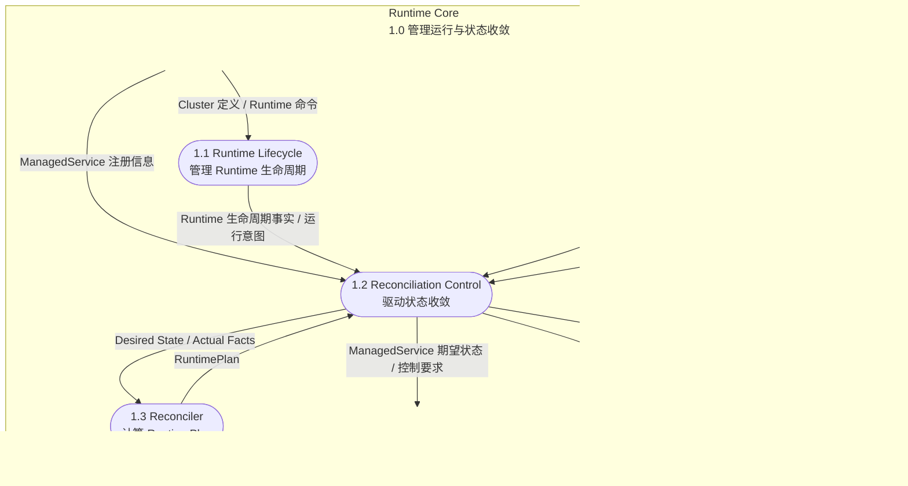

<p class="figure-caption">图 6-2 Runtime Core 第 2 层 DFD</p>

<p class="table-caption">表 6-2 Runtime Core 子模块职责</p>

| 子模块 | 核心职责 | 主要输入 | 主要输出 |
|---|---|---|---|
| `Runtime Lifecycle` | 管理 Deploy Runtime 自身启动、运行、停止和异常生命周期 | Cluster 定义、Runtime 命令 | Runtime 生命周期事实、运行意图 |
| `Reconciliation Control` | 驱动 Reconciliation；读取 ManagedService 与 Cluster Actual Facts；准备 Desired State；执行 RuntimePlan；管理触发和重试 | Runtime 生命周期事实、ManagedService 实际运行事实、Cluster 协调事实、ManagedService 注册信息 | Desired State / Actual Facts、ManagedService 控制要求、Cluster 协调要求、Runtime 状态与控制结果 |
| `Reconciler` | 保持纯决策，根据 Desired State 与 Actual Facts 计算下一步 RuntimePlan | Desired State、Actual Facts | `RuntimePlan` |

## 6.5 ManagedService Management 第 2 层 DFD

`ManagedService Management` 对应第 1 层过程 `2.0 管理本地 ManagedService`，进一步划分为：

1. `2.1 ManagedService Registry`；
2. `2.2 ManagedService Lifecycle Control`；
3. `2.3 ManagedService Activation Control`；
4. `2.4 ManagedService State Observation`。

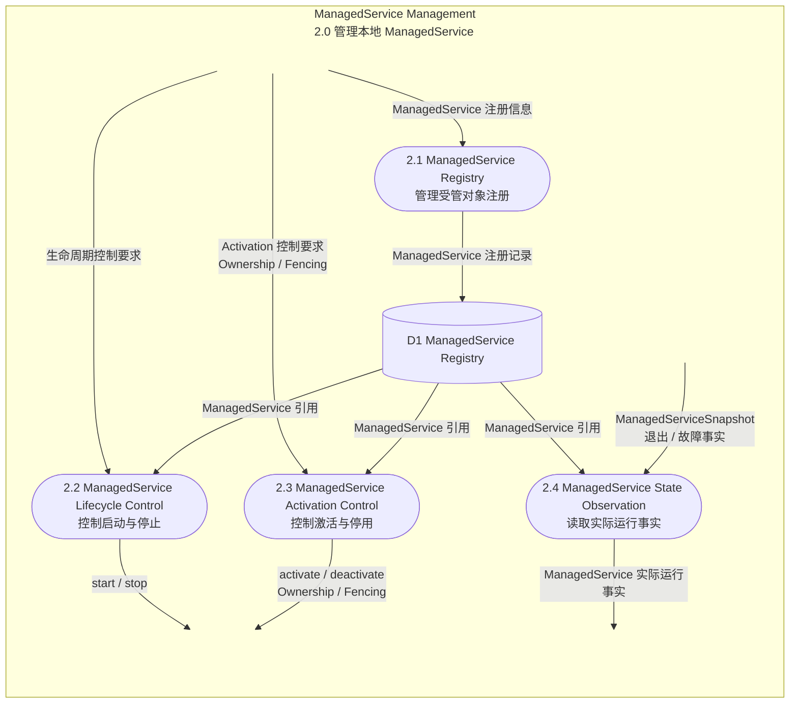

<p class="figure-caption">图 6-3 ManagedService Management 第 2 层 DFD</p>

<p class="table-caption">表 6-3 ManagedService Management 子模块职责</p>

| 子模块 | 核心职责 | 主要输入 | 主要输出 |
|---|---|---|---|
| `ManagedService Registry` | 维护 `service_id → ManagedService` 的本地注册关系 | ManagedService 注册信息 | 注册记录、ManagedService 引用 |
| `ManagedService Lifecycle Control` | 根据 Runtime Core 控制要求调用 `ManagedService.start()` / `stop()` | 生命周期控制要求、ManagedService 引用 | 生命周期控制结果 |
| `ManagedService Activation Control` | 调用 `activate()` / `deactivate()`；Deploy 托管模式下传递有效 Ownership / Fencing | Activation 控制要求、Ownership / Fencing、ManagedService 引用 | Activation 控制结果 |
| `ManagedService State Observation` | 调用 `snapshot()`，并通过 `wait()` / 状态观察感知异常退出，统一形成 Actual Facts | ManagedService 引用、ManagedServiceSnapshot | ManagedService 实际运行事实 |

`ManagedService Management` 不管理 Underlying Runtime 的框架细节；具体生命周期翻译属于 `ManagedService` 自身职责。

## 6.6 Cluster Coordination 第 2 层 DFD

`Cluster Coordination` 对应第 1 层过程 `3.0 管理集群协调`，进一步划分为：

1. `3.1 Membership Management`；
2. `3.2 Ownership Management`；
3. `3.3 Lease Management`；
4. `3.4 Coordination State`。

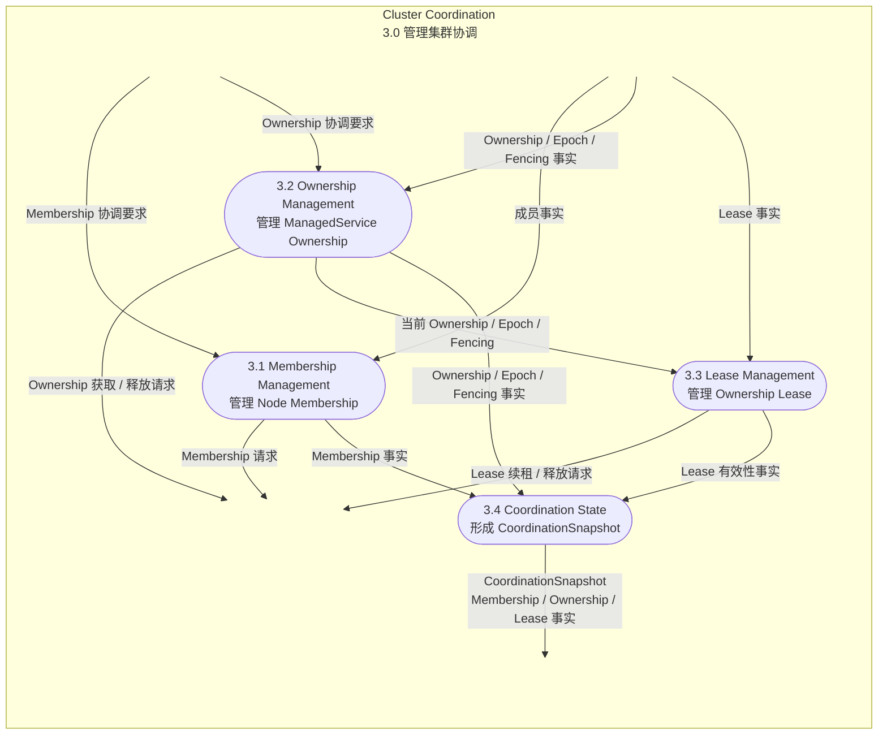

<p class="figure-caption">图 6-4 Cluster Coordination 第 2 层 DFD</p>

<p class="table-caption">表 6-4 Cluster Coordination 子模块职责</p>

| 子模块 | 核心职责 | 主要输入 | 主要输出 |
|---|---|---|---|
| `Membership Management` | 管理当前 Node 的 join / heartbeat / leave，并读取其他 Node 的 Membership 事实 | Membership 协调要求、Backend 成员事实 | Membership 请求、Membership 事实 |
| `Ownership Management` | 原子获取 / 释放 ManagedService Replica Slot Ownership；维护 Epoch / Fencing | Ownership 协调要求、Ownership / Epoch / Fencing 事实 | Ownership 请求、Ownership / Epoch / Fencing 事实 |
| `Lease Management` | 对本节点 Ownership 续租并判断 Lease 是否仍可信 | 当前 Ownership、Lease 事实 | Lease 请求、Lease 有效性事实 |
| `Coordination State` | 汇总 Membership、Ownership、Lease、Epoch / Fencing，形成 `CoordinationSnapshot` | 各协调子模块事实 | `CoordinationSnapshot` |

当无法确认 Lease 有效时，必须产生“不再可信”的协调事实供 Runtime Core Fail-Closed 收敛。

## 6.7 ClusterRuntime 生命周期状态机

第一阶段骨架开发只冻结 `ClusterRuntime` 自身生命周期，不把 Node、ManagedService、Ownership、Lease 等状态合并为一个全局状态机。

`ClusterRuntime` 生命周期状态：

- `CREATED`；
- `STARTING`；
- `RUNNING`；
- `STOPPING`；
- `STOPPED`；
- `FAILED`。

第一阶段把一个 `ClusterRuntime` 实例设计为**单次生命周期对象**：进入 `STOPPED` 后不重新 `start()`；需要重新启动时由宿主程序创建新的 Runtime 实例。

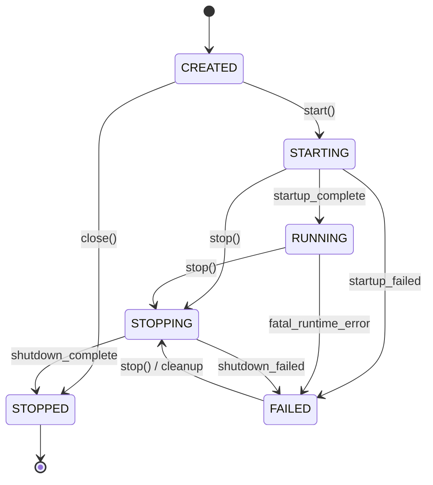

<p class="figure-caption">图 6-5 ClusterRuntime 生命周期状态机</p>

<p class="table-caption">表 6-5 ClusterRuntime 状态迁移约束</p>

| 当前状态 | 事件 / 条件 | 下一状态 | 主要动作 |
|---|---|---|---|
| `CREATED` | `start()` | `STARTING` | 开始 Runtime 启动序列 |
| `CREATED` | `close()` | `STOPPED` | 未启动对象直接结束生命周期 |
| `STARTING` | 启动全部完成 | `RUNNING` | 开放正常 Reconciliation 周期 |
| `STARTING` | `stop()` | `STOPPING` | 中止未完成启动并执行统一清理 |
| `STARTING` | 致命启动错误 | `FAILED` | 保存错误事实，等待统一清理 |
| `RUNNING` | `stop()` | `STOPPING` | 进入有序关闭 |
| `RUNNING` | Runtime 关键控制单元终止 | `FAILED` | Runtime 不再视为健康运行 |
| `FAILED` | `stop()` / cleanup | `STOPPING` | 清理部分启动或运行期资源 |
| `STOPPING` | 全部关闭动作完成 | `STOPPED` | Runtime 生命周期结束 |
| `STOPPING` | 关闭阶段致命错误 | `FAILED` | 保存关闭失败事实 |

单个 ManagedService 业务请求失败、单次 Job 失败、一次 Reconciliation Action 失败或一次 Coordination 请求失败，不应自动把 `ClusterRuntime` 置为 `FAILED`。只有 Runtime 关键控制单元无法继续维持生命周期时才进入 Runtime 级 `FAILED`。

## 6.8 启动、运行与关闭总体流程

第一阶段程序骨架先保证三个一级模块和已注册 `ManagedService` 能按确定顺序启动、运行和关闭。

启动顺序：

1. `ClusterRuntime` 从 `CREATED` 进入 `STARTING`；
2. 校验 Cluster 定义和 `ManagedService` 注册关系；
3. 启动 `Cluster Coordination`，当前 Node 进入 `JOINING`；
4. 启动 Membership / Lease 维护骨架；
5. `ManagedService Management` 调用各本地 `ManagedService.start()`；
6. 每个 `ManagedService` 负责启动自己的 Underlying Runtime，并向 Deploy 暴露 `RUNNING + INACTIVE`；
7. 当前 Node 满足接管条件后进入 `READY`；
8. 启动 `Reconciliation Control`；
9. `ClusterRuntime` 进入 `RUNNING`。

关闭顺序：

1. `ClusterRuntime` 从 `RUNNING` 进入 `STOPPING`；
2. 停止 `Reconciliation Control` 产生新的 Acquire / Activate 控制要求；
3. 当前 Node 进入 `LEAVING`；
4. 对本节点 `ACTIVE` ManagedService 调用 `deactivate()`；
5. 释放本节点持有的 Ownership；
6. 对已启动 ManagedService 调用 `stop()`；各 ManagedService 负责停止自己的 Underlying Runtime；
7. 当前 Node 从 Coordination Backend 离开；
8. 停止 Cluster Coordination 内部维护任务；
9. `ClusterRuntime` 进入 `STOPPED`。

关闭阶段由 `Runtime Lifecycle` 显式编排，不依赖 Reconciliation 自己最终收敛到停止状态。

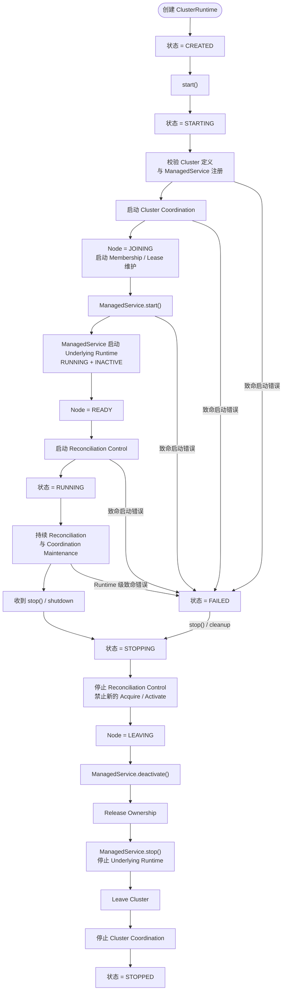

<p class="figure-caption">图 6-6 Deploy Runtime 启动、运行与关闭总体流程</p>


### 6.8.1 启动阶段类调用时序

图 6-7 从**程序行为与调用链视角**完整展开图 6-6 的启动阶段，包括：

- `ManagedService` 与 Underlying Runtime 的构造；
- `ManagedService` 注册；
- Coordination Backend 接入；
- ManagedService 启动；
- Node READY；
- Reconciliation Control 启动；
- `ClusterRuntime` 最终进入 `RUNNING`。

根据 Sequence Diagram 的语义，本图 Lifeline 使用实际类 / 对象，消息使用方法级调用语义。

`/abc/deploy` 内部类的 Lifeline 顶部框统一采用两行：

```text
<相对 abc.deploy 的模块名>
<ClassName>
```

例如：

```text
runtime
ClusterRuntime
```

表示：

```text
abc.deploy.runtime.ClusterRuntime
```

公共前缀 `abc.deploy` 不在图内重复显示。外部对象使用 `external` 作为头部信息。

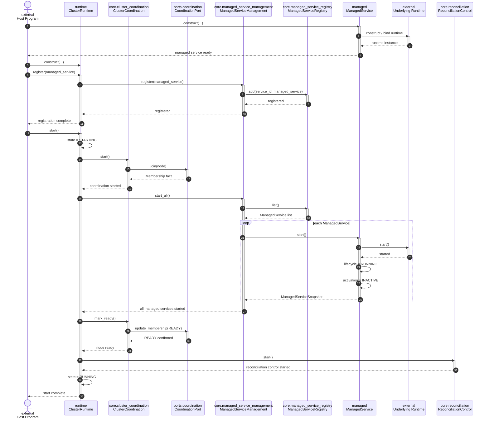

<p class="figure-caption">图 6-7 Deploy Runtime 启动阶段类调用时序图</p>

图 6-7 中各类 / 对象的启动职责如下。下表中的内部模块名均相对 `abc.deploy`。

<p class="table-caption">表 6-6 启动阶段主要类职责</p>

| 所属模块 | 类 / 对象 | 启动阶段职责 |
|---|---|---|
| `external` | `Host Program` | 构造具体 `ManagedService` 和 `ClusterRuntime`；完成 ManagedService 注册；调用 `ClusterRuntime.start()` |
| `runtime` | `ClusterRuntime` | 启动过程总编排者；负责 `CREATED → STARTING → RUNNING` 状态迁移，并决定各子系统启动顺序 |
| `core.cluster_coordination` | `ClusterCoordination` | 建立本节点 Cluster 协调能力；通过 `CoordinationPort` 加入 Cluster、更新 Membership，并建立后续 Ownership / Lease 维护环境 |
| `ports.coordination` | `CoordinationPort` | 向 `ClusterCoordination` 提供稳定协调接口，并把调用映射到 Local / etcd / Redis 等具体 Coordination Backend |
| `core.managed_service_management` | `ManagedServiceManagement` | 管理本节点所有已注册 `ManagedService` 的生命周期；启动阶段读取 Registry 并逐个执行 `start()` |
| `core.managed_service_registry` | `ManagedServiceRegistry` | 保存 `service_id → ManagedService` 引用关系，并向 `ManagedServiceManagement` 提供已注册对象集合 |
| `managed` | `ManagedService` | Deploy 的直接管理对象；把统一 `start()` 转换为具体 Underlying Runtime 启动操作，并归一化 Lifecycle / Activation 状态 |
| `external` | `Underlying Runtime` | 真正长期运行的程序，如 `uvicorn.Server`、`AsyncIOScheduler`、Kafka Consumer 或后台循环；只由所属 ManagedService 直接管理 |
| `core.reconciliation` | `ReconciliationControl` | 在 Coordination 和 ManagedService 均进入可运行状态后启动后台状态收敛循环 |

启动过程必须保持以下约束：

1. `ManagedService` 的构造与注册发生在 `ClusterRuntime.start()` 之前；
2. Deploy Runtime 不越过 `ManagedService` 直接调用 Underlying Runtime；
3. `ClusterCoordination` 必须先于 `ReconciliationControl` 建立，因为 Reconciliation 依赖 Cluster Actual Facts；
4. `ManagedService.start()` 完成后，Deploy 仍应读取 `ManagedServiceSnapshot` 确认 Actual State，而不是把调用成功直接等价为 `RUNNING`；
5. ManagedService 完成启动后默认处于 `RUNNING + INACTIVE`，进入 `ACTIVE` 必须等待后续 Reconciliation 和合法 Ownership；
6. 当前 Node 只有在 Coordination 与本地 ManagedService 均具备运行条件后才进入 `READY`；
7. `ReconciliationControl` 建立后，`ClusterRuntime` 才进入 `RUNNING`；
8. 任一关键启动阶段发生 Runtime 级致命错误时，由 `ClusterRuntime` 统一进入 `FAILED`，随后沿图 6-5、图 6-6 的 cleanup / `STOPPING` 路径回收已经启动的资源。


第一阶段可以继续暂缓：

- `Reconciler` 先返回空 `RuntimePlan`；
- Coordination Backend 先使用 Local Coordination；
- Ownership、Lease、Epoch / Fencing 先保留数据结构和最小接口；
- 真实 Failover / Failback、多 Active、etcd Adapter 后续实现；
- 具体 Uvicorn / APScheduler / Kafka ManagedService 不需要全部实现，只需一个最小测试 ManagedService 即可验证骨架。

## 6.9 第一阶段代码目录结构

当前仓库 `/abc/deploy` 只有 `__init__.py`。第一阶段目标目录调整为：

```text
abc/deploy/
├── __init__.py
├── managed.py
├── runtime.py
├── model/
│   ├── __init__.py
│   ├── cluster.py
│   ├── state.py
│   └── ownership.py
├── core/
│   ├── __init__.py
│   ├── reconciliation.py
│   ├── reconciler.py
│   ├── managed_service_management.py
│   ├── managed_service_registry.py
│   ├── cluster_coordination.py
│   └── plan.py
├── ports/
│   ├── __init__.py
│   ├── coordination.py
│   └── event.py
└── adapters/
    ├── __init__.py
    └── coordination/
        ├── __init__.py
        └── local.py
```

`ManagedService` 的具体实现不放在 `/abc/deploy/adapters/service/`。它属于目标运行单元自身或后续可复用 integration package，例如：

```text
some_application/
├── server.py
└── managed_service.py
```

其中：

```text
managed_service.py
    UvicornManagedService
        ↓
    uvicorn.Server
```

该 `UvicornManagedService` 既可以由 `some_application` 独立启动，也可以注册给 `/abc/deploy`。

<p class="table-caption">表 6-7 第一阶段代码目录职责</p>

| 路径 | 第一阶段职责 | 是否必须有可运行实现 |
|---|---|---|
| `managed.py` | 定义 `ManagedService` 公共契约、`ManagedServiceSnapshot` 及必要的基础类型 | 是 |
| `runtime.py` | `ClusterRuntime` 生命周期和三个一级模块的启动 / 关闭编排 | 是 |
| `model/cluster.py` | `ClusterModel`、`NodeSpec`、`ManagedServiceSpec` 等静态定义 | 是，先保留最小字段 |
| `model/state.py` | `ClusterRuntimeLifecycleState`、Node State 及其他共享状态类型 | 是 |
| `model/ownership.py` | Ownership、Lease、Epoch / Fencing 数据结构 | 只需骨架 |
| `core/reconciliation.py` | Reconciliation Control 后台循环、启动 / 停止、触发与重试骨架 | 是 |
| `core/reconciler.py` | 纯 Reconciler；输入 Desired State + Actual Facts，输出 RuntimePlan | 是，可先返回空 Plan |
| `core/managed_service_management.py` | ManagedService Management 门面；统一生命周期、Activation 和状态观察入口 | 是 |
| `core/managed_service_registry.py` | 维护 `service_id → ManagedService` | 是 |
| `core/cluster_coordination.py` | Cluster Coordination 门面 | 是 |
| `core/plan.py` | RuntimePlan / RuntimeAction 最小模型 | 是，可先只定义类型 |
| `ports/coordination.py` | CoordinationPort 契约 | 是 |
| `ports/event.py` | 可选 Runtime Event 输出 Port | 否，可先定义空接口 |
| `adapters/coordination/local.py` | 进程内 Coordination 实现 | 是 |

第一阶段明确**不创建**：

```text
ports/service.py
adapters/service/
```

因为 `ManagedService` 已经承担统一生命周期管理契约，再增加 `ServicePort → ServiceAdapter` 会形成重复抽象。

### 6.9.1 第一阶段最小开发闭环

第一阶段代码只需要证明：

```text
Host
  │
  ├── 创建 ManagedService
  │
  └── 注册到 ClusterRuntime
            ↓
          CREATED
            ↓
          STARTING
            ↓
  ManagedService.start()
            ↓
           RUNNING
            ↓
          STOPPING
            ↓
 ManagedService.deactivate()
            ↓
 ManagedService.stop()
            ↓
          STOPPED
```

同时至少验证：

1. 具体 ManagedService 可以脱离 Deploy Runtime 独立完成 `start → activate → wait → deactivate → stop`；
2. 同一个 ManagedService 实例也能注册给 ClusterRuntime 托管；
3. Cluster Coordination 先于 Reconciliation Control 启动，并晚于 Ownership / ManagedService 清理结束；
4. ManagedService 能把 Underlying Runtime 正常退出或异常退出反映到 `wait()` / `snapshot()`；
5. Reconciliation Control 能独立启动、持续等待并可靠停止；
6. Reconciler 即使暂时返回空 RuntimePlan，也不影响 ClusterRuntime 主生命周期跑通；
7. 任一启动阶段发生 Runtime 级致命错误时进入 `FAILED`，随后仍可通过统一 cleanup 路径进入 `STOPPING`；
8. 不依赖真实 etcd、Failover 或多 Active 算法即可完成完整启动和关闭。

完成这一闭环后，生命周期骨架可以视为成立，再进入真实 Ownership / Lease、Fail-Closed、Failover / Failback 和分布式 Coordination Backend 开发。

---
