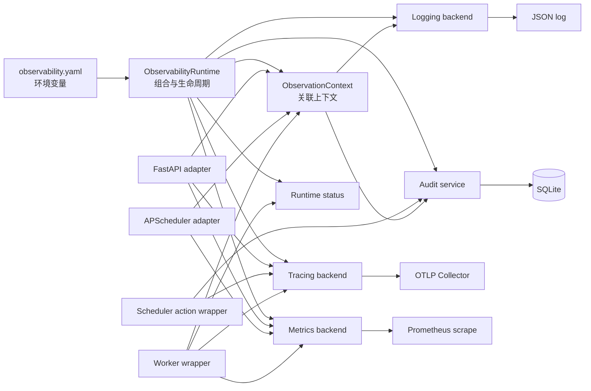
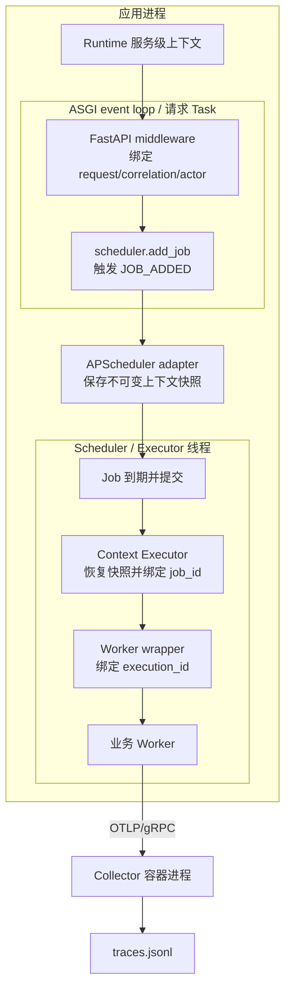

# Observability Integration Runtime

`observability` 是面向 Python 应用的可观测性组合层。它把结构化日志、Prometheus
指标、OpenTelemetry Trace、SQLite 审计和运行状态统一到一个
`ObservabilityRuntime` 中，并为 FastAPI、APScheduler 3.x 和同步/异步 Worker
提供不同的插桩入口。

这些对象可以任意组合，并不要求应用一定同时包含 FastAPI、Scheduler 和 Worker。
当前提供的三个 example 分别覆盖：

- `Runtime → Worker`
- `Runtime → Scheduler → Worker`
- `Runtime → FastAPI → Scheduler → Worker`，同时包含 `FastAPI → Worker` 直接调用

## 1. 功能介绍

### 1.1 统一配置与生命周期

`config/observability.yaml` 是配置入口。加载器支持 `${NAME:-default}` 环境变量替换，
并把稳定字段校验为不可变的 `ObservabilityConfig`；未知的稳定字段会被拒绝。第三方
库参数放在 `provider_options`、`exporter_options`、`processor_options` 或各
instrumentation 的 `options` 中。

Runtime 使用显式生命周期：

```text
created → starting → started → closing → closed
```

框架 route、middleware、listener 和 Executor 替换必须在宿主启动前完成；
`runtime.start()` 启动已经安装的 adapter，`runtime.close()` 逆序停止 adapter、卸载
结构并刷新 Trace exporter。启动失败时会回滚已经安装或启动的 adapter。

### 1.2 能力清单

| 能力 | 当前实现 | 主要输出 |
|---|---|---|
| 关联上下文 | 基于 `ContextVar` 的不可变 `ObservationContext` | 日志、审计及执行边界可读取统一关联字段 |
| 日志 | `structlog` JSON 日志、轮转文件、上下文字段注入、敏感字段清洗 | `observability.log` 或标准输出 |
| 指标 | 每个 Runtime 独立的 Prometheus registry | FastAPI 的 `GET /metrics`，或由代码直接读取 registry |
| Trace | 独立 OTel `TracerProvider`，支持比例采样、OTLP/gRPC 和 console exporter | OTLP Collector 或标准输出 |
| Audit | `AuditService` 和 SQLite store | `audit.sqlite3` |
| Status | Runtime 生命周期、backend、adapter 和 Worker 状态快照 | `runtime.status()`；FastAPI 中可自动提供 `GET /status` |
| FastAPI | 请求上下文、OTel HTTP span、Prometheus HTTP 指标 | request/correlation/actor 上下文、HTTP span 和 RED 指标 |
| APScheduler | 技术事件 listener、Job 上下文快照、Executor 上下文恢复 | scheduler 日志、指标以及传入 Job 的上下文 |
| Worker | 同步/异步 wrapper | execution ID、执行 span、成功/失败/取消指标及状态 |

上下文字段包括：

```text
service_name            service_instance_id
request_id              correlation_id
actor                   source
job_id                  execution_id
attributes
```

边界只补充或覆盖自己负责的字段。最终进入 Worker 时，`source` 是 `worker`，但上游的
`request_id`、`correlation_id`、`actor` 和 `job_id` 会继续保留。日志 processor 只
输出有值的字段，并在存在有效 OTel span 时追加 `trace_id` 和 `span_id`。

### 1.3 自动提供的 FastAPI 路由

向 `install_observability()` 传入 FastAPI `app` 后：

- `status.enabled=true` 时自动添加 `GET /status`；
- FastAPI instrumentation 和 metrics backend 均启用，且
  `expose_metrics=true` 时自动添加 `GET /metrics`；
- 当前不会给目标应用自动添加 `/health`；
- Collector 自身在 Compose 中另外提供 `http://127.0.0.1:13133/` 健康检查。

### 1.4 当前局限

1. 当前只提供 Python 接入，框架 adapter 仅覆盖 FastAPI 和 APScheduler 3.x。
2. APScheduler 上下文恢复支持其 `ThreadPoolExecutor` 和 `AsyncIOExecutor`：
   `BackgroundScheduler` 默认线程池、`AsyncIOScheduler` 的协程 Job，以及
   `AsyncIOExecutor` 把同步 Job 送入默认线程池的路径均被覆盖。`ProcessPoolExecutor`
   和自定义 Executor 尚不支持自动上下文恢复。
3. `ContextVar` 是进程内机制。跨进程 Worker、外部消息队列、远程 Scheduler 或其他
   服务边界，需要自行把关联字段写入消息并在消费端恢复；当前没有通用 carrier。
4. APScheduler adapter 会在启动前访问并替换 APScheduler 3.x Executor，依赖其当前
   内部接口；升级 APScheduler 大版本前必须重新做兼容性验证。
5. FastAPI 的内置 actor resolver 从请求头读取演示身份。生产应用必须确保这些请求头
   来自可信网关或认证层，不能把它当作身份认证本身。
6. Scheduler listener 只能记录“Job 已添加、提交、成功、失败、错过”等技术事实。
   “谁执行了创建、暂停、删除”等管理语义必须显式使用
   `observe_scheduler_action()`，才能记录对应 Trace 和 Audit。
7. FastAPI 审计 route class 已有基础实现，但当前没有由
   `install_observability()` 自动安装；三个 example 只演示 Scheduler 管理操作审计。
8. Audit 当前只支持本地 SQLite，没有集中式存储、保留策略、加密、访问控制或数据库
   迁移系统。
9. Prometheus 指标只保存在进程内存中，不持久化；非 FastAPI 应用不会自动获得
   `/metrics`，需要自行暴露 `runtime.metrics.registry`。
10. Status 是当前进程的即时快照，不是历史指标，也不等价于 liveness/readiness；
    非 FastAPI 应用通过 `runtime.status()` 获取，不会自动启动 HTTP 服务。
11. Logging 会配置进程全局 root logger 和 structlog。虽然 Metrics registry 和
    TracerProvider 属于各自 Runtime，但同一进程创建多个不同日志配置的 Runtime 时，
    后创建者可能影响先创建者的日志行为。
12. 示例 Collector 的 file exporter 是本地验证工具。`traces.jsonl` 每行是一次导出
    批次，一行可以包含多条 trace 和多个 span，不是面向生产查询的 Trace 后端。

## 2. 架构视图

### 2.1 逻辑视图



`ObservabilityRuntime` 是 composition root，但不拥有 FastAPI、Scheduler 或 Worker
的业务生命周期。宿主应用负责启动和停止这些对象；Runtime 只管理自己的 backend 和
instrumentation。

### 2.2 进程视图

不同对象必须使用不同的插桩方法：

| 目标对象或操作 | 插桩入口 | 安装时机 | 作用 |
|---|---|---|---|
| FastAPI app | `install_observability(config, app=app)` 或 `runtime.instrument_fastapi(app)` | app 启动前 | HTTP middleware、OTel FastAPI、Prometheus HTTP 指标、可选 `/metrics` |
| APScheduler 实例 | `install_observability(config, scheduler=scheduler)` 或 `runtime.instrument_apscheduler(scheduler)` | `scheduler.start()` 前 | listener、Job 上下文快照和受支持 Executor 替换 |
| Scheduler 管理操作 | `observe_scheduler_action(runtime, ..., action=callable)` | 每个需要语义审计的 create/pause/remove 等调用点 | 管理操作 span、成功/失败 Audit、操作上下文 |
| 同步或异步 Worker | `runtime.instrument_worker(name, worker)` | 注册/提交 Worker 前，并使用其返回值 | execution ID、执行 span、指标、状态和上下文绑定 |
| 普通业务日志 | `get_logger(__name__)` | Runtime 创建并配置日志后 | 自动读取当前上下文，不要求手工传递所有关联字段 |
| 无 FastAPI 的状态读取 | `runtime.status()` | 任意运行阶段 | 返回当前 Runtime 快照 |

一个包含 FastAPI、`BackgroundScheduler` 和 Worker 的单进程运行关系如下：



关键传播语义：

- 同一同步调用链或同一个 asyncio Task 中，`ContextVar` 自然可见。
- 切换到 APScheduler 线程池时，不能依赖线程自动继承 `ContextVar`。adapter 在 Job
  添加时保存不可变快照，在 Executor 真正执行 Job 时通过 `with` 作用域恢复。
- `AsyncIOScheduler + AsyncIOExecutor` 的协程 Job 在 asyncio Task 中恢复；同步 Job
  进入 event loop 默认线程池时也在工作线程中恢复。
- Worker wrapper 不关心调用方是否存在 FastAPI 或 Scheduler。它从同一 Runtime 的
  当前上下文继承已有字段，只增加新的 `execution_id` 并把 `source` 设为 `worker`。

因此，不同组合在 Worker 内可见的上下文逐步增加：

| 组合 | Worker 中可见的主要字段 |
|---|---|
| `Runtime → Worker` | service、instance、execution ID |
| `Runtime → Scheduler → Worker` | service、instance、job ID、execution ID |
| `Runtime → FastAPI → Worker` | service、instance、request/correlation/actor、execution ID |
| `Runtime → FastAPI → Scheduler → Worker` | service、instance、request/correlation/actor、job ID、execution ID |

### 2.3 开发视图

```text
observability/
├── __init__.py                 # 最小公共 API；不主动导入可选框架
├── runtime.py                  # composition root、backend 装配、生命周期
├── config/
│   ├── models.py               # Pydantic 强类型配置契约
│   ├── loader.py               # YAML、环境变量和本地路径解析
│   ├── observability.yaml      # 应用观测配置
│   ├── collector-config.yaml   # Collector receiver/processor/exporter
│   └── docker-compose.collector.yaml
├── context/                    # 不可变上下文、ContextVar 和各边界 bind 函数
├── instrumentation/
│   ├── base.py                 # adapter 生命周期 Protocol
│   ├── registry.py             # 安装、启动、逆序清理和失败回滚
│   ├── fastapi.py              # FastAPI adapter
│   ├── apscheduler.py          # APScheduler listener/Executor adapter
│   ├── task_scheduler.py       # Scheduler 管理操作 wrapper
│   └── task_runner.py          # 同步/异步 Worker wrapper
├── logs/                       # structlog 配置、上下文注入和脱敏
├── metrics/                    # 独立 Prometheus registry 与指标定义
├── trace/                      # 独立 OTel provider/exporter 生命周期
├── audit/                      # 审计模型、服务、SQLite store、FastAPI route class
├── status/                     # Runtime/adapter/Worker 状态模型和 FastAPI 路由
├── example/                    # 三种独立运行形态及其输出目录
└── test/                       # 单元测试
```

主要依赖方向为：

```text
public API → runtime → backend / instrumentation registry
instrumentation → context + runtime 提供的 backend
backend → config models
example → public API；不被生产模块反向依赖
```

新增框架 adapter 时，实现 `Instrumentation` 的四阶段契约：

1. `install(runtime)`：只在宿主启动前安装结构；中途失败必须可回滚。
2. `start()`：启动运行期资源，不再修改 route、middleware 等宿主结构。
3. `stop()`：停止自身资源，并允许关闭流程重复调用。
4. `uninstall()`：在资源停止后移除自身安装的结构。

扩展稳定配置字段时，应同步修改 `config/models.py`、YAML 和使用方；第三方库的开放
参数继续保留在对应 `options` 映射边界，避免把第三方 API 全部复制为内部 schema。

## 3. 使用三个 example

### 3.1 启动共享 Collector

三个 example 共用一个 Collector，但各自使用不同的 `service.instance.id`。从仓库根
目录执行：

```bash
source .env.local

docker compose \
  --env-file abc/observability/example/collector.env \
  -f abc/observability/config/docker-compose.collector.yaml \
  up -d
```

`collector.env` 注入配置文件和输出目录的宿主机路径。可以确认 Collector 已就绪：

```bash
curl http://127.0.0.1:13133/
```

示例默认向 `http://127.0.0.1:64317` 发送明文 OTLP/gRPC，并把采样率设为 `1.0`，
保证本地验证期间不在应用侧抽样。

### 3.2 Example 1：只有 Worker

文件：`example/worker.py`

```bash
python -m observability.example.worker
```

该进程不创建 FastAPI 或 Scheduler。它完成以下装配：

```python
runtime = install_observability(config)
runner = runtime.instrument_worker("example.worker.task", business_worker)
await runtime.start()
result = runner(21)
await runtime.close()
```

重点观察：Worker 继承 Runtime 的 `service_name` 和 `service_instance_id`，并生成自己的
`execution_id`。进程执行一次后打印 JSON 摘要并退出。

### 3.3 Example 2：Scheduler + Worker

文件：`example/scheduler_worker.py`

```bash
python -m observability.example.scheduler_worker
```

示例创建 `BackgroundScheduler` 和一次性 `DateTrigger` Job：

```python
runtime = install_observability(config, scheduler=scheduler)
runner = runtime.instrument_worker("example.scheduler.task", business_worker)
await runtime.start()
scheduler.start()
```

Job 的创建使用 `observe_scheduler_action()`，因此“创建任务”具备独立管理操作 span 和
Audit；Job 到期后，Scheduler adapter 在线程池入口恢复上下文并绑定 `job_id`，随后
Worker wrapper 追加 `execution_id`。执行完成后示例关闭 Scheduler 和 Runtime 并退出。

### 3.4 Example 3：FastAPI + Scheduler + Worker

文件：`example/fastapi_scheduler_worker.py`

```bash
python -m observability.example.fastapi_scheduler_worker
```

该服务使用 FastAPI lifespan 管理 Runtime 和 Scheduler：

```python
runtime = install_observability(config, app=app, scheduler=scheduler)
runner = runtime.instrument_worker("example.fastapi.task", business_worker)
```

可在另一个终端调用：

```bash
# 直接执行 HTTP → Worker
curl -X POST \
  -H 'x-request-id: demo-request-1' \
  -H 'x-correlation-id: demo-correlation-1' \
  -H 'x-actor: demo-user' \
  'http://127.0.0.1:8000/tasks/1/run'

# 执行 HTTP → Scheduler → Worker
curl -X POST \
  -H 'x-request-id: demo-request-2' \
  -H 'x-correlation-id: demo-correlation-2' \
  -H 'x-actor: scheduler-user' \
  'http://127.0.0.1:8000/schedules/demo-job?task_id=2&delay_seconds=1'

curl http://127.0.0.1:8000/status
curl http://127.0.0.1:8000/metrics
```

内嵌 Scheduler 与 Web 服务位于同一进程，示例固定使用一个 Uvicorn worker。生产环境
若启动多个 Web 进程，每个进程都会创建自己的 Scheduler；此时应把 Scheduler 独立
部署，或使用能够保证单实例/租约/fencing 的调度架构。

### 3.5 运行内嵌 doctest

三个 example 的 doctest 使用真实 Worker、`BackgroundScheduler` 和 FastAPI
`TestClient`，验证对应上下文、状态、指标、日志和审计文件：

```bash
python -m doctest -v \
  abc/observability/example/worker.py \
  abc/observability/example/scheduler_worker.py \
  abc/observability/example/fastapi_scheduler_worker.py
```

当前断言数分别为 10、8、8，共 26 项。它们验证本地组合行为，不等价于 Collector、
网络或生产 Trace 后端的完整集成测试。

### 3.6 查看输出

所有 example 文件输出都位于 `example/output/`，并互不覆盖：

```text
example/output/
├── worker/
│   ├── observability.log
│   └── audit.sqlite3
├── scheduler_worker/
│   ├── observability.log
│   └── audit.sqlite3
├── fastapi_scheduler_worker/
│   ├── observability.log
│   ├── server.log
│   └── audit.sqlite3
└── collector/
    └── traces.jsonl
```

Collector 输出可以通过 `service.instance.id` 区分三个 example：

```bash
jq -r '
  .. | objects
  | select(.key? == "service.instance.id")
  | .value.stringValue
' abc/observability/example/output/collector/traces.jsonl | sort -u
```

预期可看到：

```text
fastapi_scheduler_worker-01
scheduler_worker-01
worker-01
```

格式化查看 JSONL 时应逐行交给 `jq`。不要把文件原地改成一个格式化 JSON 数组，
因为 Collector 会继续以“一次导出批次一行”的方式追加。

停止 Collector：

```bash
docker compose \
  --env-file abc/observability/example/collector.env \
  -f abc/observability/config/docker-compose.collector.yaml \
  down
```
