<h1 class="title">Ingest 可观测性设计</h1>

<p class="subtitle">v0_8 · 20260819</p>

<style>
body { font-family: "Microsoft YaHei"; font-size: 16px; line-height: 1.75; color: #24292f; }
.title { font-family: "Microsoft YaHei"; font-size: 32px; line-height: 1.30; font-weight: 700; text-align: center; }
.subtitle { font-family: "Microsoft YaHei"; font-size: 18px; line-height: 1.50; font-weight: 400; text-align: center; }
h1 { font-family: "Microsoft YaHei"; font-size: 28px; line-height: 1.40; font-weight: 700; }
h2 { font-family: "Microsoft YaHei"; font-size: 22px; line-height: 1.40; font-weight: 700; }
h3 { font-family: "Microsoft YaHei"; font-size: 18px; line-height: 1.50; font-weight: 700; }
h4 { font-family: "Microsoft YaHei"; font-size: 16px; line-height: 1.50; font-weight: 700; }
p, li { font-family: "Microsoft YaHei"; font-size: 16px; line-height: 1.75; }
.figure-caption, .formula-caption { font-family: "Microsoft YaHei"; font-size: 14px; line-height: 1.50; font-weight: 600; text-align: center; margin: 0.65em 0 0.35em 0; }
.table-caption { font-family: "Microsoft YaHei"; font-size: 13px; line-height: 1.40; font-weight: 500; text-align: center; margin: 0.65em 0 0.35em 0; }
.mermaid, .mermaid text, .mermaid .label { font-family: "Microsoft YaHei" !important; font-size: 14px !important; line-height: 1.20; }
table { width: 100%; border-collapse: collapse; font-family: "Microsoft YaHei"; font-size: 13px; line-height: 1.45; }
table th, table td { padding: 0.40em 0.60em; vertical-align: top; }
code, pre { font-family: "Cascadia Code"; font-size: 14px; line-height: 1.50; }
p code, li code, td code { color: #24292f; background: #f3f4f6; padding: 0.08em 0.28em; border-radius: 3px; }
pre { color: #c9d1d9; background: #0d1117; padding: 1em; border-radius: 6px; overflow-x: auto; }
pre code { color: inherit; background: transparent; padding: 0; }
.mermaid { width: 100%; max-width: 100%; overflow-x: auto; }
.mermaid svg { max-width: 100% !important; height: auto !important; }
</style>

---

## 目录

1. [文档约定](#1-文档约定)
2. [文档定位与使用方式](#2-文档定位与使用方式)
3. [需求与设计目标](#3-需求与设计目标)
4. [逻辑视图——核心类与信息模型](#4-逻辑视图核心类与信息模型)
5. [逻辑视图——能力、Port 与 Adapter](#5-逻辑视图能力port-与-adapter)
6. [实现策略与业务代码侵入控制](#6-实现策略与业务代码侵入控制)
7. [过程视图](#7-过程视图)
8. [实际项目应用示例](#8-实际项目应用示例)
9. [开发视图](#9-开发视图)
10. [物理视图](#10-物理视图)
11. [场景视图](#11-场景视图)
12. [设计约束与演进](#12-设计约束与演进)
13. [附录 A：Python 扩展机制——Hook、Middleware 与 Event / Listener](#附录-a-python-扩展机制hookmiddleware-与-event--listener)

---

# 1. 文档约定

本章是全文的固定排版与表达规范。文档修订、补充和派生版本均应遵守本章，不再根据个人习惯调整字体、字号、行距、图题、表题、公式或代码样式。

## 1.1 字体约定

<p class="table-caption">表 1-1 文档字体与排版规范</p>

| 文档元素 | 字体 | 字号 | 行高 | 字重 | 对齐 |
|---|---|---:|---:|---:|---|
| 文档标题 | Microsoft YaHei | 32 px | 1.30 | 700 | 居中 |
| 文档副标题 | Microsoft YaHei | 18 px | 1.50 | 400 | 居中 |
| 一级标题 | Microsoft YaHei | 28 px | 1.40 | 700 | 左对齐 |
| 二级标题 | Microsoft YaHei | 22 px | 1.40 | 700 | 左对齐 |
| 三级标题 | Microsoft YaHei | 18 px | 1.50 | 700 | 左对齐 |
| 四级标题 | Microsoft YaHei | 16 px | 1.50 | 700 | 左对齐 |
| 正文 | Microsoft YaHei | 16 px | 1.75 | 400 | 左对齐 |
| 图题 | Microsoft YaHei | 14 px | 1.50 | 600 | 居中 |
| 表题/表格 | Microsoft YaHei | 13 px | 1.40~1.45 | 500/400 | 居中/左对齐 |
| 代码 | Cascadia Code | 14 px | 1.50 | 400 | 左对齐 |

## 1.2 绘图约定

1. 图形统一使用 Mermaid。
2. 每个 Mermaid 代码块第一行必须加入：

```text
%%{init: {"flowchart": {"useMaxWidth": true}}}%%
```

3. 每张图使用“图 章节号-序号”编号和普通图题样式。
4. 一张图只承担一个明确主旨，不混合架构、控制流、数据流和部署关系。

## 1.3 公式约定

行内公式使用 `$...$`，独立公式使用 `$$...$$`；正式公式使用 LaTeX，不使用普通文本模拟数学符号。

## 1.4 代码约定

多行代码使用带语言标识的围栏代码块；涉及当前实现的代码必须可回到 BlueCrystal 当前 `main` 核对；目标设计代码必须明确为目标示例，不伪装成已经实现。

---


# 2. 文档定位与使用方式

## 2.1 适用对象

本文适用于 BlueCrystal `Whale Ingest` 部署运行体系中的可观测性设计，重点覆盖当前 `Standalone` 运行模式，并为后续 `Worker`、`Source I/O`、`Publishing`、主备和集群运行模式保留演进边界。

本文覆盖：

- `Runtime`、Management Web API、`TaskScheduler`、未来 `Worker` 的日志、指标、诊断和审计设计；
- 可观测上下文、采集处理、存储与导出、查询展示接口；
- `observability` Python Package 的模块划分及与 `deploy` 的依赖关系；
- Standalone 本地闭环和后续外部 Observability Backend；
- Reference Implementation 与 Production Implementation 的边界。

## 2.2 目标

本文目标是建立一套低侵入、可逐步实现、底层技术可替换的 Observability 设计：

1. 明确 `Logs`、`Metrics`、`Diagnostics`、`Audit` 四类信息的语义边界；
2. 明确事实由哪些组件、在什么执行点产生；
3. 统一 `runtime_id`、`request_id`、`task_id`、`connection_id`、`node_id`；
4. 明确规范化、过滤、脱敏、聚合和状态投影规则；
5. 明确本地存储、进程内状态、持久化审计和未来外部导出的职责；
6. 明确 Health、Metrics、Diagnostics、Audit 的查询边界；
7. 保证 Observability 故障不得成为 Ingest 主链路故障源；
8. 保留自研 Reference Implementation，用于理解原理和验证语义。

## 2.3 设计依据与代码基线

本文延续 v0_3 的“信息模型 + 裁剪 4+1 视图”组织方法，并遵守《报告模板》和《软件系统建模图形与表达规范》。

本文 BlueCrystal 代码基线为 `main` 分支提交：

```text
fd386bc95ee9f9f5783c9c926fe91c92102275a8
```

该版本已经正式包含：

```text
abc/deploy/observability/
├── shared/
├── instrumentation/
└── logs/
```

其中已经实现：

- `ObservationContext` 与 `ContextVar` 传播；
- FastAPI Middleware Instrumentation；
- APScheduler Listener Instrumentation；
- `ObservedTaskRunner`；
- `InstrumentationHooks`；
- 结构化 Logs、Console Adapter 和 Rolling File Adapter。

本文中的 `metrics`、`diagnostics`、`audit` 详细实现和 `CompositeInstrumentationHooks` 属于已完成设计与本地候选实现、但在上述基线中尚未正式进入 `main` 的目标实现。

## 2.4 图形选择

<p class="table-caption">表 2-1 本文图形与主旨</p>

| 建模内容 | 主要问题 | 图形 |
|---|---|---|
| 四类信息与处理链 | 信息如何形成 | 关系流程图 |
| 核心对象 | 稳定类和 Snapshot 如何关联 | UML Class Diagram |
| Instrumentation | 哪个边界负责哪类事实 | 关系流程图 |
| HTTP/Task/Audit | 对象如何按时间交互 | UML Sequence Diagram |
| 源码组织 | Package 如何依赖 | Module/Package Dependency Diagram |
| Reference/Production | 两套实现如何共享语义 | 关系图 |
| Standalone 部署 | 进程、文件、SQLite 位于何处 | Deployment Diagram |

---

# 3. 需求与设计目标

## 3.1 Observability 定义

本文将 Observability 定义为：

> 运行系统持续产生可关联的运行信息，并对这些信息进行采集、处理、保存和查询，使运维人员或监控系统能够判断“系统现在怎么样、发生了什么、为什么异常以及谁改变了系统”。

其能力链包括：

1. **Observable Information**：系统观测什么；
2. **Instrumentation**：谁在什么位置产生事实；
3. **Collection & Processing**：如何补全、规范、过滤和聚合；
4. **Storage & Export**：信息保存在哪里、如何输出；
5. **Query & Presentation**：信息如何被查询和展示。

<p class="figure-caption">图 3-1 Observability 五层能力模型</p>

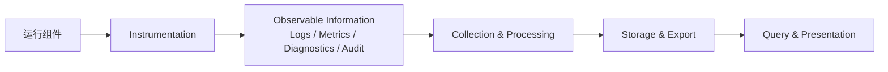

## 3.2 四类信息

<p class="table-caption">表 3-1 四类可观测信息</p>

| 类型 | 回答的问题 | 信息形态 | 典型用途 |
|---|---|---|---|
| `Logs` | 发生了什么 | 按时间记录的事件历史 | 故障定位、运行回溯 |
| `Metrics` | 运行得怎么样 | 可聚合数值 | 趋势、性能、容量、告警 |
| `Diagnostics` | 当前是什么状态、为什么异常 | 当前状态投影 | 运维查询、故障定位 |
| `Audit` | 谁改变了什么 | 持久化管理操作记录 | 追溯、责任定位、合规 |

一次 Task 失败可以同时形成：

```text
Log: task_execution_failed
Metric: task_execution_failures_total += 1
Diagnostic: last_error / last_failure_at 更新
```

但只有管理行为才产生 Audit。

## 3.3 P0 本地闭环

```text
Logs        -> Console + Rolling File
Metrics     -> In-memory Registry
Diagnostics -> In-memory Store
Audit       -> SQLite Local Store
```

普通 Logs 不进入 SQLite。Diagnostics 是当前投影，不设计成第二套事件数据库。

## 3.4 设计原则

1. **事实在最接近发生处产生**；
2. **同一事实只允许一个权威采集点**；
3. **同一事实允许形成多个观测维度**；
4. **统一上下文，分流处理**；
5. **机器字段优先，不依赖解析自然语言**；
6. **默认本地可诊断**；
7. **Observability 旁路化**；
8. **敏感数据统一脱敏**；
9. **严格控制 Metrics 高基数 Label**；
10. **业务语义稳定，底层实现可替换**。

## 3.5 分阶段目标

<p class="table-caption">表 3-2 分阶段范围</p>

| 阶段 | 范围 |
|---|---|
| P0 | Context、Logs、基础 Metrics、Runtime/Scheduler/Task Diagnostics、Audit 本地持久化、Health/Query |
| P1 | Worker/Connection/Source I/O/Publishing 指标与诊断、外部 Export |
| P2 | Distributed Tracing、多进程/多节点关联、集中式 Backend |

---

# 4. 逻辑视图——核心类与信息模型

## 4.1 核心类设计定位

可观测信息模型多数属于 Value Object、Record、Snapshot 或 Descriptor，不需要全部设计成复杂 Domain Entity。

## 4.2 `ObservationContext`

v0_8 将 `ObservationContext` 从“只存 ID”提升为**统一执行上下文**。原则是：

> **Context 保存“当前是谁 / 当前处于什么执行边界”；Hook 参数保存“本次事件发生了什么”。**

因此下列信息进入 Context：

| 类别 | 字段 |
|---|---|
| Runtime | `runtime_id`、`node_id` |
| HTTP Request | `request_id`、`http_method`、`http_path` |
| Identity | `actor`、`source` |
| Execution Subject | `task_id`、`connection_id` |
| Management Operation | `operation`、`target_type`、`target_id` |

而以下信息**不进入 Context**：

```text
status_code
duration_seconds
exception
scheduled_run_time
scheduled_run_times
```

它们属于某一次事件的事件载荷，继续作为 Hook 参数。

### 4.2.1 `ContextVar` 机制

同一个 `_CONTEXT` 在不同 asyncio Context 中可以映射到不同的不可变 `ObservationContext`：

```text
Context A -> request_id=R1, actor=user-a
Context B -> task_id=100
Context C -> task_id=200
```

`set()` 返回 Token，`reset(token)` 在退出边界时恢复进入前的 Context，因此 Middleware、Wrapper、Listener 和 Route Adapter 可以安全嵌套。

### 4.2.2 语义化 Context 边界

v0_8 不鼓励业务代码直接使用通用 `bind_observation_context()`，而由基础设施使用语义化绑定器：

```text
bind_request_context()
bind_task_execution_context()
bind_task_operation_context()
bind_scheduler_event_context()
bind_connection_context()
bind_operation_context()
```

边界规则：

| Boundary | 设置 | 主动清理 |
|---|---|---|
| Runtime | `runtime_id/node_id` | 其余为空 |
| HTTP Request | `request_id/method/path/actor/source` | Task/Connection/Operation |
| Task Execution | `task_id/source=scheduler` | HTTP/Actor/Connection/Operation |
| Task Operation | `task_id` | 保留当前 Request/Actor |
| Scheduler Event | `task_id/source=scheduler` | HTTP/Actor/Connection/Operation |
| Connection | `connection_id` | 保留上层 Task |
| Audit Operation | `operation/target_*` | 保留当前 Request/Actor |

这样 `ObservedTaskRunner` 与 HTTP Middleware 都会调用 Context Binder，但它们分别建立**不同的执行边界**，不是重复绑定同一职责。

## 4.3 Logs 核心对象

Reference Implementation 主要对象：

```text
LogEvent
LogLevel
ExceptionInfo
LogService
LogSink
```

`LogEvent` 至少包含：

```text
timestamp
level
component
event
message
runtime_id
node_id
request_id
task_id
connection_id
fields
exception
```

`event` 是稳定机器字段；`message` 只用于阅读。

## 4.4 Metrics 核心模型

P0 只需要：

```text
Counter
Gauge
Histogram
```

- Counter：累计次数；
- Gauge：当前值；
- Histogram：耗时等数值样本分布。

P0 推荐指标：

```text
scheduler_running
http_requests_total
http_request_failures_total
http_request_duration_seconds
http_requests_in_flight
task_executions_total
task_execution_failures_total
task_execution_cancellations_total
task_execution_duration_seconds
task_executions_in_flight
task_misfires_total
task_max_instances_skips_total
scheduler_task_operations_total
```

`scheduled_tasks`、`paused_tasks` 这类当前 Gauge 应由 Scheduler 当前 Snapshot 显式设置，不能通过操作事件简单加减推导。

Metrics Label 默认禁止使用：

```text
request_id
task_id
connection_id
point_id
带动态 ID 的 raw path
```

## 4.5 Diagnostics 核心模型

Diagnostics 是当前状态投影。

Task 状态必须分两个正交维度：

```text
TaskScheduleState:
    unknown
    scheduled
    paused
    removed

TaskExecutionState:
    idle
    running
    succeeded
    failed
    cancelled
```

一个 Task 可以同时：

```text
schedule_state = paused
execution_state = failed
```

主要对象：

```text
RuntimeDiagnostic
SchedulerDiagnostic
TaskDiagnostic
ConnectionDiagnostic（P1）
```

## 4.6 Audit 核心模型

Audit 仍以 `AuditRecord` 作为最终持久化记录，但在 v0_8 中增加两个关键对象：

```text
AuditContext
AuditSpec
```

`AuditContext` 保存一次管理调用中需要传播、但不应由业务函数反复传递的信息：

```text
actor
source
```

`request_id/runtime_id/node_id` 继续由公共 `ObservationContext` 提供。

`AuditSpec` 只声明“这个业务入口代表什么管理操作”：

```text
operation
target_type
target_arg
detail_args
```

例如：

```python
@audit_action(
    operation="task.pause",
    target_type="task",
    target_arg="task_id",
)
```

它不执行 Audit，也不包裹业务函数，只把 `AuditSpec` 作为元数据挂在 endpoint 上。

最终持久化的 `AuditRecord` 仍包含：

```text
audit_id
timestamp
runtime_id
node_id
request_id
actor
source
operation
target_type
target_id
result
detail
error_type
error_message
```

其中：

- `operation/target_type/target_arg` 来自 `AuditSpec`；
- `actor/source` 来自 `AuditContext`；
- `request_id/runtime_id/node_id` 来自 `ObservationContext`；
- `result/error` 由外层 Route Adapter 根据业务调用结果自动判断；
- timestamp 和 `audit_id` 由 `AuditService` 创建。

因此业务函数不再负责组织完整 `AuditRecord`。

# 5. 逻辑视图——能力、Port 与 Adapter

## 5.1 Capability-first 逻辑划分

Reference Implementation 延续 v0_3 的轻量结构：

```text
model -> service -> port <- adapter
```

不机械复制 `domain/application/usecase/core` 多层目录。

<p class="table-caption">表 5-1 P0 Port 与 Adapter</p>

| 能力 | Port | P0 Adapter | 持久性 |
|---|---|---|---|
| Logs | `LogSink` | `ConsoleLogSink` | 否 |
| Logs | `LogSink` | `RollingFileLogSink` | 是 |
| Metrics | `MetricRegistry` | `InMemoryMetricRegistry` | 否 |
| Diagnostics | `DiagnosticStore` | `InMemoryDiagnosticStore` | 否 |
| Audit | `AuditStore` | `SQLiteAuditStore` | 是 |

## 5.2 Logs

```text
LogInstrumentationHooks
    ↓
LogService
    ↓
LogSink
   ├── ConsoleLogSink
   └── RollingFileLogSink
```

`LogService` 负责结构化记录、补充 Context、统一脱敏、限制超长字段和 Sink fan-out。单个 Sink 失败不能中断其它 Sink，更不能覆盖业务结果。

Logs 自身故障不能再递归调用 Logs 报错，只能使用最小 stderr 或 Health degradation 通道。

## 5.3 Metrics

```text
MetricInstrumentationHooks
    ↓
MetricService
    ↓
MetricRegistry
    ↓
InMemoryMetricRegistry
```

Registry 保存聚合状态，不保存逐条事件历史。未来生产实现可由 `prometheus-client` 替换。

## 5.4 Diagnostics

```text
DiagnosticInstrumentationHooks
    ↓
DiagnosticService
    ↓
DiagnosticStore
    ↓
InMemoryDiagnosticStore
```

`DiagnosticService` 负责状态转换，Store 只保存当前投影。

## 5.5 Audit

v0_8 将 Audit 正式并入统一 `InstrumentationHooks` 管线。

Audit 的 HTTP Adapter 不再直接依赖 `AuditService`：

```text
HTTP Middleware
    ↓
bind_request_context()
    request_id/method/path/actor/source
    ↓
AuditedAPIRoute
    ↓
bind_operation_context()
    operation/target_type/target_id
    ↓
audit_operation_succeeded()
或
audit_operation_failed()
    ↓
CompositeInstrumentationHooks
    ↓
AuditInstrumentationHooks
    ↓
AuditService
    ↓
AuditStore
```

因此 `audit/` 与其它 capability 一样拥有：

```text
audit/instrumentation.py
```

`AuditInstrumentationHooks` 从 `ObservationContext` 取得 actor/source/request_id/operation/target，再把事件转换为 `AuditRecord`。

业务 endpoint 仍只需要：

```python
@audit_action(
    operation="task.pause",
    target_type="task",
    target_arg="task_id",
)
```

Router 不显式调用 `audit.success()/audit.failure()`。

## 5.6 Composite Instrumentation

v0_8 的 Composite 是统一 Producer-facing Hook Contract：

```text
Instrumentation Producer
        ↓
CompositeInstrumentationHooks
        ├── LogInstrumentationHooks
        ├── MetricInstrumentationHooks
        ├── DiagnosticInstrumentationHooks
        └── AuditInstrumentationHooks
```

一个关键调整是：

> capability consumer 可以只实现自己关心的 Hook，不再机械实现整个 `InstrumentationHooks`。

`CompositeInstrumentationHooks` 使用 `getattr()` 做可选分发。例如 Audit 只需要实现：

```text
audit_operation_succeeded
audit_operation_failed
```

而无需实现 HTTP、Scheduler、TaskRunner 的所有 no-op 方法。

这使 `InstrumentationHooks` 可以继续作为统一 Producer Contract，而 capability 侧保持低耦合。

# 6. 实现策略与业务代码侵入控制

## 6.1 总体原则

> **基础技术事实自动采集，业务语义事实显式产生。**

低侵入不等于“业务代码一行 Observability 都不能出现”。只有业务层知道的事实，显式一行 Semantic Hook 比从框架事件猜测更可靠。

## 6.2 Observability 插入点总览

从收到 Management HTTP Request，到 TaskScheduler 管理，再到 APScheduler 调度和真实 Task 执行，采用下表所示的扩展机制：

| 链路位置 | 插入方式 | 主要负责 |
|---|---|---|
| HTTP 请求 | FastAPI Middleware | Request Context；HTTP started / finished / failed |
| Audit 管理操作 | `@audit_action` + 自定义 `APIRoute` | operation / target；Audit success / failure |
| TaskScheduler 管理动作 | `ObservedTaskScheduler` Wrapper | scheduled / removed / paused / resumed / run_requested |
| APScheduler | Listener | scheduler started / stopped；misfire；max_instances |
| Task 执行 | `ObservedTaskRunner` Wrapper | execution started / succeeded / failed / cancelled |

其中前三条技术执行链可简化理解为：

| 链路位置 | 插入方式 | 主要负责 |
|---|---|---|
| HTTP 请求 | FastAPI Middleware | request context、HTTP started/finished/failed |
| APScheduler | Listener | scheduler started/stopped、misfire、max_instances |
| Task 执行 | Wrapper / `ObservedTaskRunner` | execution started/succeeded/failed/cancelled |

<p class="figure-caption">图 6-1 Observability 全链路插入位置</p>

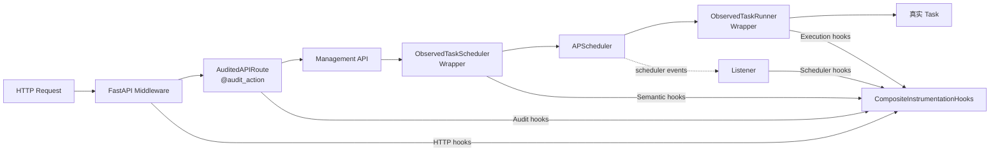

这里应区分：

- **TaskScheduler**：BlueCrystal 的管理语义层，知道 `schedule/remove/pause/resume/run_now`；
- **APScheduler**：底层调度框架，只产生自身技术事件；
- **ObservedTaskRunner**：真正 Task 函数的执行边界；
- **AuditedAPIRoute**：管理操作的审计边界。

## 6.3 FastAPI Middleware

v0_8 使用一个统一 HTTP Observability Middleware 建立 HTTP Context：

```python
with bind_request_context(
    request_id=request_id,
    method=request.method,
    path=request.url.path,
    actor=actor_resolver(request),
    source="http",
):
    ...
```

因此后续 Hook 不再重复传递：

```text
request_id
method
path
actor
source
```

例如：

```python
hooks.http_request_finished(
    status_code=response.status_code,
    duration_seconds=duration,
)
```

其中 `status_code/duration_seconds` 是事件载荷，保留为参数。

## 6.4 APScheduler Listener

当前 `APSCHEDULER_OBSERVABILITY_EVENT_MASK` 只包含：

```text
EVENT_SCHEDULER_STARTED
EVENT_SCHEDULER_SHUTDOWN
EVENT_JOB_MISSED
EVENT_JOB_MAX_INSTANCES
```

原因是 Listener 只负责 APScheduler 自己最可靠知道的 Scheduler 技术事实。

Task 成功、失败和耗时已经由 `ObservedTaskRunner` 负责；如果 Listener 再根据 `EVENT_JOB_EXECUTED` / `EVENT_JOB_ERROR` 产生同一事实，会导致：

```text
重复 Log
Counter 翻倍
Diagnostic 重复更新
```

`EVENT_JOB_MODIFIED` 也不直接映射 `task_paused`，因为它不能区分 pause、resume、reschedule、replace 等业务语义。

因此该常量更准确的含义是：

> APScheduler Listener 负责的技术事件集合。

后续可考虑更名为 `APSCHEDULER_TECHNICAL_EVENT_MASK` 或 `APSCHEDULER_LISTENER_EVENT_MASK`。

## 6.5 TaskRunner Wrapper

`ObservedTaskRunner` 是真正的 Task Execution Context 边界：

```python
with bind_task_execution_context(task_id):
    hooks.task_execution_started()
    ...
```

进入该边界时：

```text
保留：runtime_id / node_id
设置：task_id / source=scheduler
清空：request_id / method / path / actor / connection_id / operation
```

因此即使 Task 由 HTTP `run_now` 触发，真正的异步 Task 生命周期也不会错误继承 HTTP request_id。

Hook 从：

```python
hooks.task_execution_succeeded(
    task_id=task_id,
    duration_seconds=duration,
)
```

简化为：

```python
hooks.task_execution_succeeded(
    duration_seconds=duration,
)
```

`task_id` 由 capability instrumentation 自己从 `ObservationContext` 读取。

## 6.6 TaskScheduler Semantic Wrapper

v0_8 不再让 Router 显式调用 `observe_task_paused()` 等 helper。

Composition Root 只包装一次：

```python
scheduler = instrument_task_scheduler(
    raw_scheduler,
    hooks,
)
```

业务 Router 之后只调用原始业务接口：

```python
scheduler.pause(task_id)
scheduler.resume(task_id)
scheduler.run_now(task_id)
```

`ObservedTaskScheduler` 在真实动作成功后自动产生 Semantic Hook：

```python
def pause(self, task_id: int):
    result = self._scheduler.pause(task_id)

    with bind_task_operation_context(task_id):
        safe_observe(self._hooks.task_paused)

    return result
```

因此：

```text
真实动作成功
    ↓
建立 Task Operation Context
    ↓
Semantic Hook
```

真实动作失败则不会错误产生成功语义 Hook。Semantic Fact 仍是显式定义，但不再侵入 Router。

## 6.7 Instrumentation 权威事实源

<p class="figure-caption">图 6-1 v0_8 Instrumentation 责任划分</p>

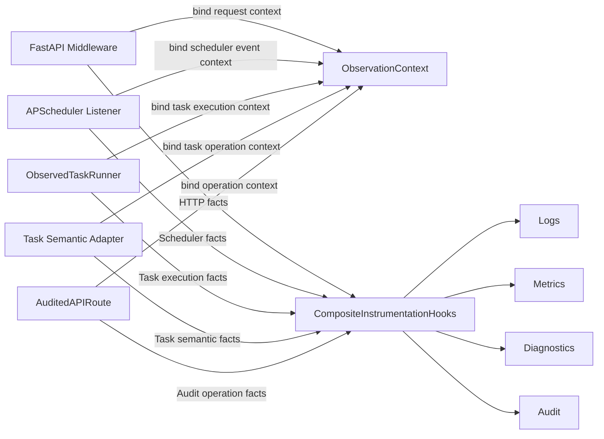

同一事实只有一个权威 Producer；所有 consumer 从同一个 Context 读取关联信息。

## 6.8 Context Scope

Context 的边界建立统一交给 Middleware、Wrapper、Listener、Route Adapter 或 semantic helper，业务函数不直接操作 `_CONTEXT`。

判断标准：

| 信息 | 归属 |
|---|---|
| 当前 request/task/connection/actor/operation | `ObservationContext` |
| status/duration/exception/scheduled time | Hook 参数 |

因此不存在“所有 Hook 参数都放进 Context”的设计。Context 是执行环境，Hook 参数是事件载荷。

## 6.9 Audit 的声明式接入

Audit 现在与 Logs/Metrics/Diagnostics 使用同一条 Hook 总线。

`AuditedAPIRoute`：

```text
读取 @audit_action -> AuditSpec
绑定 operation/target 到 ObservationContext
执行 endpoint
成功 -> hooks.audit_operation_succeeded(...)
失败 -> hooks.audit_operation_failed(...)
```

`AuditInstrumentationHooks`：

```text
get_observation_context()
    ↓
actor/source/request_id/operation/target
    ↓
AuditService.success()/failure()
```

因此：

```text
业务语义声明显式
Context 注入自动
Audit 事实产生自动
Audit 持久化消费自动
```

并且 Audit 不再需要独立 `AuditContext`。

## 6.10 `safe_observe`

自动 Instrumentation 必须保证：

```text
业务成功 + Observability 失败 -> 业务仍成功
业务异常 + Observability 失败 -> 原业务异常仍是主异常
```

Audit 是否允许 fail-open 可通过严格模式单独控制，但属于安全策略，不由普通 Logs 决定。

---

# 7. 过程视图

## 7.1 HTTP Request

<p class="figure-caption">图 7-1 HTTP Request 观测时序</p>

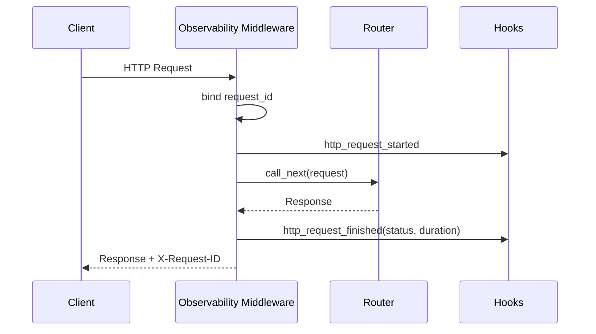

## 7.2 Task Execution

<p class="figure-caption">图 7-2 Task Execution 观测时序</p>

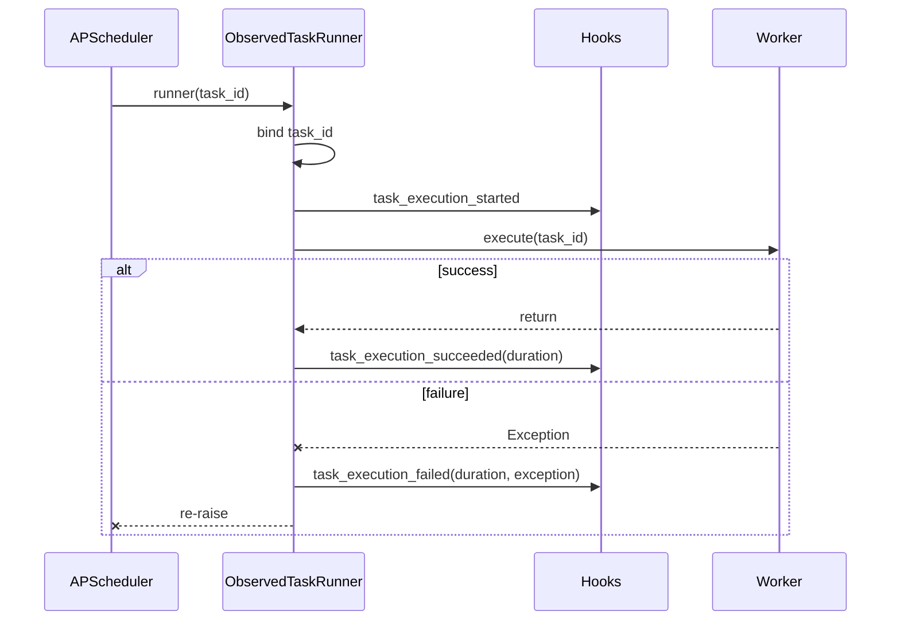

## 7.3 APScheduler Misfire

<p class="figure-caption">图 7-3 Misfire 观测流程</p>

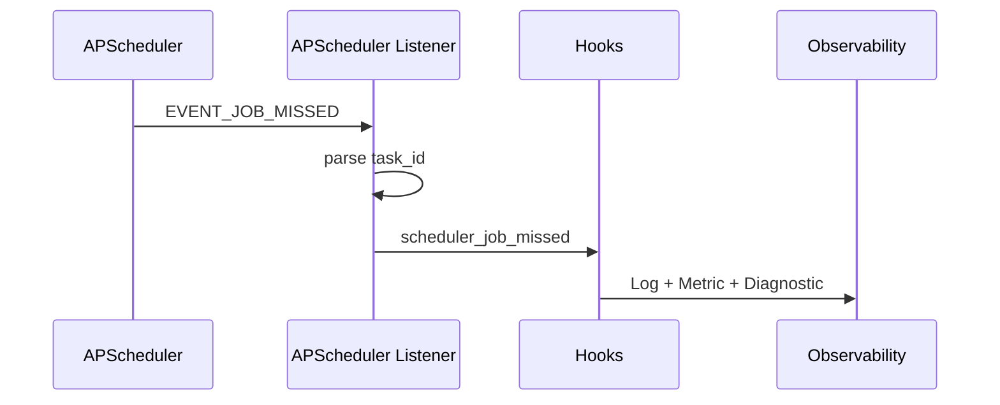

## 7.4 Audit

<p class="figure-caption">图 7-4 声明式 Audit 流程</p>

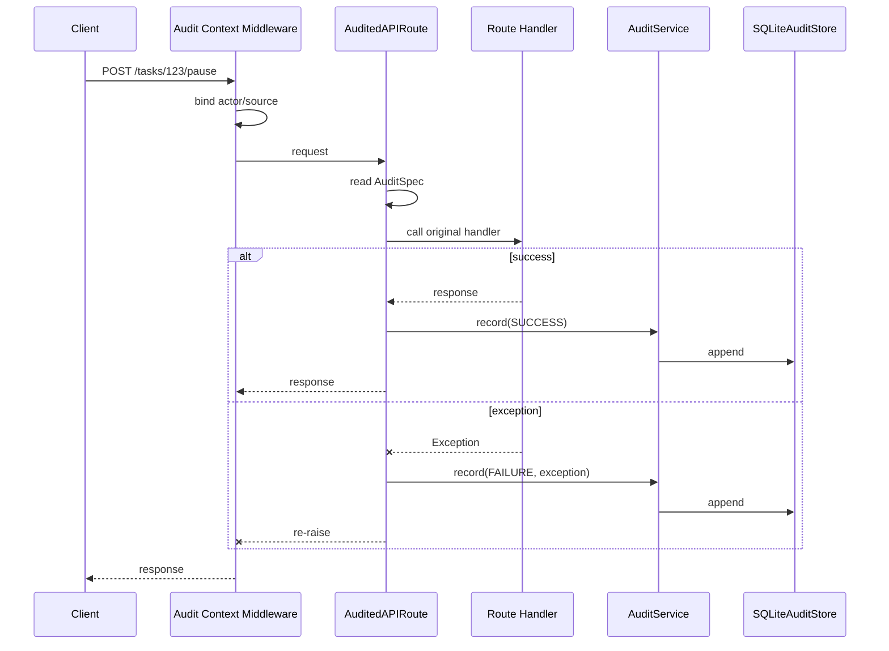

业务 Handler 不出现 `audit.success()`、`audit.failure()` 或为 Audit 服务的 try/except。

## 7.5 Context Scope

<p class="figure-caption">图 7-5 Observation Context Scope</p>

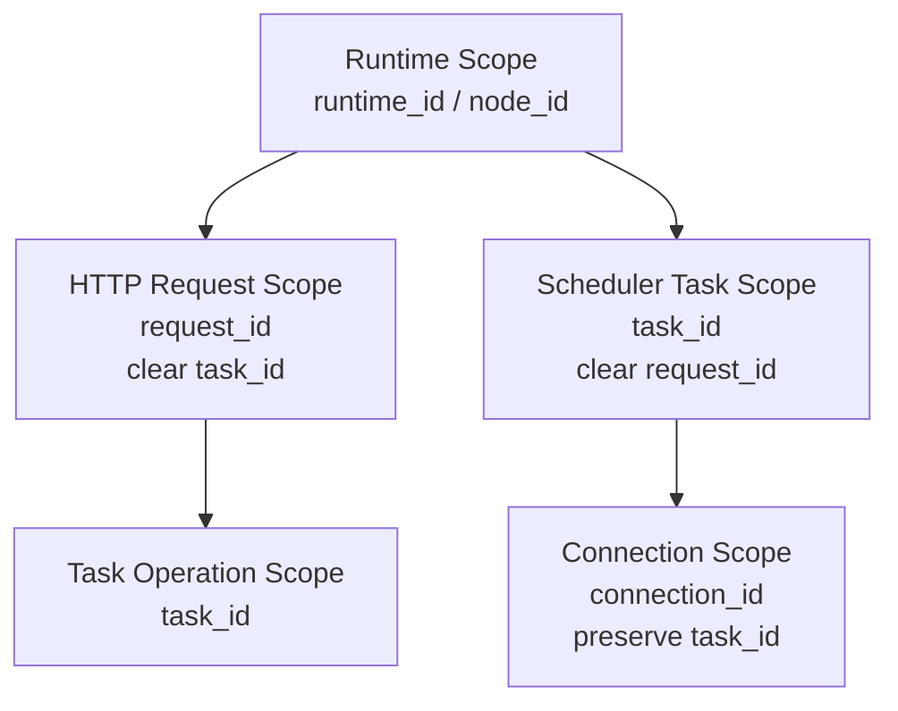

---

# 8. 可运行的最小应用示例

v0_8 将 Task Semantic Hook 从 Router 中移出，统一由 `ObservedTaskScheduler` Wrapper 产生。

## 8.1 五类插入机制

| 链路位置 | 插入机制 |
|---|---|
| HTTP | Middleware |
| Audit | Decorator Metadata + APIRoute Wrapper |
| TaskScheduler Semantic | Wrapper |
| APScheduler | Listener |
| Task Execution | Wrapper |

因此 Router 只表达业务动作：

```python
scheduler.pause(task_id)
scheduler.resume(task_id)
scheduler.run_now(task_id)
```

## 8.2 Pause 请求完整链路

<p class="figure-caption">图 8-1 Pause 请求完整 Observability 链路</p>

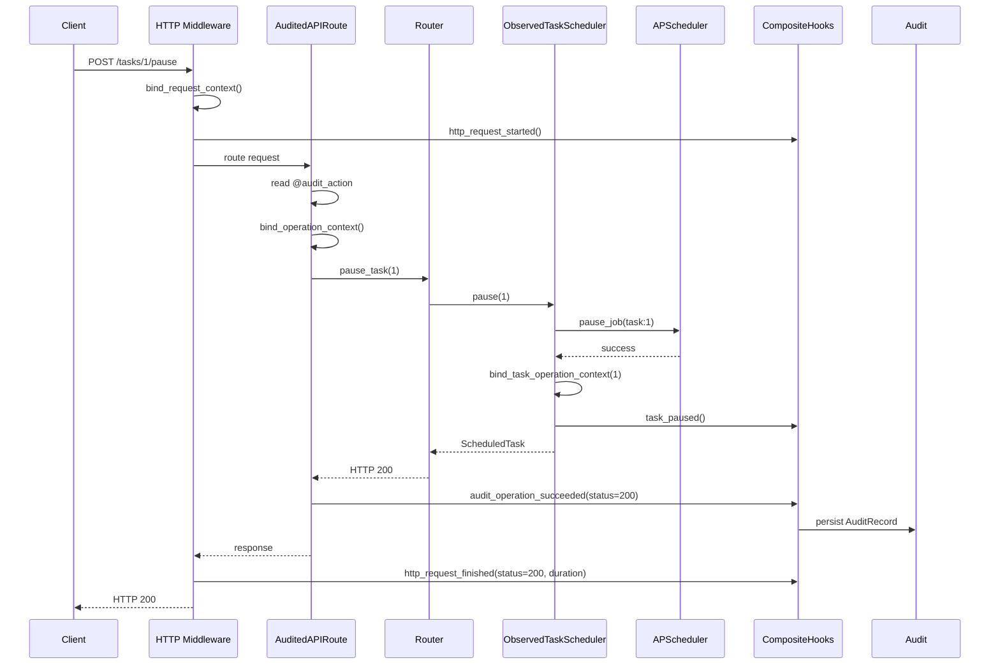

## 8.3 完整 `observability_example_app_v4.py`

```python
"""FastAPI + APScheduler + Observability Reference v0_8.

关键规则：
1. Context 只在 Middleware / Wrapper / Route Adapter / semantic helper 边界注入；
2. Hook 不再重复传 request_id/task_id/method/path/actor 等 Context 数据；
3. Audit 进入统一 CompositeInstrumentationHooks。
"""

from __future__ import annotations

import asyncio
from contextlib import asynccontextmanager
from pathlib import Path

import uvicorn
from fastapi import FastAPI, HTTPException
from fastapi.encoders import jsonable_encoder

from observability_reference.audit import (
    AuditInstrumentationHooks,
    AuditQuery,
    AuditService,
    audit_action,
    install_fastapi_audit,
)
from observability_reference.audit.adapters import SQLiteAuditStore
from observability_reference.diagnostics import (
    DiagnosticInstrumentationHooks,
    DiagnosticService,
    InMemoryDiagnosticStore,
)
from observability_reference.instrumentation import (
    CompositeInstrumentationHooks,
    install_apscheduler_instrumentation,
    install_fastapi_instrumentation,
    instrument_task_runner,
    instrument_task_scheduler,
)
from observability_reference.logs import LogInstrumentationHooks, LogService
from observability_reference.logs.adapters import ConsoleLogSink, RollingFileLogSink
from observability_reference.metrics import (
    InMemoryMetricRegistry,
    MetricInstrumentationHooks,
    MetricService,
)
from observability_reference.shared import initialize_runtime_context
from observability_reference.task_scheduler_reference import (
    ScheduledTaskNotFoundError,
    TaskScheduler,
)


TASK_ID = 1
RECURRING_JOB_ID = f"task:{TASK_ID}"

initialize_runtime_context(
    runtime_id="observability-reference-demo",
    node_id="local",
)

logs = LogService(
    [
        ConsoleLogSink(),
        RollingFileLogSink(
            Path("data/observability-reference/app.log"),
            max_bytes=5 * 1024 * 1024,
            backup_count=3,
        ),
    ]
)
metrics = MetricService(InMemoryMetricRegistry())
diagnostics = DiagnosticService(InMemoryDiagnosticStore())
audit = AuditService(
    [
        SQLiteAuditStore(
            Path("data/observability-reference/audit.sqlite3")
        )
    ],
    strict=False,
)

hooks = CompositeInstrumentationHooks(
    [
        LogInstrumentationHooks(logs),
        MetricInstrumentationHooks(metrics),
        DiagnosticInstrumentationHooks(diagnostics),
        AuditInstrumentationHooks(audit),
    ]
)


async def demo_task(task_id: int) -> None:
    """真实业务 Task 不主动操作 ObservationContext."""

    print(f"demo task running: task_id={task_id}")
    await asyncio.sleep(1)


observed_task = instrument_task_runner(
    demo_task,
    hooks,
)

raw_scheduler = TaskScheduler(observed_task)

install_apscheduler_instrumentation(
    raw_scheduler.apscheduler,
    hooks,
)

scheduler = instrument_task_scheduler(
    raw_scheduler,
    hooks,
)


@asynccontextmanager
async def lifespan(app: FastAPI):
    diagnostics.runtime_starting()

    scheduler.schedule_interval(
        TASK_ID,
        interval_ms=5000,
    )

    scheduler.start()
    diagnostics.runtime_started()

    try:
        yield
    finally:
        diagnostics.runtime_stopping()

        if scheduler.running:
            scheduler.stop()

        diagnostics.runtime_stopped()
        audit.flush()
        audit.close()
        logs.flush()
        logs.close()


app = FastAPI(
    title="Observability Reference v0_8",
    lifespan=lifespan,
)

# 统一 HTTP Middleware 同时建立：
# request_id / method / path / actor / source
install_fastapi_instrumentation(
    app,
    hooks,
)

# Audit Adapter 不再持有 AuditService，只产生统一 Hook。
install_fastapi_audit(
    app,
    hooks,
)


@app.get("/")
async def root() -> dict[str, object]:
    return {
        "name": "observability-reference-v0_8",
        "task_id": TASK_ID,
        "interval_seconds": 5,
    }


@app.post("/tasks/{task_id}/run")
@audit_action(
    operation="task.run",
    target_type="task",
    target_arg="task_id",
)
async def run_task_once(task_id: int) -> dict[str, object]:
    scheduler.run_now(task_id)

    return {
        "task_id": task_id,
        "submitted": True,
    }


@app.post("/tasks/{task_id}/pause")
@audit_action(
    operation="task.pause",
    target_type="task",
    target_arg="task_id",
)
async def pause_task(task_id: int) -> dict[str, object]:
    try:
        scheduler.pause(task_id)
    except ScheduledTaskNotFoundError as exc:
        raise HTTPException(
            status_code=404,
            detail="task not found",
        ) from exc


    return {
        "task_id": task_id,
        "paused": True,
    }


@app.post("/tasks/{task_id}/resume")
@audit_action(
    operation="task.resume",
    target_type="task",
    target_arg="task_id",
)
async def resume_task(task_id: int) -> dict[str, object]:
    try:
        scheduler.resume(task_id)
    except ScheduledTaskNotFoundError as exc:
        raise HTTPException(
            status_code=404,
            detail="task not found",
        ) from exc


    return {
        "task_id": task_id,
        "paused": False,
    }


@app.get("/metrics")
async def get_metrics():
    return jsonable_encoder(metrics.snapshot())


@app.get("/diagnostics/runtime")
async def get_runtime_diagnostic():
    return jsonable_encoder(diagnostics.runtime())


@app.get("/diagnostics/scheduler")
async def get_scheduler_diagnostic():
    return jsonable_encoder(diagnostics.scheduler())


@app.get("/diagnostics/tasks/{task_id}")
async def get_task_diagnostic(task_id: int):
    diagnostic = diagnostics.task(task_id)

    if diagnostic is None:
        raise HTTPException(
            status_code=404,
            detail="task diagnostic not found",
        )

    return jsonable_encoder(diagnostic)


@app.get("/audit")
async def get_audit():
    return jsonable_encoder(
        audit.query(
            AuditQuery(limit=100)
        )
    )


if __name__ == "__main__":
    uvicorn.run(
        app,
        host="127.0.0.1",
        port=8000,
    )
```

## 8.4 启动

```bash
python -m observability_reference.observability_example_app_v4
```

---

# 9. 开发视图

## 9.1 当前 `main` 状态

当前代码基线中：

```text
abc/deploy/observability/
├── shared/
├── instrumentation/
└── logs/
```

`metrics`、`diagnostics`、`audit` 仍属于目标实现/本地候选实现，评审时不得写成已进入 `main`。

## 9.2 Reference Implementation

v0_8 Reference Implementation 目录：

```text
observability_reference/
├── shared/
│   └── context.py
├── instrumentation/
│   ├── hooks.py
│   ├── composite.py
│   ├── fastapi.py
│   ├── apscheduler.py
│   ├── task_runner.py
│   └── task_scheduler.py
├── logs/
│   ├── instrumentation.py
│   ├── models.py
│   ├── ports.py
│   ├── service.py
│   └── adapters/
├── metrics/
│   ├── instrumentation.py
│   ├── models.py
│   ├── ports.py
│   ├── service.py
│   └── adapters/
├── diagnostics/
│   ├── instrumentation.py
│   ├── models.py
│   ├── ports.py
│   ├── service.py
│   └── adapters/
├── audit/
│   ├── instrumentation.py
│   ├── decorators.py
│   ├── fastapi.py
│   ├── models.py
│   ├── ports.py
│   ├── service.py
│   └── adapters/
├── task_scheduler_reference.py
└── observability_example_app_v4.py
```

Audit 的独立 `context.py` 已删除，actor/source 与 management operation 合并进入统一 `ObservationContext`。

## 9.3 Production Implementation

生产实现可以逐步采用成熟库：

```text
logs        -> structlog + stdlib logging
metrics     -> prometheus-client
FastAPI     -> OpenTelemetry FastAPI Instrumentation（可选）
diagnostics -> BlueCrystal 自定义
audit       -> BlueCrystal 自定义 + SQLAlchemy/SQLite
```

Reference 与 Production 共享的是“语义契约”，不是完全一致的代码结构。

## 9.4 依赖规则

Production Runtime：

```text
可以 import deploy.observability
禁止 import deploy.observability_reference
```

Reference 不能成为生产代码的传递依赖。

<p class="figure-caption">图 9-1 Reference 与 Production 关系</p>

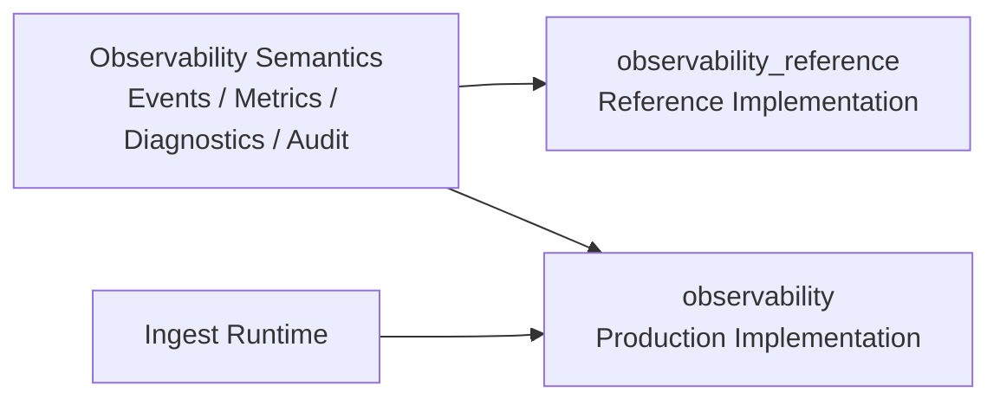

## 9.5 Semantic Contract Test

对关键事实建立对照测试。例如 `task_execution_succeeded`，Reference 与 Production 都必须满足：

```text
task_executions_total 增加
duration 被记录
TaskDiagnostic.execution_state = succeeded
last_success_at 更新
```

Reference 因而不仅是学习代码，也可以作为生产实现的语义基准。

---

# 10. 物理视图

## 10.1 Standalone P0 部署

<p class="figure-caption">图 10-1 Standalone Observability Deployment</p>

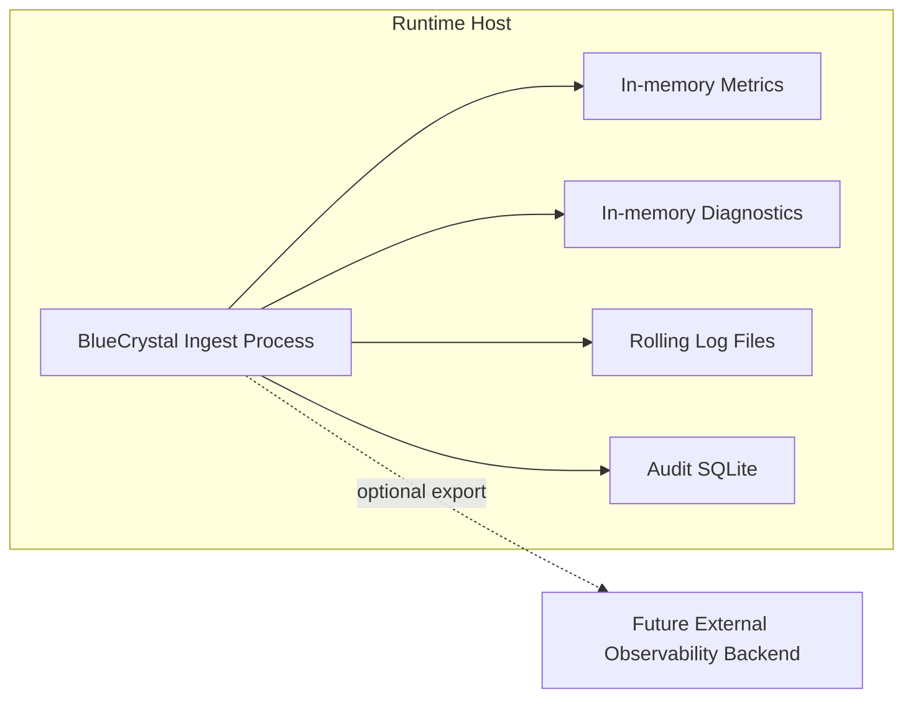

## 10.2 本地容量边界

- Rolling Log 必须限制文件大小、数量或总容量；
- SQLite Audit 应规划归档/保留策略；
- In-memory Metrics/Diagnostics 不得无限扩展高基数 Key；
- 外部 Export 不得使用无界队列吸收长期故障。

## 10.3 外部 Backend

未来可选：

```text
Logs    -> Loki / ELK / OpenTelemetry Collector
Metrics -> Prometheus / OpenTelemetry
Tracing -> OpenTelemetry
```

外部 Backend 故障必须 fail-open，不影响采集、调度和控制主链路；Audit 是否允许 fail-open 由安全策略单独确定。

---

# 11. 场景视图

## 11.1 Runtime 启动

期望：

- 初始化 `runtime_id`；
- Scheduler Started 形成 Log/Metric/Diagnostic；
- Health 反映 Runtime/Scheduler 状态；
- Logs/Audit 本地存储可用。

## 11.2 HTTP 查询

期望：

- 自动生成/接收 `request_id`；
- 产生 HTTP Metric；
- 普通 GET 不产生无意义 Audit；
- HTTP 异常不泄露 Authorization/Token。

## 11.3 Task 执行成功

期望：

- `ObservedTaskRunner` 绑定 `task_id`；
- 自动记录开始、成功、duration；
-成功 Counter 增加；
- Diagnostic 更新 `last_success_at`；
- APScheduler Listener 不重复产生 success 事实。

## 11.4 Task 执行失败

期望：

- 原业务异常继续抛出；
- Log 保存异常摘要；
- failure Counter 增加；
- Diagnostic 更新 `last_error`；
- Observability 内部失败不得覆盖业务异常。

## 11.5 Scheduler Misfire

期望：

- 由 APScheduler Listener 产生一次权威 misfire；
- 不启动 Worker；
- Log/Metric/Diagnostic 同步更新；
- 可通过 `task_id` 关联。

## 11.6 管理 API 暂停 Task

期望：

- Router 只声明 `@audit_action(operation="task.pause", ...)`；
- Router 不显式调用 `audit.success()/failure()`；
- Audit Context Middleware 自动取得 actor/source；
- FastAPI HTTP Instrumentation 自动提供 `request_id`；
- Scheduler 真正 pause 成功后产生 `task_paused` Semantic Hook；
- Logs/Metrics/Diagnostics 自动更新；
- `AuditedAPIRoute` 根据最终响应或异常自动形成 SUCCESS/FAILURE Audit；
- Audit 自动关联 `actor/request_id/target_id`。

## 11.7 外部 Observability Backend 故障

期望：

- 本地日志继续写入；
- In-memory Metrics/Diagnostics 继续更新；
- Scheduler/Task 不失败；
- Export 失败本身可诊断；
- 不允许递归使用 Logs 记录 Logs 自身故障。

---

# 12. 设计约束与演进

## 12.1 P0 完成判据

目标 P0：

```text
Shared Context
+ FastAPI Middleware
+ APScheduler Listener
+ TaskRunner Wrapper
+ Semantic Hooks
+ Logs
+ Metrics
+ Diagnostics
+ Audit
+ Health/Metrics/Diagnostics/Audit Query
+ Runtime Composition/Wiring
+ 端到端验证
```

只有“能力代码存在”还不能视为完成 P0。必须完成 Composition Root、Runtime 接入、Query API 和端到端验证后，才能称为“具备基本可观测能力”。

## 12.2 Reference Implementation

完整自研版本保留，不删除。

其目的：

- 理解 `ContextVar`、Token、Scope；
- 理解 Middleware/Listener/Wrapper；
- 理解结构化 Log pipeline；
- 理解 Counter/Gauge/Histogram；
- 理解当前状态投影；
- 理解 Audit 与普通日志边界；
- 为 Production Implementation 提供语义参考。

Production Runtime 禁止依赖 Reference。

## 12.3 第三方库演进

<p class="table-caption">表 12-1 Reference 与 Production 候选映射</p>

| 能力 | Reference | Production 候选 |
|---|---|---|
| Logs | 自研 `LogService/LogSink` | `structlog + logging` |
| Metrics | 自研 Registry | `prometheus-client` |
| HTTP 自动插桩 | 自研 Middleware | OpenTelemetry FastAPI Instrumentation |
| Context | 自研 `ContextVar` | 保留薄层或对接 OTel Context |
| APScheduler | 自研薄 Listener | 保留 |
| Task Execution | 自研 Wrapper | 保留 |
| Diagnostics | 自研 | 保留 |
| Audit | 自研业务层 | 保留，存储可用 SQLAlchemy |
| Tracing | 不实现 | OpenTelemetry |

## 12.4 关键非功能约束

1. Observability 不得在采集热路径执行无界网络 I/O；
2. Rolling File 和 Audit SQLite 必须有容量边界；
3. 敏感字段统一脱敏；
4. Metric Label 严格控制基数；
5. Audit 不受普通 Log Level 和 Rolling Policy 影响；
6. Diagnostics 只维护当前状态和必要摘要；
7. Adapter 故障不能向核心业务链路传播；
8. 同一事实只能存在一个权威采集点；
9. Instrumentation 不承载业务规则；
10. Capability 不形成横向循环依赖；
11. Composition Root 是唯一集中创建具体 Adapter 的位置；
12. Reference Implementation 不进入生产依赖链；
13. 当前实现状态和目标设计状态必须明确区分；
14. FastAPI Audit 采用声明式元数据，业务 Router 不显式编排 `audit.success()/failure()`；
15. actor/source 由请求上下文统一建立，业务函数不重复解析身份；
16. Audit 的业务语义必须显式声明，但 Audit 控制流必须由基础设施自动完成；
17. Hook 不重复传递 Context 已有字段；
18. Context 只允许保存执行环境，不保存 duration/status/exception 等事件载荷；
19. Context 由 Middleware/Wrapper/Listener/Route Adapter 等边界统一建立；
20. Audit 必须进入统一 CompositeInstrumentationHooks；
21. Semantic Hook 不得散落在 Router，应由 TaskScheduler Wrapper/Adapter 在真实动作成功后产生。

## 12.5 推荐后续实现顺序

1. 将完整自研实现整理为 `observability_reference`；
2. 确定 Production `observability` 的第三方库选型；
3. 增加 `CompositeInstrumentationHooks` 或生产等价机制；
4. 在 `StandaloneRuntime` 完成 Composition Root；
5. 接入 FastAPI Instrumentation；
6. 接入 APScheduler Listener；
7. 使用 `ObservedTaskRunner` 包装真实 Task Runner；
8. 在 `TaskScheduler` 成功操作点增加 Semantic Hooks；
9. 接入 `AuditContext + @audit_action + AuditedAPIRoute` 声明式 Audit；
10. 增加 Health/Metrics/Diagnostics/Audit Router；
11. 建立端到端 Observability 测试；
12. 再扩展 Connection、Source I/O、Publishing 和外部 Backend。

## 12.6 P1/P2 演进

P1：

- `ConnectionDiagnostic`；
- Source I/O 与 Publishing 指标；
- connection lifecycle semantic hooks；
- 外部 Log/Metric Adapter；
- 告警规则。

P2：

- `node_id` 全面启用；
- Distributed Tracing；
- 跨节点 Query/Correlation；
- 集中式 Observability Backend；
- 多节点 Metric 聚合与 Runtime ownership 诊断。

---

---

# 附录 A Python 扩展机制：Hook、Middleware 与 Event / Listener

本附录整合自《Python 扩展机制：Hook、Middleware 与 Event / Listener》v0_2。为避免与正文第 1 章重复，原附件中的文档约定不重复收录；Hook、Middleware、Event / Listener 的概念、基础 Python 实现、FastAPI Middleware 机制和 APScheduler 风格 Event Mask 示例按附件内容保留并调整为附录编号。

## A.1 概述

### A.1.1 为什么需要扩展机制

业务程序通常存在两类逻辑：

1. **主业务逻辑**：例如执行任务、处理 HTTP 请求、调度 Job。
2. **横切逻辑**：例如日志、指标、Tracing、鉴权、审计、异常观测。

如果把横切逻辑直接写进每个业务函数，会产生重复代码和强耦合。Hook、Middleware、Event / Listener 都是在不改变主业务职责的前提下，为系统提供扩展能力。

### A.1.2 三类机制的总体关系

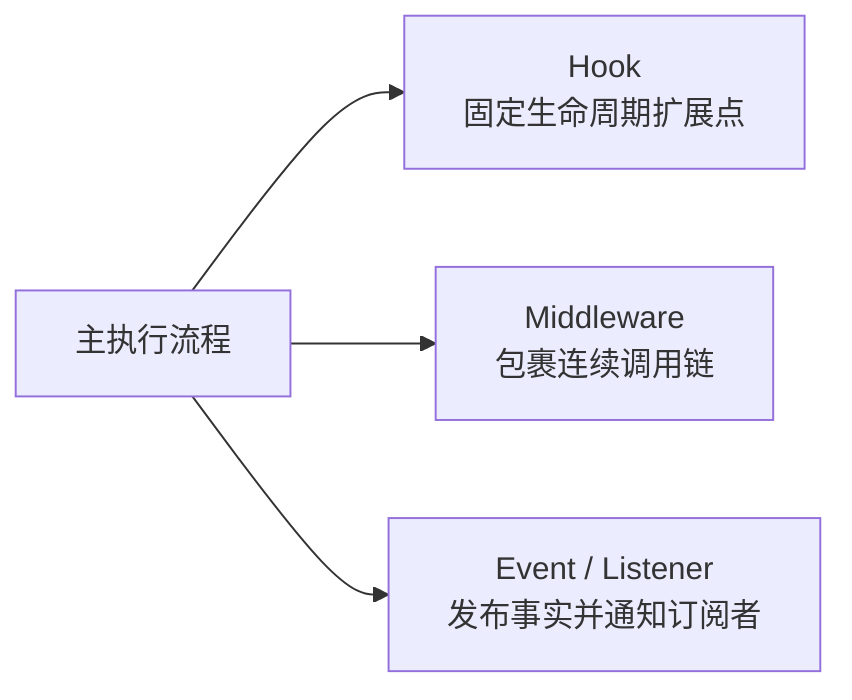

<p class="figure-caption">图 2-1 Hook、Middleware 与 Event / Listener 的总体定位</p>

三者最核心的区别是：

- **Hook**：调用方主动调用一个预先定义好的扩展点。
- **Middleware**：一层层包住后续执行链，可以在执行前后介入。
- **Event / Listener**：事件源发布一个已经发生的事实，零个、一个或多个 Listener 可以接收。

### A.1.3 适用边界

<p class="table-caption">表 2-1 三类扩展机制的适用场景</p>

| 场景 | 更合适的机制 | 原因 |
|---|---|---|
| HTTP 请求统一计时 | Middleware | 请求天然形成连续调用链 |
| Task 执行开始/结束观测 | Hook | 生命周期点明确 |
| Scheduler Job missed | Event / Listener | 属于 Scheduler 自身产生的离散事件 |
| 一个事实需要通知多个模块 | Event / Listener | 原生支持一对多 |
| 对后续执行进行拦截或短路 | Middleware | 可决定是否继续调用 `call_next()` |

---

## A.2 Hook 机制

### A.2.1 Hook 的概念与核心思想

Hook 不是 Python 的特殊语法，而是一种扩展机制：

> 在既有执行流程的关键位置，预留一个可调用的扩展点。

最简单的 Hook：

```python
def on_started(task_id: int) -> None:
    print("started:", task_id)


def run_task(task_id: int) -> None:
    on_started(task_id)
    print("running:", task_id)


run_task(1)
```

这里 `on_started()` 就是 Hook。业务流程在“任务开始”这个位置主动调用它。

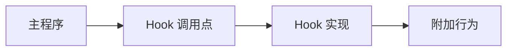

<p class="figure-caption">图 3-1 Hook 的基本结构</p>

### A.2.2 用基础 Python 实现可替换 Hook

下面用 `Protocol` 定义 Hook 接口，只依赖 Python 标准库：

```python
from __future__ import annotations

from typing import Protocol


class Hooks(Protocol):
    def task_started(self, task_id: int) -> None:
        ...

    def task_finished(self, task_id: int) -> None:
        ...


class PrintHooks:
    def task_started(self, task_id: int) -> None:
        print("task_started:", task_id)

    def task_finished(self, task_id: int) -> None:
        print("task_finished:", task_id)


class NullHooks:
    def task_started(self, task_id: int) -> None:
        pass

    def task_finished(self, task_id: int) -> None:
        pass


def run_task(task_id: int, hooks: Hooks) -> None:
    hooks.task_started(task_id)

    print("run task:", task_id)

    hooks.task_finished(task_id)


hooks = PrintHooks()
run_task(1, hooks)
```

主程序只依赖 `Hooks` 的接口，不依赖具体实现，因此可把 `PrintHooks` 换成日志、指标或空实现。

### A.2.3 Hook 的关键特征

Hook 的关键特征是：

1. **调用点明确**：主程序知道什么时候触发 Hook。
2. **主动调用**：通常是 `hooks.xxx(...)` 或 `callback(...)`。
3. **控制关系直接**：调用方知道自己调用了哪个扩展点。
4. **实现可替换**：Hook 接口和具体实现可以分离。
5. **不天然等于广播机制**：一个 Hook 可以自己再调用多个处理器，但那已经是在 Hook 内部实现分发。

### A.2.4 常见 Hook 写法

#### A.2.4.1 callback

```python
def run(callback):
    result = 100
    callback(result)


def on_complete(result):
    print(result)


run(on_complete)
```

#### A.2.4.2 对象方法

```python
class Hooks:
    def on_complete(self, result):
        print(result)


hooks = Hooks()
hooks.on_complete(100)
```

#### A.2.4.3 decorator

```python
def observe(func):
    def wrapped(*args, **kwargs):
        print("before")
        result = func(*args, **kwargs)
        print("after")
        return result

    return wrapped


@observe
def task():
    print("task")


task()
```

Decorator 本质上也是在函数调用前后插入扩展逻辑。

#### A.2.4.4 framework hook

很多框架直接暴露生命周期回调，例如：

```text
on_start
on_stop
before_request
after_request
on_error
```

名称不同，但基本思想相同：框架在固定生命周期点调用用户提供的扩展函数。

---

## A.3 Middleware 机制

### A.3.1 Middleware 的核心思想

Middleware 不是简单地“收到一个通知”，而是**包住后续执行链**。

典型 FastAPI 写法为：

```python
@app.middleware("http")
async def observability_middleware(request, call_next):
    before()

    response = await call_next(request)

    after()

    return response
```

其中最重要的是：

```python
response = await call_next(request)
```

`call_next` 表示“继续执行后面的 Middleware 或最终 Route Handler”。

### A.3.2 洋葱模型

多个 Middleware 会形成嵌套结构：

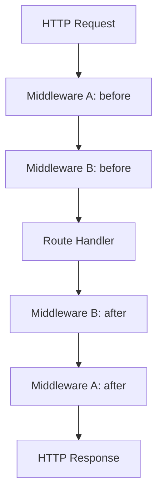

<p class="figure-caption">图 4-1 Middleware 的洋葱执行模型</p>

逻辑上相当于：

```text
MiddlewareA(
    MiddlewareB(
        Handler
    )
)
```

因此 Middleware 既能在进入阶段做事，也能在返回阶段做事。

### A.3.3 `@app.middleware("http")` 的含义

FastAPI 中：

```python
@app.middleware("http")
async def observability_middleware(request, call_next):
    ...
```

这里：

- `"http"`：框架规定的 HTTP Middleware 类型标识，不是自定义名称。
- `request`：当前 HTTP 请求。
- `call_next`：下一层可调用对象。
- `response`：后续执行链返回的 HTTP 响应。

它不是替换某个默认 HTTP Middleware，而是向 Middleware 链中再注册一层。

### A.3.4 用基础 Python / asyncio 完整实现 Middleware

下面不依赖 FastAPI，只使用基础 Python 和 `asyncio`，但保留 FastAPI 中最关键的名称：`FastAPI`、`middleware()`、`request`、`call_next`、`response`。

```python
import asyncio
from collections.abc import Awaitable, Callable
from dataclasses import dataclass


@dataclass
class Request:
    path: str


@dataclass
class Response:
    body: str
    status_code: int = 200


Handler = Callable[[Request], Awaitable[Response]]
Middleware = Callable[[Request, Handler], Awaitable[Response]]


class FastAPI:
    def __init__(self):
        self._middleware: list[Middleware] = []
        self._handler: Handler | None = None

    def middleware(self, middleware_type: str):
        if middleware_type != "http":
            raise ValueError("only 'http' is supported")

        def decorator(func: Middleware):
            self._middleware.append(func)
            return func

        return decorator

    def route(self, handler: Handler) -> Handler:
        self._handler = handler
        return handler

    async def handle(self, request: Request) -> Response:
        if self._handler is None:
            raise RuntimeError("route handler is not registered")

        async def call_handler(request: Request) -> Response:
            return await self._handler(request)

        call_next: Handler = call_handler

        # 逐层包装，构造 Middleware 洋葱。
        # reversed() 使第一个注册的 Middleware 成为最外层。
        for middleware in reversed(self._middleware):
            previous = call_next

            async def wrapped(
                request: Request,
                middleware: Middleware = middleware,
                previous: Handler = previous,
            ) -> Response:
                return await middleware(
                    request,
                    previous,
                )

            call_next = wrapped

        return await call_next(request)


app = FastAPI()


@app.middleware("http")
async def middleware_a(
    request: Request,
    call_next: Handler,
) -> Response:
    print("A before")

    response = await call_next(request)

    print("A after")
    return response


@app.middleware("http")
async def middleware_b(
    request: Request,
    call_next: Handler,
) -> Response:
    print("B before")

    response = await call_next(request)

    print("B after")
    return response


@app.route
async def handler(request: Request) -> Response:
    print("handler:", request.path)
    return Response(body="OK")


async def main():
    response = await app.handle(Request(path="/tasks"))
    print("response =", response)


asyncio.run(main())
```

执行顺序为：

```text
A before
B before
handler: /tasks
B after
A after
response = Response(body='OK', status_code=200)
```

### A.3.5 为什么需要 `wrapped()`

不能写成：

```python
call_next = middleware(request, previous)
```

因为这会**立即调用** `middleware()`，得到的是 coroutine object，而不是以后还能继续调用的函数。

需要的是：

```python
call_next = wrapped
```

其含义是：

> 保存一个新的可调用函数；真正收到 `request` 时，再去调用当前 `middleware(request, previous)`。

另外：

```python
middleware=middleware
previous=previous
```

把当前循环中的两个对象绑定到默认参数，避免闭包晚绑定导致所有 `wrapped()` 最终引用同一个循环变量。

### A.3.6 Middleware 可以中断后续执行

Middleware 比普通通知型 Hook 更强的一点是：它可以不调用 `call_next()`。

```python
@app.middleware("http")
async def authorization_middleware(request, call_next):
    if request.path == "/forbidden":
        return Response(
            body="Forbidden",
            status_code=403,
        )

    return await call_next(request)
```

此时 `/forbidden` 请求不会进入后续 Middleware 或 Route Handler。

### A.3.7 `@app.middleware()` 与 `app.add_middleware()`

FastAPI 中通常可这样理解：

```python
@app.middleware("http")
async def my_middleware(request, call_next):
    ...
```

适合函数式 HTTP Middleware。

而：

```python
app.add_middleware(SomeMiddleware, ...)
```

通常用于注册 Middleware class，例如 CORS、GZip、TrustedHost 等 Starlette/FastAPI Middleware。

---

## A.4 Event / Listener 机制

### A.4.1 Event 与 Listener 的基本概念

Event / Listener 的基本模型是：

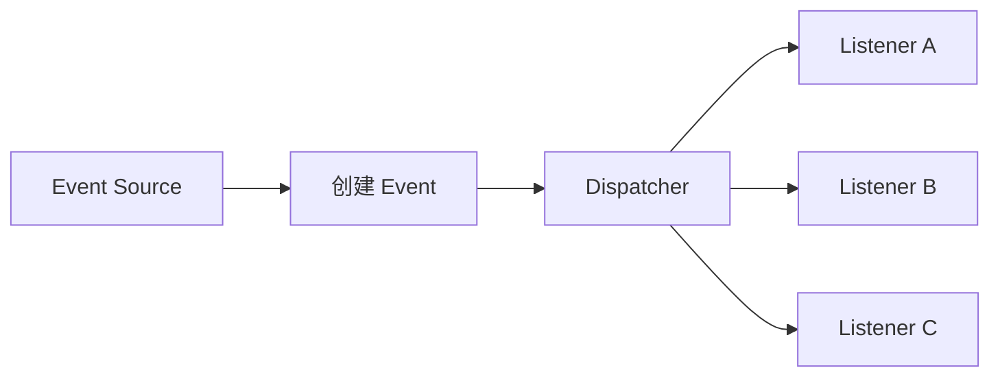

<p class="figure-caption">图 5-1 Event / Listener 的基本分发模型</p>

其中：

- **Event Source**：知道某件事情已经发生。
- **Event**：描述发生的事实和相关数据。
- **Listener**：提前注册，希望收到某类 Event。
- **Dispatcher**：根据 Event 类型或 Mask 找到匹配 Listener 并调用。

### A.4.2 APScheduler 风格的基本用法

APScheduler 3.x 中关键调用形式为：

```python
scheduler.add_listener(
    listener,
    EVENT_JOB_EXECUTED | EVENT_JOB_ERROR,
)
```

Listener 形式：

```python
def listener(event):
    print(event.code)
```

当 Scheduler 内部产生对应事件时，会调用：

```python
listener(event)
```

### A.4.3 Event Mask 机制

Event 常量可以设计为互不重叠的二进制位：

```python
EVENT_JOB_EXECUTED = 0x01  # 0001
EVENT_JOB_ERROR = 0x02     # 0010
EVENT_JOB_MISSED = 0x04    # 0100
```

订阅多个事件时：

```python
mask = EVENT_JOB_EXECUTED | EVENT_JOB_ERROR
```

得到：

```text
0011
```

分发时：

```python
if event.code & mask:
    callback(event)
```

例如 `EVENT_JOB_ERROR` 为 `0010`：

```text
event.code  = 0010
mask        = 0011
-----------------
&           = 0010
```

结果非零，因此匹配。

### A.4.4 用基础 Python 完整实现 APScheduler 核心事件系统

下面代码只依赖 Python 标准库，但关键类名、函数名和变量名与 APScheduler 的概念保持一致：

- `SchedulerEvent`
- `JobExecutionEvent`
- `BaseScheduler`
- `add_listener()`
- `remove_listener()`
- `add_job()`
- `_dispatch_event()`
- `job_id`
- `retval`
- `exception`

```python
from __future__ import annotations

from collections.abc import Callable
from dataclasses import dataclass
from typing import Any


EVENT_JOB_EXECUTED = 0x01
EVENT_JOB_ERROR = 0x02
EVENT_JOB_MISSED = 0x04


@dataclass
class SchedulerEvent:
    code: int


@dataclass
class JobExecutionEvent(SchedulerEvent):
    job_id: str
    retval: Any = None
    exception: Exception | None = None


Listener = Callable[[SchedulerEvent], None]


class BaseScheduler:
    def __init__(self):
        self._listeners: list[tuple[Listener, int]] = []
        self._jobs: dict[str, Callable[[], Any]] = {}

    def add_listener(
        self,
        callback: Listener,
        mask: int,
    ) -> None:
        self._listeners.append(
            (callback, mask)
        )

    def remove_listener(
        self,
        callback: Listener,
    ) -> None:
        self._listeners = [
            item
            for item in self._listeners
            if item[0] is not callback
        ]

    def add_job(
        self,
        func: Callable[[], Any],
        *,
        id: str,
    ) -> None:
        self._jobs[id] = func

    def _dispatch_event(
        self,
        event: SchedulerEvent,
    ) -> None:
        for callback, mask in self._listeners:
            if event.code & mask:
                callback(event)

    def run_job(self, job_id: str) -> None:
        func = self._jobs[job_id]

        try:
            retval = func()

        except Exception as exc:
            event = JobExecutionEvent(
                code=EVENT_JOB_ERROR,
                job_id=job_id,
                exception=exc,
            )
            self._dispatch_event(event)

        else:
            event = JobExecutionEvent(
                code=EVENT_JOB_EXECUTED,
                job_id=job_id,
                retval=retval,
            )
            self._dispatch_event(event)

    def mark_job_missed(self, job_id: str) -> None:
        event = JobExecutionEvent(
            code=EVENT_JOB_MISSED,
            job_id=job_id,
        )
        self._dispatch_event(event)


def listener_a(event: SchedulerEvent) -> None:
    print("listener_a:", event)


def listener_b(event: SchedulerEvent) -> None:
    print("listener_b:", event)


def task_ok():
    print("task_ok running")
    return 100


def task_error():
    print("task_error running")
    raise RuntimeError("boom")


scheduler = BaseScheduler()

scheduler.add_listener(
    listener_a,
    EVENT_JOB_EXECUTED | EVENT_JOB_ERROR,
)

scheduler.add_listener(
    listener_b,
    EVENT_JOB_ERROR | EVENT_JOB_MISSED,
)

scheduler.add_job(
    task_ok,
    id="task:1",
)

scheduler.add_job(
    task_error,
    id="task:2",
)

scheduler.run_job("task:1")
scheduler.run_job("task:2")
scheduler.mark_job_missed("task:3")
```

### A.4.5 Event 到底如何产生

Event 不是自动出现的。

Scheduler 在内部知道某个事实已经发生之后，主动构造 Event：

```python
event = JobExecutionEvent(
    code=EVENT_JOB_EXECUTED,
    job_id=job_id,
    retval=retval,
)
```

然后主动调用：

```python
self._dispatch_event(event)
```

因此完整链路是：

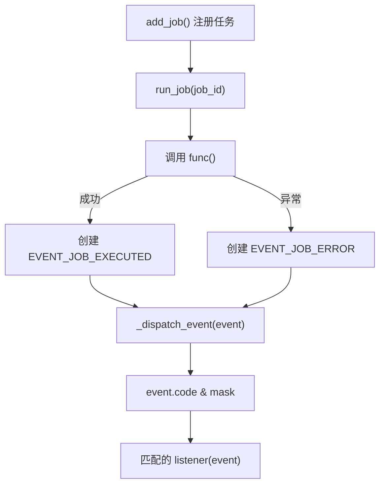

<p class="figure-caption">图 5-2 Scheduler 执行任务并产生 Event 的关键过程</p>

### A.4.6 一个 Event 可以对应多个 Listener

可以。

```python
scheduler.add_listener(
    listener_a,
    EVENT_JOB_ERROR,
)

scheduler.add_listener(
    listener_b,
    EVENT_JOB_ERROR,
)
```

发生 `EVENT_JOB_ERROR` 后，两个 Listener 都会收到同一个事件。

在上述基础实现中，Listener 按 `_listeners` 中的保存顺序调用，也就是注册顺序。但工程设计上不应让 Listener A 和 Listener B 依赖这种先后关系，应把每个 Listener 设计成相互独立。

### A.4.7 `is` 与 `==` 在 `remove_listener()` 中的区别

代码：

```python
if item[0] is not callback
```

这里使用 `is` 是判断**对象身份**：

> `item[0]` 是否就是此前注册进去的那个 callback 对象。

`==` 判断的是值相等关系，不等价。

```python
a = []
b = a
c = []

print(a is b)   # True
print(a is c)   # False

print(a == c)   # True
```

因此删除 Listener 时，使用对象身份判断更符合“删除这个已注册 callback”的语义。

### A.4.8 一个 Listener 处理多种 Event

可以用一个 Listener：

```python
def listener(event):
    if event.code == EVENT_JOB_EXECUTED:
        ...
    elif event.code == EVENT_JOB_ERROR:
        ...
    elif event.code == EVENT_JOB_MISSED:
        ...
```

并一次注册：

```python
scheduler.add_listener(
    listener,
    EVENT_JOB_EXECUTED
    | EVENT_JOB_ERROR
    | EVENT_JOB_MISSED,
)
```

也可以拆开：

```python
def on_job_executed(event):
    ...

def on_job_error(event):
    ...

def on_job_missed(event):
    ...
```

分别注册：

```python
scheduler.add_listener(
    on_job_executed,
    EVENT_JOB_EXECUTED,
)

scheduler.add_listener(
    on_job_error,
    EVENT_JOB_ERROR,
)

scheduler.add_listener(
    on_job_missed,
    EVENT_JOB_MISSED,
)
```

事件较少且每个处理逻辑差异明显时，拆成多个 Listener 通常更直观；若需要把整个适配器作为一个对象统一安装和卸载，则一个 Listener + Mask 也很常见。

---

## A.5 Hook、Middleware 与 Event / Listener 的关系

### A.5.1 三者不是同一层次的概念

三者都用于“让主流程可扩展”，但控制关系不同。

<p class="table-caption">表 6-1 三种机制的控制关系</p>

| 机制 | 谁主动 | 是否包住后续执行 | 是否天然一对多 |
|---|---|---:|---:|
| Hook | 业务代码主动调用 Hook | 否 | 否 |
| Middleware | Middleware 主动调用 `call_next()` | 是 | 形成链，而不是广播 |
| Event / Listener | Event Source 发布 Event | 否 | 是 |

### A.5.2 Middleware 可以视为一种 Around Hook

普通 Hook 往往只是某个点：

```text
before_hook()
业务逻辑
after_hook()
```

Middleware 则把“业务逻辑”作为 `call_next` 交给外层：

```python
before()

response = await call_next(request)

after()
```

因此 Middleware 可以理解为一种更强的 **Around Hook**。

但它要求后续逻辑能够形成连续调用链，所以不能普遍替代 Hook。

### A.5.3 Event 与 Hook 的核心区别

Hook：

```python
hooks.task_started(1)
```

调用方明确知道：

> 我要调用 `task_started` 这个扩展点。

Event：

```python
event_bus.publish(
    TaskStarted(task_id=1)
)
```

调用方只表达：

> `TaskStarted` 这个事实发生了。

至于后面由谁处理，事件源不需要知道：

```text
TaskStarted
    ├── LogListener
    ├── MetricsListener
    ├── TraceListener
    └── AuditListener
```

因此 Event / Listener 在“一对多扩展”上更自然，但同时需要额外维护 Event 类型、Listener 注册、Dispatcher、异常隔离、同步/异步策略等基础设施。

### A.5.4 为什么 Event 不能简单完全替代 Hook

Event 更强不等于所有地方都应该使用 Event。

如果只是一个明确的内部扩展点：

```python
hooks.task_started(task_id=1)
```

调用关系非常直接。

如果改成 Event Bus，则至少多出：

```text
Event
EventBus
subscribe()
publish()
listener registry
dispatch
```

系统复杂度会上升。

因此一般原则是：

- **固定、明确、窄接口生命周期点**：优先 Hook。
- **连续执行链的前后拦截**：优先 Middleware。
- **一个事实需要通知多个独立消费者**：优先 Event / Listener。

### A.5.5 选择原则

<p class="table-caption">表 6-2 Hook、Middleware 与 Event / Listener 选择原则</p>

| 问题 | 推荐机制 |
|---|---|
| HTTP 请求统一观测 | Middleware |
| HTTP 鉴权前置拦截 | Middleware |
| 任务开始/成功/失败的固定扩展点 | Hook |
| Scheduler started / stopped / missed 等框架事件 | Event / Listener |
| 一个事件同时驱动 Logs、Metrics、Trace、Audit | Event / Listener |
| 外部框架 Event 转换为内部稳定接口 | Listener + Adapter + Hook |
| 需要中断后续执行 | Middleware |
| 只需要一个简单、明确的扩展接口 | Hook |

可以将三者压缩成一句话：

> **Hook 是扩展点，Middleware 是执行链包装器，Event / Listener 是事实广播机制。**
