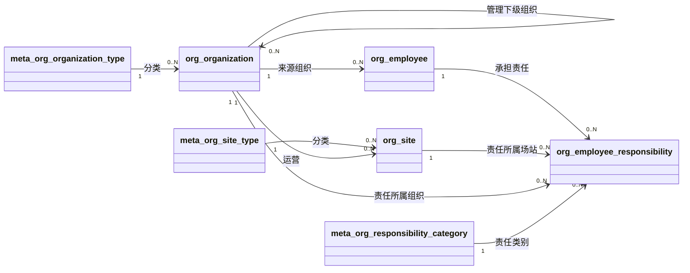
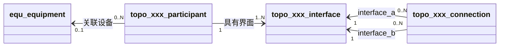
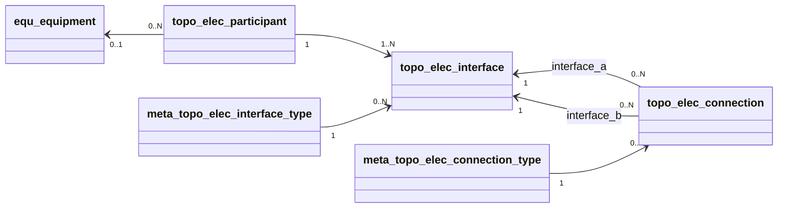
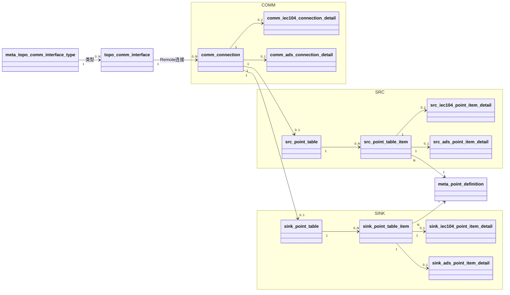
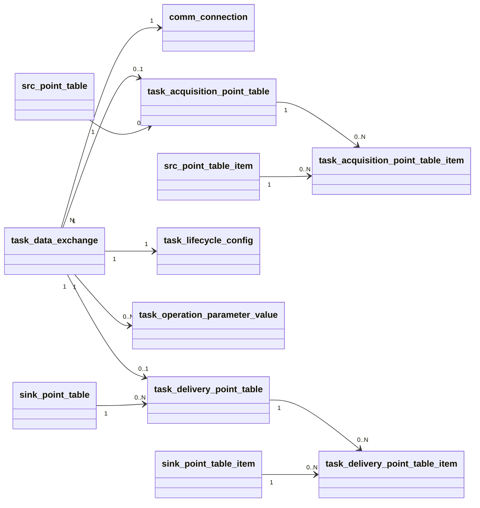
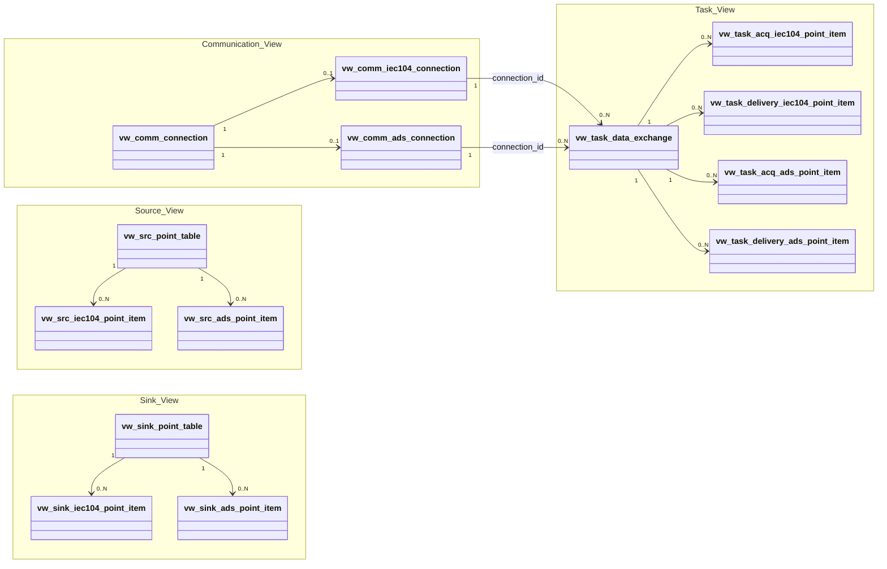

<h1 class="title">Whale 概念数据模型设计——阶段 D 与阶段 E 领域模型、专业拓扑、Communication 与运行契约 View 定稿版</h1>

<p class="subtitle">V2.14 · 2026-08-08</p>

<style>
body {
  font-family: "Microsoft YaHei";
  font-size: 16px;
  line-height: 1.75;
  color: #24292f;
}
.title {
  font-family: "Microsoft YaHei";
  font-size: 32px;
  line-height: 1.30;
  font-weight: 700;
  text-align: center;
}
.subtitle {
  font-family: "Microsoft YaHei";
  font-size: 18px;
  line-height: 1.50;
  font-weight: 400;
  text-align: center;
}
h1 {
  font-family: "Microsoft YaHei";
  font-size: 28px;
  line-height: 1.40;
  font-weight: 700;
}
h2 {
  font-family: "Microsoft YaHei";
  font-size: 22px;
  line-height: 1.40;
  font-weight: 700;
}
h3 {
  font-family: "Microsoft YaHei";
  font-size: 18px;
  line-height: 1.50;
  font-weight: 700;
}
h4 {
  font-family: "Microsoft YaHei";
  font-size: 16px;
  line-height: 1.50;
  font-weight: 700;
}
p, li {
  font-family: "Microsoft YaHei";
  font-size: 16px;
  line-height: 1.75;
}
.figure-caption,
.formula-caption {
  font-family: "Microsoft YaHei";
  font-size: 14px;
  line-height: 1.50;
  font-weight: 600;
  text-align: center;
  margin: 0.65em 0 0.35em 0;
}
.table-caption {
  font-family: "Microsoft YaHei";
  font-size: 13px;
  line-height: 1.40;
  font-weight: 500;
  text-align: center;
  margin: 0.65em 0 0.35em 0;
}
.mermaid,
.mermaid text,
.mermaid .label {
  font-family: "Microsoft YaHei" !important;
  font-size: 14px !important;
  line-height: 1.20;
}
table {
  width: 100%;
  border-collapse: collapse;
  font-family: "Microsoft YaHei";
  font-size: 13px;
  line-height: 1.45;
}
table th,
table th p,
table th li {
  font-family: "Microsoft YaHei";
  font-size: 13px;
  line-height: 1.40;
  font-weight: 600;
}
table td,
table td p,
table td li {
  font-family: "Microsoft YaHei";
  font-size: 13px;
  line-height: 1.45;
  font-weight: 400;
}
table th,
table td {
  padding: 0.40em 0.60em;
  vertical-align: top;
}
code, pre {
  font-family: "Cascadia Code";
  font-size: 14px;
  line-height: 1.50;
}
p code, li code, td code {
  color: #24292f;
  background: #f3f4f6;
  padding: 0.08em 0.28em;
  border-radius: 3px;
}
pre {
  color: #c9d1d9;
  background: #0d1117;
  padding: 1em;
  border-radius: 6px;
  overflow-x: auto;
}
pre code {
  color: inherit;
  background: transparent;
  padding: 0;
}
.hljs-comment, .hljs-quote,
.token.comment, .token.prolog, .token.doctype, .token.cdata {
  color: #8b949e;
  font-style: italic;
}
.hljs-keyword, .hljs-selector-tag, .hljs-literal,
.token.keyword, .token.boolean { color: #ff7b72; }
.hljs-string, .hljs-doctag, .hljs-regexp,
.token.string, .token.char, .token.regex { color: #a5d6ff; }
.hljs-number, .token.number { color: #79c0ff; }
.hljs-title, .hljs-function, .token.function { color: #d2a8ff; }
.hljs-title.class_, .hljs-type, .hljs-built_in,
.token.class-name, .token.builtin { color: #ffa657; }
.hljs-variable, .hljs-attr, .hljs-property,
.token.variable, .token.property, .token.attr-name { color: #7ee787; }
.hljs-operator, .hljs-punctuation,
.token.operator, .token.punctuation { color: #c9d1d9; }
</style>

---

## 目录

1. [文档约定](#1-文档约定)  
2. [文档定位与使用方式](#2-文档定位与使用方式)  
3. [当前业务域与命名约定](#3-当前业务域与命名约定)  
4. [管理组织、场站与人员元信息](#4-管理组织场站与人员元信息)  
5. [设备与电气、机械、通信拓扑](#5-设备与电气机械通信拓扑)  
6. [Communication、Source 能力与 Sink 需求](#6-communicationsource-能力与-sink-需求)  
7. [数据交换任务与执行配置](#7-数据交换任务与执行配置)  
8. [View 与运行时读取模型](#8-view-与运行时读取模型)  
9. [模块读取边界](#9-模块读取边界)  
10. [核心关系、基数与约束](#10-核心关系基数与约束)  
11. [逻辑表与视图命名](#11-逻辑表与视图命名)  
12. [本版修订结论](#12-本版修订结论)  

---

# 1. 文档约定

本章是全文的固定排版与表达规范。文档修订、补充和派生版本均应遵守本章，不再根据个人习惯调整字体、字号、行距、图题、表题、公式或代码样式。

本文开头的 `<style>...</style>` 是 HTML `style` 元素，其中包含内部 CSS 样式表，本文简称为 **CSS 样式块**。第 1.1～1.4 节规定目标样式；CSS 样式块通过 `h1`、`h2`、`p`、`table`、`th`、`td`、`pre`、`code` 等选择器，将规范应用到 Markdown 渲染后生成的 HTML 元素。

## 1.1 字体约定

<p class="table-caption">表 1-1 文档字体与排版规范</p>

| 文档元素 | 字体 | 字号 | 行间距/行高 | 字重 | 对齐方式 |
|---|---|---:|---:|---:|---|
| 文档标题 | Microsoft YaHei | 32 px | 1.30 | 700 | 居中 |
| 文档副标题 | Microsoft YaHei | 18 px | 1.50 | 400 | 居中 |
| 一级标题 | Microsoft YaHei | 28 px | 1.40 | 700 | 左对齐 |
| 二级标题 | Microsoft YaHei | 22 px | 1.40 | 700 | 左对齐 |
| 三级标题 | Microsoft YaHei | 18 px | 1.50 | 700 | 左对齐 |
| 四级标题 | Microsoft YaHei | 16 px | 1.50 | 700 | 左对齐 |
| 正文 | Microsoft YaHei | 16 px | 1.75 | 400 | 左对齐 |
| 图题 | Microsoft YaHei | 14 px | 1.50 | 600 | 居中 |
| 图内文字 | Microsoft YaHei | 14 px | 1.20 | 400 | 按图形布局 |
| 表题 | Microsoft YaHei | 13 px | 1.40 | 500 | 居中 |
| 表头 | Microsoft YaHei | 13 px | 1.40 | 600 | 左对齐 |
| 表格正文 | Microsoft YaHei | 13 px | 1.45 | 400 | 左对齐 |
| 公式题 | Microsoft YaHei | 14 px | 1.50 | 600 | 居中 |
| 代码文字 | Cascadia Code | 14 px | 1.50 | 400 | 左对齐 |

以上规范已经通过本文开头的 CSS 样式块固定。其中，正文为 `16 px`；表题、表头和表格正文均为 `13 px`。表头字重为 `600`，低于标题字重；表格正文行高为 `1.45`，因此表格在字号、字重和行距上均明显弱于正文。英文业务对象、数据库对象和程序标识符仍按所在文本元素的字号排版，但使用行内代码形式，例如 `Asset`、`Connection`、`task_id`。

## 1.2 绘图约定

1. 上下文图、第 0 层及更深层 DFD、总体流程图和关系流程图统一使用 Mermaid。
2. 每一个 Mermaid 图都必须在代码块第一行加入：

```text
%%{init: {"flowchart": {"useMaxWidth": true}}}%%
```

3. 每张图必须有图编号和图题，编号采用“章节号-本章图序号”，例如“图 7-2”。
4. 图题必须使用普通图题样式，不得使用 Markdown 标题。统一写法为：

```html
<p class="figure-caption">图 7-2 图题</p>
```

5. 图中的过程、外部实体、数据存储和数据流使用业务语言，不得直接使用函数名、SQL、API 路径、类名或界面控件名称代替业务概念。
6. DFD 层级和过程编号固定如下：
   - **第 0 层 DFD**：只包含整个系统、外部实体以及系统边界输入输出；整个系统编号为 `0`。
   - **第 1 层 DFD**：对整个系统进行总体功能分解，过程编号为 `1.0`、`2.0`、`3.0`……；不再绘制外部实体框，但必须保留第 0 层的外部输入输出。
   - **第 2 层 DFD**：选择第 1 层中的一个过程单独下钻，例如将 `1.0` 分解为 `1.1`、`1.2`、`1.3`……；不绘制外部实体框，但必须保留父过程的全部边界输入输出。
   - **第 3 层及以下 DFD**：继续按父过程编号扩展，例如将 `1.2` 分解为 `1.2.1`、`1.2.2`……；继续遵守父子图输入输出平衡原则。
7. 第 1 层及更深层 DFD 中，外部输入输出使用无形边界端点表达。无形端点不是过程、数据存储或外部实体，只用于保留跨图边界的数据流。
8. 子层图可以增加父过程内部的数据流，但不得丢失、篡改或无依据地新增父过程的边界输入输出。

## 1.3 公式约定

1. 行内公式使用单美元符号，例如 `$E_1$`。
2. 独立公式使用双美元符号，例如：

```text
$$
\mathrm{Entity}=E_1\land(E_2\lor E_3\lor E_4)\land E_5
$$
```

3. 正式公式不得放入代码块。
4. 不使用 `\[` 与 `\]` 作为公式定界符。
5. 变量下标统一写成 `E_1`、`R_1`；逻辑“与”和“或”统一写成 `\land`、`\lor`。
6. 公式必须使用 LaTeX，不使用普通文本模拟数学符号。
7. 需要编号的公式使用“式（章节号-本章公式序号）”，式题采用普通公式题样式：

```html
<p class="formula-caption">式（8-1）实体判断逻辑</p>
```

## 1.4 代码约定

1. 多行代码必须使用带语言标识的围栏代码块，例如 `python`、`sql`、`json`、`yaml`、`mermaid` 或 `text`。
2. 单个标识符、字段名、命令和短代码使用行内代码，例如 `PRIMARY KEY`、`Connection`。
3. 伪代码必须明确标记为 `text` 或在正文中说明“以下为伪代码”；不得使读者误认为它可以直接运行。
4. 代码块统一使用深色背景，颜色为 `#0D1117`；普通代码文字颜色为 `#C9D1D9`。
5. 语法高亮统一采用表 1-2 的配色。Markdown 渲染器应使用 Highlight.js 或 Prism 可识别的语言标识；渲染器不支持高亮时，至少保留代码背景色和普通代码文字颜色。

<p class="table-caption">表 1-2 代码语法高亮配色</p>

| 语法元素 | 颜色 | 十六进制 |
|---|---|---|
| 代码背景 | 深黑蓝 | `#0D1117` |
| 普通文字、运算符和标点 | 浅灰 | `#C9D1D9` |
| 注释 | 灰色 | `#8B949E` |
| 关键字和布尔值 | 红色 | `#FF7B72` |
| 字符串和正则表达式 | 浅蓝 | `#A5D6FF` |
| 数值 | 蓝色 | `#79C0FF` |
| 函数名 | 紫色 | `#D2A8FF` |
| 类型、类名和内置对象 | 橙色 | `#FFA657` |
| 变量、属性和字段 | 绿色 | `#7EE787` |

---

# 2. 文档定位与使用方式

## 2.1 文档定位

本文直接继承 V2.13，在已确认的 `comm_ / src_ / sink_ / task_`、IEC104/ADS 协议范围、三类专业拓扑和运行契约 View 原则上继续增量收敛。V2.14 重点消除 Communication 域中重复的 Endpoint 转义层：

1. 删除 `comm_endpoint`；`comm_connection` 直接关联 `topo_comm_interface`；
2. 删除 `meta_comm_endpoint_type`；通信界面类型统一由 `meta_topo_comm_interface_type` 表达；
3. `vw_comm_*` 用 `interface_id / interface_type` 替代 `endpoint_id / endpoint_type`，并继续直接输出 `equipment_id / equipment_name`；
4. `comm_connection` 仍只描述 Whale 主动访问的外部 Remote Connection，`host / port` 永远表示远端地址；
5. Source/Sink、Task Acquisition/Delivery、三类 Topology 和 IEC104/ADS 协议范围保持不变；
6. Whale 本地监听地址、本地 Server 能力继续延期到独立 `serv_*` 域。

本文数据库实现与本文同步，配套 PostgreSQL 文件版本为 `2.14.0`。仓库核对基准采用 BlueCrystal `main` 分支提交 `83ad730745c5b522d9d12712c04c4f22617a4b22`。

## 2.2 当前输出物

本版对应以下输出物：

```text
whale_conceptual_data_model_stage_de_v2_14.md
02_bluecrystal_schema_ddl_v2_14_0.sql
03_bluecrystal_basic_data_v2_14_0.sql
04_bluecrystal_site_sample_v2_14_0.sql
```

其中：

- `02` 在 V2.10 基础上重组表前缀、重构 Remote Connection、补齐 ADS，并按运行契约重建 View；
- `03` 提供统一 `meta_*`、IEC104 与 ADS 基础元数据；
- `04` 保留既有组织/设备/拓扑样例，通信与任务样例收敛为 IEC104 Remote 被控站和 ADS Remote Server。

## 2.3 当前范围

当前数据库对象按以下职责域组织：

```text
meta_       跨域元数据、协议标准语义与共享 PointDefinition
org_        管理组织、场站与人员元信息
equ_        设备类型、型号、组成与设备实例
topo_elec_  电气拓扑
topo_mech_  机械拓扑
topo_comm_  通信拓扑
comm_       外部 Remote Communication Connection
src_        外部向 Whale 提供的数据源能力
sink_       外部可从 Whale 接收的数据/命令/参数需求
task_       数据交换任务与 Acquisition/Delivery 点子集
```

明确不纳入：

- 资产财务核算和资产管理；
- 完整 HR；
- 实时遥测/遥信样本；
- 任务执行历史；
- 数据治理、质量规则和数据血缘；
- 仿真模型本体；
- 上层应用与统一 Web。

## 2.4 使用原则

本文区分三个层次：

1. **领域实体**：具有独立身份、生命周期或复用价值；
2. **Meta 实体**：协议标准、分类、代码或稳定业务语义；
3. **读取视图**：为运行时减少联表复杂度，不作为领域实体。

局部领域图只画该域内真实关系。某个 Meta 实体即使业务上“相关”，若数据库中不存在真实外键，也允许在局部图中悬空，不为了图形完整强行建立关系。

---

# 3. 当前业务域与命名约定

## 3.1 业务域与前缀

V2.14 按业务职责使用以下前缀：

- `meta_`：跨域 Meta、标准代码、协议语义、共享 PointDefinition；
- `org_`：组织、场站、人员与责任；
- `equ_`：设备类型、型号、组成和设备实例；
- `topo_elec_`：电气拓扑的 Participant、Interface、Connection；
- `topo_mech_`：机械拓扑的 Participant、Interface、Connection；
- `topo_comm_`：通信拓扑的 Participant、Interface、Connection；
- `comm_`：Whale 主动访问的外部 Remote Communication Connection；
- `src_`：外部向 Whale 提供的数据源能力；
- `sink_`：外部可从 Whale 接收的数据、指令、设点和参数需求；
- `task_`：数据交换任务及其 Acquisition/Delivery 点子集。

其中 `comm_` 与 `src_ / sink_` 正交：Communication Connection 只描述“通过哪个远端通信界面、以什么协议参数连接外部对端”，Source/Sink 只描述数据方向。`topo_comm_` 只描述通信网络的物理/逻辑连通结构，不承担协议连接配置职责。

## 3.2 Meta 表命名

所有 Meta 表统一使用 `meta_<二级分类>_*`，二级分类用于按对象名排序时自然形成职责块：

- `meta_sys_*`：数据库模式与系统级 Meta；
- `meta_org_*`：组织、场站、责任分类；
- `meta_equ_*`：设备类元数据；
- `meta_topo_elec_* / meta_topo_mech_* / meta_topo_comm_*`：三类专业拓扑的 Interface/Connection 类型；
- `meta_point_*`：数据类型、单位、物理量、测量语义、PointDefinition 与 Source 值更新方式；
- `meta_comm_*`：Protocol、ProtocolRole；
- `meta_task_*`：Operation、Interaction、Trigger、TaskStatus、Lifecycle 策略与 Operation 参数定义；
- `meta_iec104_*`：IEC104 标准协议元数据；
- `meta_ads_*`：ADS 标准协议元数据。

基本规则：

1. 底层规范化表通过 Meta 外键建立约束；
2. Meta 表自身主键仍严格命名为 `<table_name>_id`，因此二级分类同时进入对应 FK 字段名；
3. 运行时 View 不暴露任何 Meta 表 ID；
4. View 直接输出 `code`、`protocol_identifier`、`measurement_identifier` 等实际业务值；
5. `meta_point_definition` 作为 Source/Sink 共用的可复用业务点定义，不复制为两套。

## 3.3 主键与外键命名

每张表拥有自己的自增主键：

```text
<table_name>_id
```

协议专用明细表不再使用共享主键。例如：

```text
comm_iec104_connection_detail
├── comm_iec104_connection_detail_id      PK
└── comm_connection_id      FK UNIQUE
```

外键字段原则上与被引用主键同名。只有同一实体以多个角色出现时才增加角色前缀，例如：

```text
parent_org_organization_id
parent_equ_equipment_id
child_equ_equipment_id
```

不使用 `_ref_id`。

## 3.4 `name` 与 `description`

不要求每张表都拥有 `name_zh`、`name_en`、`description_zh`。

采用以下规则：

- 稳定技术代码已经足够辨识时，不重复存储无信息价值的名称；
- Meta 表中的 `description_zh` 必须解释代码的实际业务或标准含义；
- 组织、场站、设备、点定义、任务等面向人员识别的实体保留有意义的名称；
- 可选备注允许为 `NULL`，不以空字符串填充“形式完整”的描述。

## 3.5 第三范式

当前模型遵循“能通过唯一关系稳定推导的事实不重复保存”。

典型例子：

```text
src_point_table
→ comm_connection
→ topo_comm_interface
```

因此 `src_point_table` 不再重复保存 `topo_comm_interface_id`。

同理：

```text
comm_connection
→ meta_comm_protocol_role
→ meta_comm_protocol
```

因此 `comm_connection` 不再重复保存 `meta_comm_protocol_id`。

---

# 4. 管理组织、场站与人员元信息

## 4.1 建模边界

组织域只保存 Whale 必须使用的管理关系，不扩展为完整 HR。其核心问题是：

> 哪个组织运营哪个场站；某个场站在某段时间内由哪些人员承担哪些责任。

## 4.2 核心实体

<p class="table-caption">表 4-1 `org_` 核心实体</p>

| 实体 | 逻辑表 | 说明 |
|---|---|---|
| Organization | `org_organization` | 集团、区域公司、项目公司、部门等管理组织 |
| Site | `org_site` | 风电、光伏、储能或混合场站 |
| Employee | `org_employee` | Whale 需要识别的人员基础信息 |
| EmployeeResponsibility | `org_employee_responsibility` | 人员、责任组织、场站、责任类别及有效时间 |
| OrganizationType | `meta_org_organization_type` | 组织类型 Meta |
| SiteType | `meta_org_site_type` | 场站类型 Meta |
| ResponsibilityCategory | `meta_org_responsibility_category` | 责任类别 Meta |

## 4.3 领域模型



<p class="figure-caption">图 4-1 管理组织、场站与人员领域模型</p>

## 4.4 责任记录

`org_employee_responsibility` 是带有效时间的责任分配记录，不等价于岗位或劳动关系。一个人员可以在不同时间或不同责任类别中承担多条记录。

---

# 5. 设备与电气、机械、通信拓扑

## 5.1 建模边界

V2.14 继续不使用 `equ_connection_point / equ_topology / equ_transmission_medium / equ_topology_attachment` 同时表达三类专业拓扑。电气、机械、通信拓扑分别建模，但采用完全一致的核心结构：

> Participant（连接参与对象） → Interface（连接界面） → Connection（两个界面之间的连接关系）

其中 Participant 才与 `equ_equipment` 建立关系。Interface 不再挂在 `equ_equipment` 上，避免设备接口与拓扑连接界面在不同专业语义下混用。

场站或外部边界也可以成为 Participant；这类记录保留 `org_site_id`，`equ_equipment_id` 允许为空。

## 5.2 三套拓扑表

电气拓扑：

- `topo_elec_participant`
- `topo_elec_interface`
- `topo_elec_connection`

机械拓扑：

- `topo_mech_participant`
- `topo_mech_interface`
- `topo_mech_connection`

通信拓扑：

- `topo_comm_participant`
- `topo_comm_interface`
- `topo_comm_connection`

对应 Meta 分为：

- `meta_topo_elec_interface_type / meta_topo_elec_connection_type`
- `meta_topo_mech_interface_type / meta_topo_mech_connection_type`
- `meta_topo_comm_interface_type / meta_topo_comm_connection_type`

## 5.3 统一领域模型



<p class="figure-caption">图 5-1 专业拓扑统一抽象</p>

## 5.4 电气拓扑

电气 Participant 是参与电气连通关系的设备或边界，例如风机、箱变、开关柜、主变、并网断路器、关口计量装置和公共电网边界。

Interface 表达具体电气连接界面，例如箱变低压侧、高压侧、断路器场站侧和电网侧。Connection 直接连接两个 Interface，并保存电缆、母线等连接类型以及必要的额定电压、长度等连接事实。



<p class="figure-caption">图 5-2 电气拓扑领域模型</p>

## 5.5 机械拓扑

机械 Participant 通常对应设备或可独立管理的设备部件，例如轮毂、齿轮箱、发电机。Interface 表达轴端、法兰、安装界面；Connection 表达轴、联轴器、法兰等实际机械连接。

机械拓扑与 `equ_composition_record` 的职责不同：Composition 表达“谁由谁组成”，Topology 表达“哪些机械界面实际连接”。二者不能互相替代。

## 5.6 通信拓扑

通信 Participant 是参与通信网络连通关系的设备或网络边界，例如风机、交换机、隔离装置、服务器、AGC/AVC 控制器和调度数据网边界。Interface 表达 RJ45、SFP、串口等物理通信界面；Connection 表达铜缆、光纤等链路。

Communication Connection 直接关联 `topo_comm_interface`，从而形成：

```text
comm_connection
→ topo_comm_interface
→ topo_comm_participant
→ equ_equipment（设备型 Participant）
```

`topo_comm_interface.meta_topo_comm_interface_type_id` 直接给出接口类型，例如以太网电口、光口或串口，因此不再需要额外 Endpoint 实体或 EndpointType Meta。

# 6. Communication、Source 能力与 Sink 需求

## 6.1 本章边界

V2.14 延续 `dat_*` 拆解结果，并将通信配置域统一命名为 `comm_* / src_* / sink_*`。

最重要的边界是：

- `comm_*`：只保存 Whale **主动访问的外部 Remote Connection**；
- `src_*`：描述外部通信对端能向 Whale 提供什么数据；
- `sink_*`：描述外部通信对端能从 Whale 接收什么数据、命令、设点或参数；
- Whale 本地监听地址、本地 Server、被外部主动连接等能力，本版明确不建模，后续由独立 `serv_*` 域承担。

因此，`comm_connection.host / port` 永远表示 Remote 端地址，不再存在 `remote_host / local_bind_host` 二套字段。

## 6.2 Communication Connection

通用 Connection：

- `comm_connection`

协议专用连接明细：

- `comm_iec104_connection_detail`
- `comm_ads_connection_detail`

`comm_connection` 保存 Remote `host / port`、协议角色、重连行为等纯连接事实；协议 Detail 只保存协议自身无法通用化的参数。

当前协议范围仅保留：

- IEC 60870-5-104；
- Beckhoff ADS。

对于 IEC104，本版 `comm_*` 只允许远端通信对端角色为 `CONTROLLED_STATION`；Whale 作为控制站主动连接。

对于 ADS，本版 `comm_*` 只允许远端通信对端角色为 `SERVER`；Whale 作为 ADS Client 主动连接。

## 6.3 Source 能力

Source 表：

- `src_point_table`
- `src_point_table_item`
- `src_iec104_point_item_detail`
- `src_ads_point_item_detail`

一条 Remote Connection 最多关联一张当前 Source PointTable；PointTableItem 引用共享 `meta_point_definition`。

`src_point_table_item` 同时保存数据源值自身的刷新语义：

- `meta_point_source_value_update_mode_id`
- `value_update_interval_ms`

这组字段描述 **Source 数据值如何产生/刷新**，与 IEC104 周期上送、ADS Notification 等协议传输行为不是同一概念。

## 6.4 Sink 需求

Sink 表：

- `sink_point_table`
- `sink_point_table_item`
- `sink_iec104_point_item_detail`
- `sink_ads_point_item_detail`

Sink 表示 Whale 可以向外部 Remote 通信对端写入、控制、设点或推送的目标点集合。

## 6.5 ADS 专用 Meta

V2.11 新增：

- `meta_ads_data_type`
- `meta_ads_addressing_mode`
- `meta_ads_notification_mode`

ADS 点支持两类寻址：

- `SYMBOL`：按 PLC/TwinCAT 符号名；
- `INDEX`：按 `IndexGroup + IndexOffset`。

Source ADS 点额外允许配置 Notification 模式及周期/最大延时；Sink ADS 点只保存写入目标寻址和 ADS 数据类型。

## 6.6 领域模型



<p class="figure-caption">图 6-1 Communication、Source 能力与 Sink 需求领域模型</p>

# 7. 数据交换任务与执行配置

## 7.1 Task 不再使用 Source/Sink 命名动作

`src_ / sink_` 表达的是远端通信对端的数据能力方向；Task 表达的是“本次任务执行什么动作”。

因此原任务侧：

- Source Task PointTable → `task_acquisition_point_table`
- Source Task PointTableItem → `task_acquisition_point_table_item`
- Sink Task PointTable → `task_delivery_point_table`
- Sink Task PointTableItem → `task_delivery_point_table_item`

语义统一为：

- **Acquisition**：任务从 `src_*` 获取数据；
- **Delivery**：任务向 `sink_*` 推送数据、命令、设点或参数。

## 7.2 Task 核心表

- `task_data_exchange`
- `task_acquisition_point_table`
- `task_acquisition_point_table_item`
- `task_delivery_point_table`
- `task_delivery_point_table_item`
- `task_lifecycle_config`
- `task_operation_parameter_value`

`task_data_exchange` 直接引用：

- `comm_connection`
- `meta_task_protocol_operation`
- 可选 `task_acquisition_point_table`
- 可选 `task_delivery_point_table`

具体需要 Acquisition 还是 Delivery，由 `meta_task_protocol_operation` 的：

- `requires_acquisition_point_table`
- `requires_delivery_point_table`

决定。

## 7.3 生命周期配置

V2.10 已确认的生命周期关系化设计继续保留：每个 `task_data_exchange` 必须且只能有一条 `task_lifecycle_config`。

生命周期配置继续覆盖：执行超时、启动延时、重试、失败动作、并发策略和 misfire 策略；策略 Meta 统一改名为 `meta_*`。

## 7.4 Task 领域模型



<p class="figure-caption">图 7-1 数据交换任务领域模型</p>

# 8. View 与运行时读取模型

## 8.1 View 的定位

V2.14 继续沿用 V2.11 的原则：View 不设计为“一张表对应一张 `_full` View”。

View 是 **Starfish、Seahorse、Whale 接入模块的稳定运行契约**：

1. 应用只能访问 View，不访问原始表；
2. View 中不暴露 Meta ID，全部转换为实际 Meta 值；
3. 不输出与运行无关的 `name`、`description`、大量业务 `identifier`；
4. 协议 PointItem View 直接展开 PointDefinition + 协议 Detail；
5. 协议 Task PointItem View 直接展开任务点项所需完整协议点信息；
6. 应用不需要自行 JOIN PointDefinition、Protocol Detail 或 Meta 表。

## 8.2 Communication View

- `vw_comm_connection`
- `vw_comm_iec104_connection`
- `vw_comm_ads_connection`

总 View 用于协议分派；协议 View 使用同一个 `connection_id` 作为 Key，不再发明额外 View ID。Connection View 同时直接输出：

- `interface_id`
- `interface_type`
- `equipment_id`
- `equipment_name`

其中设备型通信界面可直接获得所属设备；场站或外部边界 Participant 的 `equipment_id / equipment_name` 允许为空。底层通过 `comm_connection -> topo_comm_interface -> topo_comm_participant -> equ_equipment` 建立设备归属；`interface_type` 直接来自 `meta_topo_comm_interface_type.code`。

## 8.3 Source View

- `vw_src_point_table`
- `vw_src_iec104_point_item`
- `vw_src_ads_point_item`

协议 PointItem View 一行对应一个 Source PointItem，并直接带出：业务点定义、数据类型、单位、范围、刷新模式以及协议地址/能力字段。

## 8.4 Sink View

- `vw_sink_point_table`
- `vw_sink_iec104_point_item`
- `vw_sink_ads_point_item`

协议 PointItem View 一行对应一个 Sink PointItem，并直接带出写入/控制所需完整点定义和协议地址字段。

## 8.5 Task View

- `vw_task_data_exchange`
- `vw_task_acq_iec104_point_item`
- `vw_task_delivery_iec104_point_item`
- `vw_task_acq_ads_point_item`
- `vw_task_delivery_ads_point_item`

`vw_task_data_exchange` 一行一个任务，直接展开：协议、角色、Operation、Trigger、TaskStatus、Lifecycle 和有效 Operation 参数；同时给出 `connection_id`、Acquisition/Delivery PointTable Key。

协议 Task PointItem View 一行对应“一个 Task × 一个任务点项”，应用按 `task_id` 查询即可，不再回到 `src_* / sink_*` View 拼接。

## 8.6 全套 View 领域模型



<p class="figure-caption">图 8-1 V2.14 运行契约 View 领域模型</p>

# 9. 模块读取边界

## 9.1 Starfish

Starfish 读取：

1. `vw_comm_connection` 做协议分派；
2. 对应 `vw_comm_iec104_connection` 或 `vw_comm_ads_connection` 获取完整连接参数；
3. `vw_src_*_point_item` 与 `vw_sink_*_point_item` 获取 远端通信对端的完整 Source/Sink 点能力；
4. simulator 点集合不再依赖 Task 决定。

## 9.2 Seahorse

Seahorse 主要读取 `vw_src_iec104_point_item` / `vw_src_ads_point_item`，直接获得：

- `data_type`
- `unit`
- `value_min / value_max / allowed_values`
- `value_update_mode`
- `value_update_interval_ms`
- 协议点地址和协议类型

因此可以根据数据库描述生成合法值并按刷新要求更新 simulator。

## 9.3 Whale 接入模块

Whale 接入模块：

1. 从 `vw_task_data_exchange` 读取完整任务头；
2. 根据 `protocol + connection_id` 读取对应协议 Connection View；
3. Acquisition 任务读取对应协议 `vw_task_*_acquisition_point_item`；
4. Delivery 任务读取对应协议 `vw_task_*_delivery_point_item`。

不需要访问任何原始表，也不需要再合并 PointDefinition/Protocol Detail/Meta。

# 10. 核心约束

1. `comm_*` 只允许外部 Remote Connection；本地 Server 不进入本版。
2. 当前 `comm_*` 仅允许 IEC104 Remote `CONTROLLED_STATION` 与 ADS Remote `SERVER`。
3. 每个 Connection 最多一张当前 Source PointTable、最多一张当前 Sink PointTable，二者可同时存在。
4. Source/Sink PointItem 必须引用共享 `meta_point_definition`。
5. IEC104/ADS PointItemDetail 必须与上级 Connection 协议一致。
6. Task Acquisition 点必须属于其引用的 Source PointTable。
7. Task Delivery 点必须属于其引用的 Sink PointTable。
8. `task_data_exchange` 的协议 Operation 必须与 Connection 协议角色一致。
9. Task 是否必须配置 Acquisition/Delivery PointTable，由 `meta_task_protocol_operation` 决定。
10. 每个 Task 必须且只能存在一条 `task_lifecycle_config`。
11. 所有表继续使用独立自增主键 `<table_name>_id`。

# 11. 逻辑表与 View 清单

## 11.1 `meta_`

系统：

- `meta_sys_schema_version`

组织：

- `meta_org_organization_type`
- `meta_org_site_type`
- `meta_org_responsibility_category`

设备与拓扑：

- `meta_equ_equipment_status`
- `meta_topo_elec_interface_type`
- `meta_topo_elec_connection_type`
- `meta_topo_mech_interface_type`
- `meta_topo_mech_connection_type`
- `meta_topo_comm_interface_type`
- `meta_topo_comm_connection_type`

数据点：

- `meta_point_data_type`
- `meta_point_unit`
- `meta_point_physical_quantity_category`
- `meta_point_measurement_semantic`
- `meta_point_definition`
- `meta_point_source_value_update_mode`

Communication：

- `meta_comm_protocol`
- `meta_comm_protocol_role`

Task：

- `meta_task_operation_semantic`
- `meta_task_interaction_mode`
- `meta_task_protocol_operation`
- `meta_task_operation_parameter_definition`
- `meta_task_trigger_mode`
- `meta_task_status`
- `meta_task_retry_backoff_strategy`
- `meta_task_failure_action`
- `meta_task_concurrency_policy`
- `meta_task_misfire_policy`

IEC104：

- `meta_iec104_type`
- `meta_iec104_type_category`
- `meta_iec104_information_value_type`
- `meta_iec104_time_tag_type`
- `meta_iec104_cause_of_transmission`
- `meta_iec104_command_mode`

ADS：

- `meta_ads_data_type`
- `meta_ads_addressing_mode`
- `meta_ads_notification_mode`

## 11.2 `org_`

- `org_organization`
- `org_site`
- `org_employee`
- `org_employee_responsibility`

## 11.3 `equ_`

- `equ_type`
- `equ_model`
- `equ_parameter_definition`
- `equ_model_parameter`
- `equ_model_component`
- `equ_equipment`
- `equ_composition_record`

## 11.4 `topo_`

电气：

- `topo_elec_participant`
- `topo_elec_interface`
- `topo_elec_connection`

机械：

- `topo_mech_participant`
- `topo_mech_interface`
- `topo_mech_connection`

通信：

- `topo_comm_participant`
- `topo_comm_interface`
- `topo_comm_connection`

## 11.5 `comm_`

- `comm_connection`
- `comm_iec104_connection_detail`
- `comm_ads_connection_detail`

## 11.6 `src_`

- `src_point_table`
- `src_point_table_item`
- `src_iec104_point_item_detail`
- `src_ads_point_item_detail`

## 11.7 `sink_`

- `sink_point_table`
- `sink_point_table_item`
- `sink_iec104_point_item_detail`
- `sink_ads_point_item_detail`

## 11.8 `task_`

- `task_data_exchange`
- `task_acquisition_point_table`
- `task_acquisition_point_table_item`
- `task_delivery_point_table`
- `task_delivery_point_table_item`
- `task_lifecycle_config`
- `task_operation_parameter_value`

## 11.9 View

Communication：

- `vw_comm_connection`
- `vw_comm_iec104_connection`
- `vw_comm_ads_connection`

Source：

- `vw_src_point_table`
- `vw_src_iec104_point_item`
- `vw_src_ads_point_item`

Sink：

- `vw_sink_point_table`
- `vw_sink_iec104_point_item`
- `vw_sink_ads_point_item`

Task：

- `vw_task_data_exchange`
- `vw_task_acq_iec104_point_item`
- `vw_task_delivery_iec104_point_item`
- `vw_task_acq_ads_point_item`
- `vw_task_delivery_ads_point_item`

# 12. V2.14 修改备忘录

## 12.1 已确认决策

1. Communication 配置域统一使用 `comm_ / meta_comm_ / vw_comm_`；`comm_connection` 是外部 Remote Communication Connection。
2. 删除 `comm_endpoint`，不再把通信拓扑 Interface 转义成第二层 Endpoint 实体。
3. 删除 `meta_comm_endpoint_type`；接口分类由 `meta_topo_comm_interface_type` 唯一承担。
4. `comm_connection.topo_comm_interface_id` 直接引用远端 `topo_comm_interface`；设备归属沿 `topo_comm_interface -> topo_comm_participant -> equ_equipment` 获取。
5. `vw_comm_*` 直接输出 `interface_id / interface_type / equipment_id / equipment_name`，协议 View 与总 View 共用 `connection_id` 作为 Key。
6. 电气、机械、通信拓扑继续采用 `participant + interface + connection` 三表模型。
7. `equ_connection_point / equ_topology / equ_transmission_medium / equ_topology_attachment` 继续退出模型。
8. 当前通信协议仍只保留 IEC104 与 ADS。
9. Source 能力、Sink 需求与 Task Acquisition/Delivery 执行子集继续保持独立。
10. Task View 继续采用 `vw_task_acq_* / vw_task_delivery_*` 命名，并作为应用一次读取即可执行的运行契约。

## 12.2 本版暂不覆盖

- Whale 本地 Server/监听配置；后续独立进入 `serv_*` 领域。
- IEC101、Modbus、OPC UA、IEC61850 MMS 等其他协议。
- 三类 Topology 的专用运行 View；当前阶段先稳定底层领域模型。

