<h1 class="title">软件系统建模图形与表达规范</h1>

<p class="subtitle">v0_2 · 20260809</p>

<style>
body {
  font-family: "Microsoft YaHei";
  font-size: 16px;
  line-height: 1.75;
  color: #24292f;
}
.title {
  font-family: "Microsoft YaHei";
  font-size: 32px;
  line-height: 1.30;
  font-weight: 700;
  text-align: center;
}
.subtitle {
  font-family: "Microsoft YaHei";
  font-size: 18px;
  line-height: 1.50;
  font-weight: 400;
  text-align: center;
}
h1 {
  font-family: "Microsoft YaHei";
  font-size: 28px;
  line-height: 1.40;
  font-weight: 700;
}
h2 {
  font-family: "Microsoft YaHei";
  font-size: 22px;
  line-height: 1.40;
  font-weight: 700;
}
h3 {
  font-family: "Microsoft YaHei";
  font-size: 18px;
  line-height: 1.50;
  font-weight: 700;
}
h4 {
  font-family: "Microsoft YaHei";
  font-size: 16px;
  line-height: 1.50;
  font-weight: 700;
}
p, li {
  font-family: "Microsoft YaHei";
  font-size: 16px;
  line-height: 1.75;
}
.figure-caption,
.formula-caption {
  font-family: "Microsoft YaHei";
  font-size: 14px;
  line-height: 1.50;
  font-weight: 600;
  text-align: center;
  margin: 0.65em 0 0.35em 0;
}
.table-caption {
  font-family: "Microsoft YaHei";
  font-size: 13px;
  line-height: 1.40;
  font-weight: 500;
  text-align: center;
  margin: 0.65em 0 0.35em 0;
}
.mermaid,
.mermaid text,
.mermaid .label {
  font-family: "Microsoft YaHei" !important;
  font-size: 14px !important;
  line-height: 1.20;
}
table {
  width: 100%;
  border-collapse: collapse;
  font-family: "Microsoft YaHei";
  font-size: 13px;
  line-height: 1.45;
}
table th,
table th p,
table th li {
  font-family: "Microsoft YaHei";
  font-size: 13px;
  line-height: 1.40;
  font-weight: 600;
}
table td,
table td p,
table td li {
  font-family: "Microsoft YaHei";
  font-size: 13px;
  line-height: 1.45;
  font-weight: 400;
}
table th,
table td {
  padding: 0.40em 0.60em;
  vertical-align: top;
}
code, pre {
  font-family: "Cascadia Code";
  font-size: 14px;
  line-height: 1.50;
}
p code, li code, td code {
  color: #24292f;
  background: #f3f4f6;
  padding: 0.08em 0.28em;
  border-radius: 3px;
}
pre {
  color: #c9d1d9;
  background: #0d1117;
  padding: 1em;
  border-radius: 6px;
  overflow-x: auto;
}
pre code {
  color: inherit;
  background: transparent;
  padding: 0;
}
.hljs-comment, .hljs-quote,
.token.comment, .token.prolog, .token.doctype, .token.cdata {
  color: #8b949e;
  font-style: italic;
}
.hljs-keyword, .hljs-selector-tag, .hljs-literal,
.token.keyword, .token.boolean { color: #ff7b72; }
.hljs-string, .hljs-doctag, .hljs-regexp,
.token.string, .token.char, .token.regex { color: #a5d6ff; }
.hljs-number, .token.number { color: #79c0ff; }
.hljs-title, .hljs-function, .token.function { color: #d2a8ff; }
.hljs-title.class_, .hljs-type, .hljs-built_in,
.token.class-name, .token.builtin { color: #ffa657; }
.hljs-variable, .hljs-attr, .hljs-property,
.token.variable, .token.property, .token.attr-name { color: #7ee787; }
.hljs-operator, .hljs-punctuation,
.token.operator, .token.punctuation { color: #c9d1d9; }

.mermaid {
  width: 100%;
  max-width: 100%;
  overflow-x: auto;
}

.mermaid svg {
  max-width: 100% !important;
  height: auto !important;
}

</style>

---

## 目录

1. [文档约定](#1-文档约定)  
2. [文档定位与使用方式](#2-文档定位与使用方式)  
3. [系统边界](#3-系统边界)  
4. [软件架构](#4-软件架构)  
5. [程序行为](#5-程序行为)  
6. [对象模型](#6-对象模型)  
7. [数据](#7-数据)  
8. [算法](#8-算法)  
9. [运行环境](#9-运行环境)  

---

# 1. 文档约定

本章是全文的固定排版与表达规范。文档修订、补充和派生版本均应遵守本章，不再根据个人习惯调整字体、字号、行距、图题、表题、公式或代码样式。

本文开头的 `<style>...</style>` 是 HTML `style` 元素，其中包含内部 CSS 样式表，本文简称为 **CSS 样式块**。第 1.1～1.4 节规定目标样式；CSS 样式块通过 `h1`、`h2`、`p`、`table`、`th`、`td`、`pre`、`code` 等选择器，将规范应用到 Markdown 渲染后生成的 HTML 元素。

## 1.1 字体约定

<p class="table-caption">表 1-1 文档字体与排版规范</p>

| 文档元素 | 字体 | 字号 | 行间距/行高 | 字重 | 对齐方式 |
|---|---|---:|---:|---:|---|
| 文档标题 | Microsoft YaHei | 32 px | 1.30 | 700 | 居中 |
| 文档副标题 | Microsoft YaHei | 18 px | 1.50 | 400 | 居中 |
| 一级标题 | Microsoft YaHei | 28 px | 1.40 | 700 | 左对齐 |
| 二级标题 | Microsoft YaHei | 22 px | 1.40 | 700 | 左对齐 |
| 三级标题 | Microsoft YaHei | 18 px | 1.50 | 700 | 左对齐 |
| 四级标题 | Microsoft YaHei | 16 px | 1.50 | 700 | 左对齐 |
| 正文 | Microsoft YaHei | 16 px | 1.75 | 400 | 左对齐 |
| 图题 | Microsoft YaHei | 14 px | 1.50 | 600 | 居中 |
| 图内文字 | Microsoft YaHei | 14 px | 1.20 | 400 | 按图形布局 |
| 表题 | Microsoft YaHei | 13 px | 1.40 | 500 | 居中 |
| 表头 | Microsoft YaHei | 13 px | 1.40 | 600 | 左对齐 |
| 表格正文 | Microsoft YaHei | 13 px | 1.45 | 400 | 左对齐 |
| 公式题 | Microsoft YaHei | 14 px | 1.50 | 600 | 居中 |
| 代码文字 | Cascadia Code | 14 px | 1.50 | 400 | 左对齐 |

以上规范已经通过本文开头的 CSS 样式块固定。其中，正文为 `16 px`；表题、表头和表格正文均为 `13 px`。表头字重为 `600`，低于标题字重；表格正文行高为 `1.45`，因此表格在字号、字重和行距上均明显弱于正文。英文业务对象、数据库对象和程序标识符仍按所在文本元素的字号排版，但使用行内代码形式，例如 `Asset`、`Connection`、`task_id`。

## 1.2 绘图约定

1. 上下文图、第 0 层及更深层 DFD、总体流程图和关系流程图统一使用 Mermaid。
2. 每一个 Mermaid 图都必须在代码块第一行加入：

```text
%%{init: {"flowchart": {"useMaxWidth": true}}}%%
```

3. 每张图必须有图编号和图题，编号采用“章节号-本章图序号”，例如“图 7-2”。
4. 图题必须使用普通图题样式，不得使用 Markdown 标题。统一写法为：

```html
<p class="figure-caption">图 7-2 图题</p>
```

5. 图中的过程、外部实体、数据存储和数据流使用业务语言，不得直接使用函数名、SQL、API 路径、类名或界面控件名称代替业务概念。
6. DFD 层级和过程编号固定如下：
   - **第 0 层 DFD**：只包含整个系统、外部实体以及系统边界输入输出；整个系统编号为 `0`。
   - **第 1 层 DFD**：对整个系统进行总体功能分解，过程编号为 `1.0`、`2.0`、`3.0`……；不再绘制外部实体框，但必须保留第 0 层的外部输入输出。
   - **第 2 层 DFD**：选择第 1 层中的一个过程单独下钻，例如将 `1.0` 分解为 `1.1`、`1.2`、`1.3`……；不绘制外部实体框，但必须保留父过程的全部边界输入输出。
   - **第 3 层及以下 DFD**：继续按父过程编号扩展，例如将 `1.2` 分解为 `1.2.1`、`1.2.2`……；继续遵守父子图输入输出平衡原则。
7. 第 1 层及更深层 DFD 中，外部输入输出使用无形边界端点表达。无形端点不是过程、数据存储或外部实体，只用于保留跨图边界的数据流。
8. 子层图可以增加父过程内部的数据流，但不得丢失、篡改或无依据地新增父过程的边界输入输出。

## 1.3 公式约定

1. 行内公式使用单美元符号，例如 `$E_1$`。
2. 独立公式使用双美元符号，例如：

```text
$$
\mathrm{Entity}=E_1\land(E_2\lor E_3\lor E_4)\land E_5
$$
```

3. 正式公式不得放入代码块。
4. 不使用 `\[` 与 `\]` 作为公式定界符。
5. 变量下标统一写成 `E_1`、`R_1`；逻辑“与”和“或”统一写成 `\land`、`\lor`。
6. 公式必须使用 LaTeX，不使用普通文本模拟数学符号。
7. 需要编号的公式使用“式（章节号-本章公式序号）”，式题采用普通公式题样式：

```html
<p class="formula-caption">式（8-1）实体判断逻辑</p>
```

## 1.4 代码约定

1. 多行代码必须使用带语言标识的围栏代码块，例如 `python`、`sql`、`json`、`yaml`、`mermaid` 或 `text`。
2. 单个标识符、字段名、命令和短代码使用行内代码，例如 `PRIMARY KEY`、`Connection`。
3. 伪代码必须明确标记为 `text` 或在正文中说明“以下为伪代码”；不得使读者误认为它可以直接运行。
4. 代码块统一使用深色背景，颜色为 `#0D1117`；普通代码文字颜色为 `#C9D1D9`。
5. 语法高亮统一采用表 1-2 的配色。Markdown 渲染器应使用 Highlight.js 或 Prism 可识别的语言标识；渲染器不支持高亮时，至少保留代码背景色和普通代码文字颜色。

<p class="table-caption">表 1-2 代码语法高亮配色</p>

| 语法元素 | 颜色 | 十六进制 |
|---|---|---|
| 代码背景 | 深黑蓝 | `#0D1117` |
| 普通文字、运算符和标点 | 浅灰 | `#C9D1D9` |
| 注释 | 灰色 | `#8B949E` |
| 关键字和布尔值 | 红色 | `#FF7B72` |
| 字符串和正则表达式 | 浅蓝 | `#A5D6FF` |
| 数值 | 蓝色 | `#79C0FF` |
| 函数名 | 紫色 | `#D2A8FF` |
| 类型、类名和内置对象 | 橙色 | `#FFA657` |
| 变量、属性和字段 | 绿色 | `#7EE787` |

---

# 2. 文档定位与使用方式

## 2.1 适用对象

本文用于规范软件系统设计、源码分析、技术文档编写和设计评审中的图形与辅助表达方式。适用内容包括系统边界、软件架构、程序行为、对象模型、数据、算法以及运行环境。

本文不是某一种单独建模语言的教程，而是在不同建模目的下组合使用 C4、UML、DFD、程序分析图、数值计算图以及算法伪代码，并统一规定各类表达的图形元素、符号含义、关系方向和使用规则。

## 2.2 目标

本文的目标是建立一套统一的软件系统建模与表达体系，使同一类问题尽量采用一致的图形语言表达，并使图中的元素和关系能够回到实际设计、源码、数据模型或运行环境中验证。

<p class="table-caption">表 2-1 软件系统建模内容分类</p>

| 建模内容 | 主要表达对象 | 细分视角 |
|---|---|---|
| 系统边界 | 系统边界、外部参与者、外部系统和系统能力 | 系统边界视角 |
| 软件架构 | 运行单元、逻辑组件、源码包结构及依赖 | 系统总体架构视角；源码组织视角 |
| 程序行为 | 程序控制流程、业务交互及函数调用关系 | 程序控制流程视角；业务交互与调用链视角 |
| 对象模型 | 类、接口、运行时对象、领域概念及生命周期 | 对象与领域模型视角；状态与生命周期视角 |
| 数据 | 数据流、实体关系、持久化结构及数据派生 | 数据视角 |
| 算法 | 算法步骤、控制依赖、数据依赖、数学模型及数值实现 | 算法视角；数学与科学计算模型视角 |
| 运行环境 | 进程、线程、协程、消息通信及物理部署 | 并发与通信视角；部署与物理运行视角 |

使用本规范时，不要求一个系统绘制全部图形。应先明确需要表达的问题，再选择对应视角和最小充分的图形集合；一张图只承担明确的表达主旨，避免把架构、控制流、数据流和部署关系混在同一张图中。

---

# 3. 系统边界

## 3.1 系统边界视角

### 3.1.1 图形表达主旨

系统边界视角回答：

> 目标系统是什么？边界在哪里？谁使用它？它依赖哪些外部系统、设备或服务？系统向外提供哪些主要能力？

这一视角只描述系统与外部世界的关系，不进入 Python Package、Class、函数和内部实现。

### 3.1.2 图形元素及使用规范

> 说明：下列表格中的“典型符号 / 写法”用于说明该元素在图中的视觉形态。对于 C4 和无统一标准的工程图，符号采用本文统一示意；对于 UML 等标准图，关系方向和端点符号按相应规范解释。凡表中使用箭头，均在“用法”列明确箭头的起点、终点及其语义。

#### 3.1.2.1 C4 System Context Diagram

<p class="table-caption">表 3-1 C4 System Context Diagram 元素及用法</p>

| 元素 | 典型符号 / 写法 | 含义 | 用法 |
|---|---|---|---|
| Person | `▭ «Person» 名称` | 与目标系统交互的人或角色 | 用角色名命名，如“运维人员”，不要写具体个人姓名 |
| Software System | `▭ «Software System» 名称` | 当前正在分析的软件系统 | 一张 Context 图通常只有一个主要研究对象，应明确系统名称和核心职责 |
| External Software System | `▭ «External System» 名称` | 位于目标系统边界之外、与其交互的其他软件系统 | 数据库若属于目标系统内部，不应误画成外部系统 |
| System Boundary | `┌─ Software System ─┐ … └─────────────────┘` | 目标软件系统的逻辑边界 | 用于明确哪些元素属于目标系统，哪些属于外部环境 |
| Relationship | `A ──▶ B` | Person/System 之间的使用、调用或数据交换关系 | 连线必须标明语义，例如“提交任务”“读取设备数据”，不应只写“调用”。若画箭头，起点为发起使用/调用/数据发送的一方，终点为被使用、被调用或接收数据的一方；例如 `上层系统 ──提交任务──▶ 目标系统`。关系名称必须与箭头方向一致。 |
| Technology / Protocol 标注 | `A ──▶ B  [HTTPS]` | 交互采用的技术或协议 | 仅在理解边界交互确有必要时标注，如 HTTPS、MQTT，不应让 Context 图陷入实现细节 |

使用时应保持较高抽象层级。System Context Diagram 不表达内部 Component、Class、函数调用或数据库表。

#### 3.1.2.2 UML Use Case Diagram

<p class="table-caption">表 3-2 UML Use Case Diagram 元素及用法</p>

| 元素 | 典型符号 / 写法 | 含义 | 用法 |
|---|---|---|---|
| Actor | `Actor（小人符号）` | 位于系统外部、与系统发生交互的角色 | Actor 表示角色而非具体人员，可以是人、外部系统或设备 |
| Use Case | `（用例名称）` | 系统向 Actor 提供的一项完整业务能力 | 使用动宾结构命名，如“执行采集任务”，避免“点击按钮”这类界面动作 |
| System Boundary | `┌─ System ─┐  (Use Cases)  └────────┘` | 用例所属系统的边界 | Use Case 放在边界内，Actor 放在边界外 |
| Association | `Actor ─── Use Case` | Actor 参与某个 Use Case | 表示交互关系，不表示函数调用方向。通常使用无方向实线连接 Actor 与 Use Case；不要把它解释为函数调用箭头。 |
| `<<include>>` | `Base - -▶ Included  «include»` | 一个 Use Case 必然复用另一个 Use Case | 仅用于稳定、必然发生的公共行为。虚线箭头从“包含者（including/base Use Case）”指向“被包含的 Use Case”；即 `Base - -▶ Included`。 |
| `<<extend>>` | `Extension - -▶ Base  «extend»` | 在特定条件下扩展基础 Use Case | 用于可选或条件式行为，不应滥用。虚线箭头从“扩展 Use Case”指向“被扩展的基础 Use Case”；即 `Extension - -▶ Base`。 |
| Generalization | `Child ──▷ Parent` | Actor 或 Use Case 的泛化关系 | 仅在确有父子语义时使用。空心三角箭头指向更一般的父 Actor / 父 Use Case；即 `Child ──▷ Parent`。 |

Use Case 的粒度应足以形成后续行为建模的分析单元。一个核心 Use Case 通常应能够继续下钻为 Activity、Sequence 和 Call Graph。

### 3.1.3 范例

示例系统：一个 Python 设备任务平台，对外提供 REST API，能够创建任务、采集设备数据并写入数据库。

<p class="figure-caption">图 3-1 设备任务平台的系统上下文图</p>

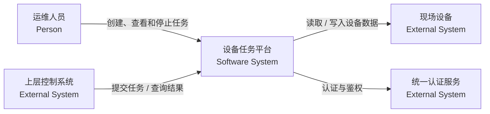

<p class="figure-caption">图 3-2 设备任务平台的用例图</p>

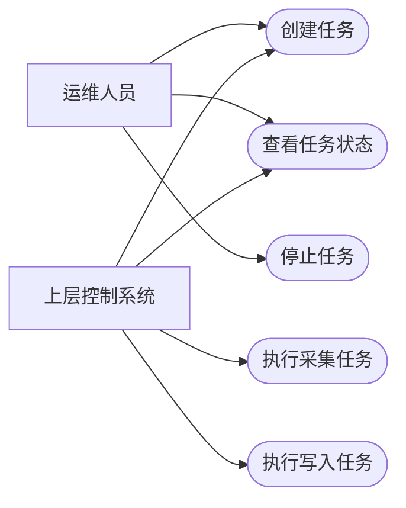

---

# 4. 软件架构

## 4.1 系统总体架构视角

### 4.1.1 图形表达主旨

系统总体架构视角回答：

> 整个软件由哪些主要运行单元和逻辑组件组成？各自承担什么职责？它们之间如何依赖和通信？

### 4.1.2 图形元素及使用规范

> 说明：下列表格中的“典型符号 / 写法”用于说明该元素在图中的视觉形态。对于 C4 和无统一标准的工程图，符号采用本文统一示意；对于 UML 等标准图，关系方向和端点符号按相应规范解释。凡表中使用箭头，均在“用法”列明确箭头的起点、终点及其语义。

#### 4.1.2.1 C4 Container Diagram

<p class="table-caption">表 4-1 C4 Container Diagram 元素及用法</p>

| 元素 | 典型符号 / 写法 | 含义 | 用法 |
|---|---|---|---|
| Person | `▭ «Person» 名称` | 使用系统的人或角色 | 保留与当前架构理解直接相关的角色 |
| Software System | `▭ «Software System» 名称` | 目标系统或外部系统 | 目标系统内部进一步展开为 Container |
| Container | `▭ «Container» 名称` | 可独立运行或承担明确运行职责的应用、服务或数据存储 | 例如 Python API、Worker、PostgreSQL、Broker；不等同于 Docker Container |
| Relationship | `Source ──▶ Target` | Container/System/Person 之间的调用或数据交换 | 标注主要业务语义，必要时附协议。起点为发起交互的 Person/System/Container，终点为被调用或接收数据的目标；例如 `API ──写入──▶ DB`。 |
| Technology | `[Python/FastAPI]` | Container 使用的关键技术 | 可写 Python/FastAPI、PostgreSQL、Redis 等，但不列无关依赖 |

Container 粒度应能够回答“系统运行时有哪些主要单元”，而不是“源码中有哪些目录”。

#### 4.1.2.2 C4 Component Diagram

<p class="table-caption">表 4-2 C4 Component Diagram 元素及用法</p>

| 元素 | 典型符号 / 写法 | 含义 | 用法 |
|---|---|---|---|
| Container Boundary | `┌─ Container ─┐ … └───────────┘` | 当前正在分解的 Container | 一张图通常聚焦一个 Container |
| Component | `▭ «Component» 名称` | Container 内承担稳定职责的一组代码 | 如 REST API、Task Engine、Repository；不应把任意 Python 文件都定义为 Component |
| External Container/System | `▭ «External» 名称` | 与当前 Component 交互的外部运行单元 | 只保留理解当前组件关系所需的外部元素 |
| Relationship | `SourceComponent ──▶ TargetComponent` | Component 之间的使用或依赖关系 | 标明调用职责或数据语义。起点为使用/调用方 Component，终点为被使用/被调用方 Component 或外部元素；关系文字必须从起点读向终点。 |
| Technology / Interface 标注 | `[REST] / [Protocol]` | Component 使用的实现技术或接口形式 | 仅保留解释架构边界必要的信息 |

#### 4.1.2.3 UML Component Diagram

<p class="table-caption">表 4-3 UML Component Diagram 元素及用法</p>

| 元素 | 典型符号 / 写法 | 含义 | 用法 |
|---|---|---|---|
| Component | `▭ «Component» 名称` | 可替换、具有明确职责和接口的软件组成单元 | 用于表达较稳定的软件边界 |
| Provided Interface | `Component ──○ Interface` | Component 对外提供的接口 | 常用棒棒糖符号表示；对应“我能提供什么” |
| Required Interface | `Component ──⊂ Interface` | Component 所依赖的接口 | 常用插口符号表示；对应“我需要什么” |
| Port | `□（位于组件边界）` | Component 与外部交互的明确连接点 | 当一个 Component 有多个类型不同的交互接口时使用 |
| Dependency | `Client - -▶ Supplier` | 一个 Component 依赖另一个 Component/Interface | 表示编译期或运行期依赖，不等同于对象持有。虚线箭头从依赖方（client）指向被依赖方（supplier）；即 `Client - -▶ Supplier`。 |
| Assembly Connector | `Required ⊂──○ Provided` | Required Interface 与 Provided Interface 的连接 | 用于说明接口契约的装配关系。没有调用方向箭头；它把 Required Interface 的插口端连接到 Provided Interface 的棒棒糖端，表示接口装配。 |

UML Component Diagram 适合强调“接口契约”；C4 Component Diagram 更适合强调“职责划分”。两者可以表达相似对象，但观察重点不同。

### 4.1.3 范例

<p class="figure-caption">图 4-1 设备任务平台的 Container 架构图</p>

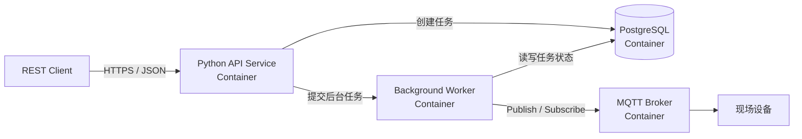

<p class="figure-caption">图 4-2 Python 后端的组件分解图</p>

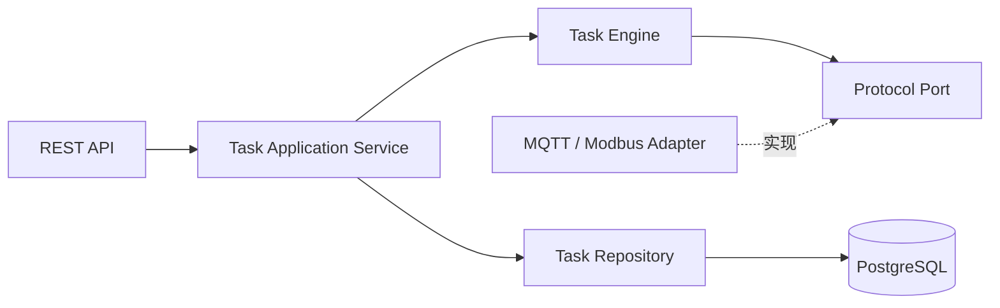

---

## 4.2 源码组织视角

### 4.2.1 图形表达主旨

源码组织视角回答：

> Python 代码仓库在 Package、Module 层面如何组织？哪些模块属于同一架构层？真实依赖方向是什么？是否存在循环依赖或跨层依赖？

### 4.2.2 图形元素及使用规范

> 说明：下列表格中的“典型符号 / 写法”用于说明该元素在图中的视觉形态。对于 C4 和无统一标准的工程图，符号采用本文统一示意；对于 UML 等标准图，关系方向和端点符号按相应规范解释。凡表中使用箭头，均在“用法”列明确箭头的起点、终点及其语义。

#### 4.2.2.1 UML Package Diagram

<p class="table-caption">表 4-4 UML Package Diagram 元素及用法</p>

| 元素 | 典型符号 / 写法 | 含义 | 用法 |
|---|---|---|---|
| Package | `┌─ package Name ─┐` | 对模型元素或源码模块进行分组的命名空间 | 在 Python 中通常映射到主要 Package，而不是每个单独文件 |
| Nested Package | `OuterPackage { InnerPackage }` | Package 内部的子 Package | 用于表达源码层级，但不应无限下钻 |
| Package Dependency | `Dependent - -▶ Supplier` | 一个 Package 使用另一个 Package 中的元素 | 箭头从依赖方指向被依赖方。虚线箭头从依赖 Package 指向被依赖 Package；即 `Dependent - -▶ Supplier`。 |
| Package Import | `Importer - -▶ Imported  «import»` | 将另一个 Package 的公开成员引入当前命名空间 | 只有需要区分 UML import 语义时才使用。带 `«import»` 的虚线箭头从 importing Package 指向被导入的 Package。 |
| Package Merge | `Receiving - -▶ Merged  «merge»` | Package 内容的合并关系 | 软件建模与源码分析中很少使用，除非项目模型确有该语义。带 `«merge»` 的虚线箭头从 receiving Package 指向被 merge 的 Package；软件建模与源码分析中通常很少需要。 |

Package Diagram 应主要表达“设计上的模块边界和依赖方向”。

#### 4.2.2.2 Module Dependency Graph

<p class="table-caption">表 4-5 Module Dependency Graph 元素及用法</p>

| 元素 | 典型符号 / 写法 | 含义 | 用法 |
|---|---|---|---|
| Node | `[ package.module ]` | Package、Module 或文件 | 同一张图必须保持统一粒度，避免 Package 与函数混画 |
| Directed Edge | `Source ──▶ Target` | Source 依赖 Target | 通常由 `import`、显式模块引用等关系产生。箭头从依赖方 Source 指向被依赖方 Target；Python 中常对应 `Source` 导入或引用 `Target`。 |
| Edge Label | `A ──▶ B  [import]` | 依赖类型或关键依赖说明 | 可标记 import、runtime load、plugin 等 |
| Cluster / Group | `┌─ Group ─┐ … └─────────┘` | 架构层或 Package 分组 | 用于比较“实际依赖”与“设计分层” |
| Cycle | `A ─▶ B ─▶ C ─▶ A` | 有向环 | 是识别循环依赖的重要信号，应重点检查 |

Dependency Graph 更接近源码事实，Package Diagram 更接近设计意图。二者应相互验证。

### 4.2.3 范例

示例目录：

```text
src/
├── api/
├── application/
├── domain/
├── infrastructure/
└── protocol/
```

<p class="figure-caption">图 4-3 示例系统的 Package Diagram</p>

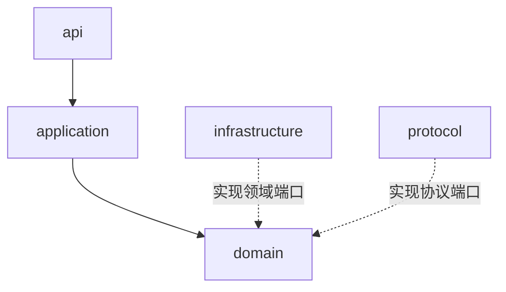

<p class="figure-caption">图 4-4 示例系统的模块依赖图</p>

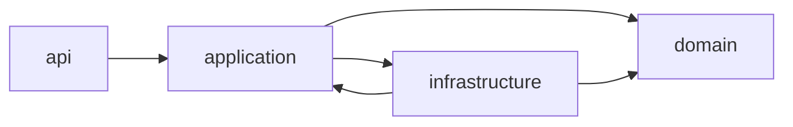

其中 `APP ↔ INF` 表示需要重点检查的循环依赖。

---

# 5. 程序行为

## 5.1 程序控制流程视角

### 5.1.1 图形表达主旨

程序控制流程视角回答：

> 程序从哪里开始？一个过程经过哪些步骤、判断、循环和并行分支？代码有哪些可能的控制路径？

### 5.1.2 图形元素及使用规范

> 说明：下列表格中的“典型符号 / 写法”用于说明该元素在图中的视觉形态。对于 C4 和无统一标准的工程图，符号采用本文统一示意；对于 UML 等标准图，关系方向和端点符号按相应规范解释。凡表中使用箭头，均在“用法”列明确箭头的起点、终点及其语义。

#### 5.1.2.1 UML Activity Diagram

<p class="table-caption">表 5-1 UML Activity Diagram 元素及用法</p>

| 元素 | 典型符号 / 写法 | 含义 | 用法 |
|---|---|---|---|
| Initial Node | `●` | 活动开始点 | 一个独立活动通常有明确入口 |
| Action | `[ Action ]` | 一个不可再分或当前层级不再细分的执行动作 | 使用动宾结构命名，如“读取配置” |
| Control Flow | `Action A ──▶ Action B` | Action 之间的执行顺序 | 箭头表示控制权转移。箭头从先执行的 Action/Node 指向后继 Action/Node，表示控制权转移方向。 |
| Object Flow | `Producer ──data──▶ Consumer` | 对象/数据在 Action 之间的流动 | 只有当数据本身对理解流程重要时使用。箭头从产生/提供对象或数据的一端指向消费/接收该对象或数据的一端。 |
| Decision Node | `◇` | 条件分支 | 各输出边应写 Guard，如 `[valid]`。一条入边进入 Decision，多条带 Guard 的出边从 Decision 指向各候选后继节点。 |
| Merge Node | `◇（多入一出）` | 多个互斥分支重新合并 | 不应与并行 Join 混淆。多个互斥分支的入边指向 Merge，Merge 再以一条出边指向后续节点。 |
| Fork Node | `━（一入多出）` | 一条控制流分裂为多个并行流 | 表示并发执行。一条入边指向 Fork，多个出边由 Fork 指向并行执行的后继分支。 |
| Join Node | `━（多入一出）` | 多条并行流同步后继续 | 表示同步屏障。多个并行分支的入边指向 Join，Join 再以一条出边指向同步后的后继节点。 |
| Activity Final | `◎` | 整个 Activity 结束 | 与单条 Flow Final 不同 |
| Swimlane / Partition | `│ Lane A │ Lane B │` | 按角色、模块或组件划分责任区域 | 用于显示“谁执行这个 Action” |

#### 5.1.2.2 Flowchart

<p class="table-caption">表 5-2 Flowchart 元素及用法</p>

| 元素 | 典型符号 / 写法 | 含义 | 用法 |
|---|---|---|---|
| Start / End | `( Start ) / ( End )` | 流程入口和出口 | 用终止符表示 |
| Process | `[ Process ]` | 一般处理步骤 | 矩形；一个节点表达一个清晰动作 |
| Decision | `◇ condition?` | 条件判断 | 菱形；每条出口标条件 |
| Input / Output | `/ Input / Output /` | 输入或输出数据 | 可用平行四边形；算法图中按需使用 |
| Subprocess | `[[ Subprocess ]]` | 调用另一个已定义过程 | 避免把复杂子过程全部展开 |
| Flow Line | `A ──▶ B` | 执行方向 | 应尽量保持单一主方向，减少交叉。箭头从当前步骤指向下一执行步骤；Decision 的各出口箭头必须标明条件。 |

#### 5.1.2.3 Control Flow Graph（CFG）

<p class="table-caption">表 5-3 CFG 元素及用法</p>

| 元素 | 典型符号 / 写法 | 含义 | 用法 |
|---|---|---|---|
| Entry Node | `Entry` | 控制流入口 | 对应函数或代码段入口 |
| Basic Block | `[ B1: statements ]` | 无内部跳转、顺序执行的一组语句 | CFG 的基本节点，不应随意把每行代码单独设为节点 |
| Directed Edge | `Source ──▶ Target` | 一个 Basic Block 执行后可能转移到另一个 Block | 对应分支、循环、异常等控制转移。箭头从可能先执行的 Basic Block 指向其可能后继 Basic Block。 |
| Branch Edge | `B1 ─[True]▶ B2` | 条件分支的不同出口 | 应标出 True/False 或实际条件。箭头从分支 Basic Block 指向不同后继 Block，并在每条边上标明 True/False 或实际条件。 |
| Back Edge | `Bk ──▶ Bj（j < k）` | 指向前序节点的边 | 常用于识别循环。箭头从循环体后部 Block 指回前面的循环头/条件 Block，用于表示迭代回跳。 |
| Exit Node | `Exit` | 控制流出口 | 一个函数可有多个实际 return，但可抽象为统一 Exit |

CFG 是代码级控制模型，应能直接由实际源码验证。

### 5.1.3 范例

<p class="figure-caption">图 5-1 Python 服务启动过程活动图</p>

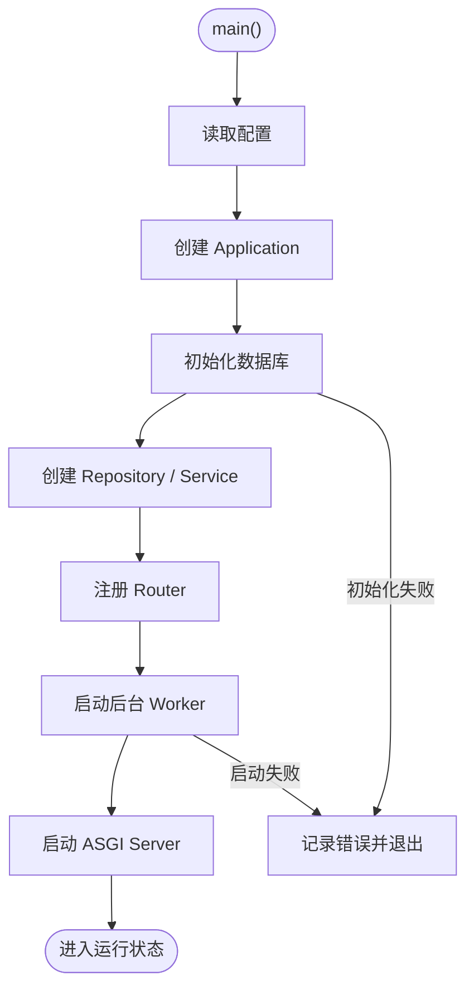

<p class="figure-caption">图 5-2 局部程序逻辑流程图</p>

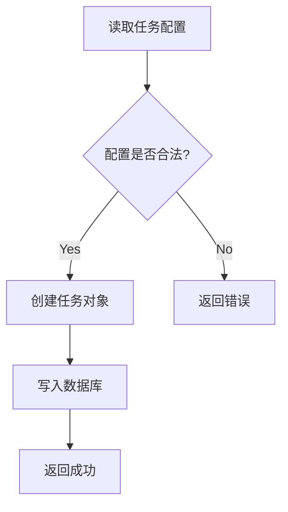

<p class="figure-caption">图 5-3 任务执行函数的简化 CFG</p>

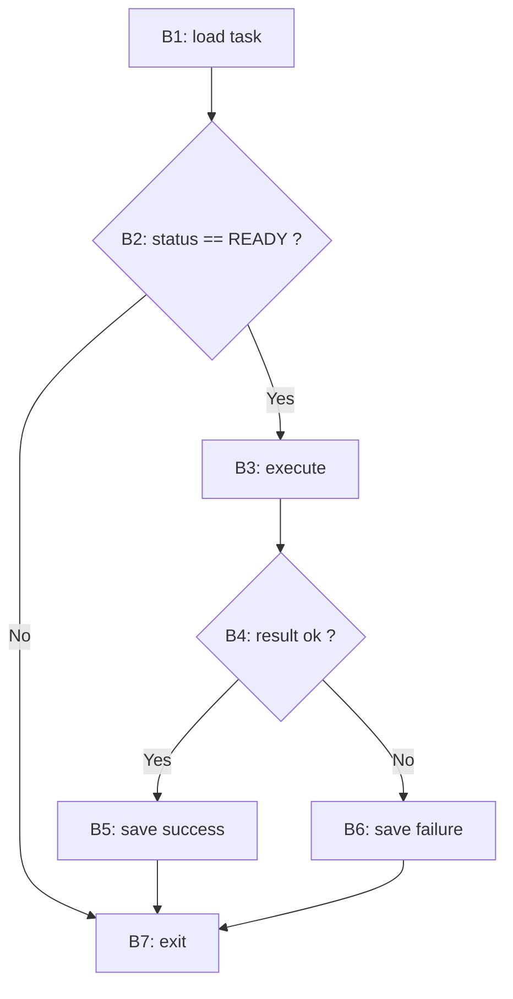

---

## 5.2 业务交互与调用链视角

### 5.2.1 图形表达主旨

业务交互与调用链视角回答：

> 一个具体 Use Case 中，哪些参与者、对象和函数参与执行？它们按什么顺序调用？哪些对象彼此直接协作？

### 5.2.2 图形元素及使用规范

> 说明：下列表格中的“典型符号 / 写法”用于说明该元素在图中的视觉形态。对于 C4 和无统一标准的工程图，符号采用本文统一示意；对于 UML 等标准图，关系方向和端点符号按相应规范解释。凡表中使用箭头，均在“用法”列明确箭头的起点、终点及其语义。

#### 5.2.2.1 UML Sequence Diagram

<p class="table-caption">表 5-4 UML Sequence Diagram 元素及用法</p>

| 元素 | 典型符号 / 写法 | 含义 | 用法 |
|---|---|---|---|
| Actor | `Actor（小人符号）` | 交互发起者或外部角色 | 放在系统交互边缘 |
| Participant / Lifeline | `Participant  ⋮` | 参与交互的对象、组件、服务或实例 | 名称应与源码对象/组件对应 |
| Activation | `Lifeline 上的窄长矩形` | Lifeline 正在执行某段行为的时间区间 | 用于突出嵌套调用，复杂图中按需使用 |
| Synchronous Message | `Caller ──▶ Callee`（实心箭头） | 调用方等待返回的同步消息 | 常映射普通函数调用或同步 RPC。箭头从调用者 Lifeline 指向被调用者 Lifeline；调用者等待该调用完成或返回。 |
| Asynchronous Message | `Sender ──> Receiver`（开放箭头） | 调用方不等待立即返回的异步消息 | 可映射消息发布、异步任务提交等。箭头从消息发送者指向接收者；发送者不因该消息而必须等待同步返回。 |
| Return Message | `Callee - - > Caller`（虚线开放箭头） | 调用结果返回 | 简单调用可省略，关键数据返回应保留。返回虚线箭头从被调用者指回原调用者，与调用消息方向相反。 |
| Self Message | `Object ─┐ ↩` | 对象调用自身行为 | 用于表示内部方法调用或递归。箭头从对象自身 Lifeline 发出并回到同一 Lifeline，表示内部调用或递归。 |
| Combined Fragment | `┌─ alt / opt / loop / par ─┐` | `alt`、`opt`、`loop`、`par` 等控制片段 | 表达条件、可选、循环、并行交互 |
| Create / Destroy | `Creator ──▶ NewObject / Object ×` | 对象创建或销毁 | 只有生命周期对 Use Case 有意义时使用。Create 消息从创建者指向新对象 Lifeline 的起点；Destroy 在被销毁 Lifeline 末端以 `×` 标记。 |

Sequence Diagram 的纵向位置表达时间先后，因此不能任意调整消息位置而不改变语义。

#### 5.2.2.2 UML Communication Diagram

<p class="table-caption">表 5-5 UML Communication Diagram 元素及用法</p>

| 元素 | 典型符号 / 写法 | 含义 | 用法 |
|---|---|---|---|
| Object / Role | `object:Class` | 参与协作的对象或角色 | 重点表达“谁与谁有直接通信关系” |
| Link | `Object A ─── Object B` | 对象之间可通信的连接 | Link 本身不表示时间顺序 |
| Message | `A ──1: m()──▶ B` | 沿 Link 发送的调用或消息 | 应写消息名。消息箭头从发送对象指向接收对象；由于没有纵向时间轴，必须用序号明确消息先后。 |
| Sequence Number | `1`、`1.1`、`2` | 消息发生顺序 | 如 `1`、`1.1`、`2`，用于补偿没有时间轴的问题 |
| Guard / Iteration 标记 | `[guard] 1: m()` / `*[i] m()` | 消息执行条件或循环 | 复杂交互按需使用 |

Communication Diagram 与 Sequence Diagram 表达同一类 Interaction，只是一个强调拓扑，一个强调时间轴。

#### 5.2.2.3 Call Graph

<p class="table-caption">表 5-6 Call Graph 元素及用法</p>

| 元素 | 典型符号 / 写法 | 含义 | 用法 |
|---|---|---|---|
| Function / Method Node | `[module.func()]` | 函数或方法 | 应保持统一粒度 |
| Call Edge | `Caller ──▶ Callee` | Caller 可能调用 Callee | 箭头从调用者指向被调用者。箭头从 Caller 指向可能被调用的 Callee；它表示调用关系，不保证某次运行一定发生。 |
| Root / Entry | `[main()] / [handler()]` | 调用链入口 | 可对应 API Handler、CLI、main 等 |
| Recursive Edge / Cycle | `f() ─↺ f()` | 递归或调用环 | 需要单独识别 |
| Dynamic Dispatch Edge | `Caller - -▶ Impl?` | 由运行时类型决定的潜在调用 | Python 多态、Protocol、插件架构中要特别注意。箭头从调用点/调用者指向可能的运行时实现；若实现不唯一，应明确这是候选边。 |

静态 Call Graph 表示“可能调用”，并不等价于某一次真实执行顺序；真实业务顺序应用 Sequence Diagram 表达。

### 5.2.3 范例

场景：`POST /task/run`

<p class="figure-caption">图 5-4 `POST /task/run` 的时序图</p>

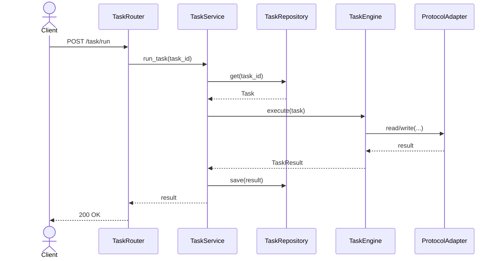

<p class="figure-caption">图 5-5 `POST /task/run` 的通信图</p>

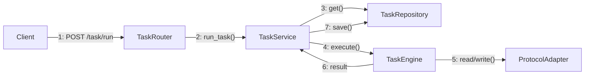

<p class="figure-caption">图 5-6 示例系统的调用图（局部）</p>

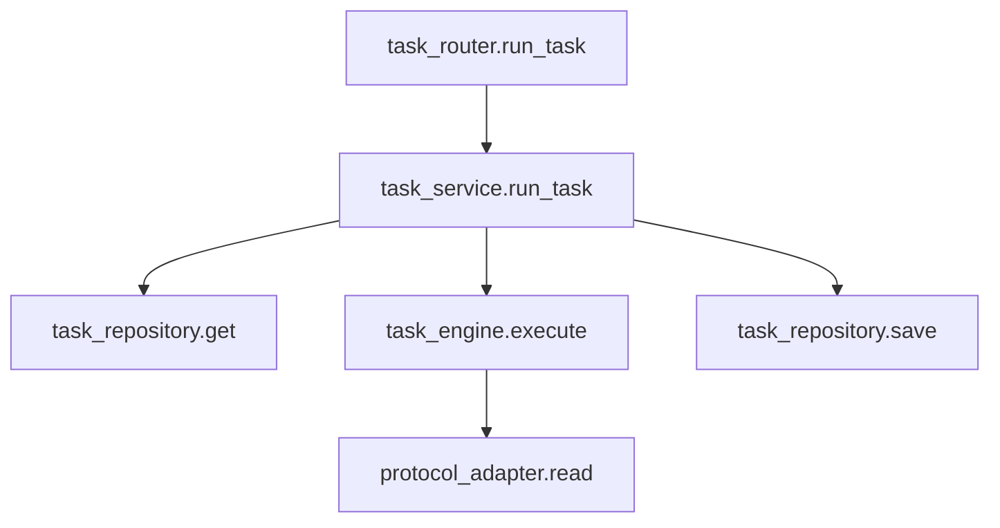

---

# 6. 对象模型

## 6.1 对象与领域模型视角

### 6.1.1 图形表达主旨

对象与领域模型视角回答：

> 软件中有哪些核心业务概念、类和运行时对象？它们之间是继承、实现、关联、组合、依赖还是实际对象引用？

### 6.1.2 图形元素及使用规范

> 说明：下列表格中的“典型符号 / 写法”用于说明该元素在图中的视觉形态。对于 C4 和无统一标准的工程图，符号采用本文统一示意；对于 UML 等标准图，关系方向和端点符号按相应规范解释。凡表中使用箭头，均在“用法”列明确箭头的起点、终点及其语义。

#### 6.1.2.1 UML Class Diagram

<p class="table-caption">表 6-1 UML Class Diagram 元素及用法</p>

| 元素 | 典型符号 / 写法 | 含义 | 用法 |
|---|---|---|---|
| Class | `┌ Class ┐ / attributes / operations` | 类型定义 | 可列名称、关键属性和关键操作，不应机械列出所有成员 |
| Interface | `«interface» InterfaceName` | 对外约定的行为契约 | Python 中可映射 `Protocol`、`ABC` 或稳定接口约定 |
| Attribute | `- name: Type` | 对象持有的数据 | 仅保留有助于理解模型的关键属性 |
| Operation | `+ operation(args): Return` | 类对外提供的行为 | 优先保留业务关键方法 |
| Association | `Class A ─── Class B` | 两个类型之间存在稳定结构关系 | 可标角色名、多重性和导航方向。默认用实线连接相关 Class，可在端点标多重性和角色名；只有需要表达 navigability 时才加箭头，并从可导航起点指向可访问目标。 |
| Aggregation | `Whole ◇── Part` | 弱“整体—部分”关系 | UML 中语义较弱，源码分析时应谨慎使用。空心菱形放在 Whole 一端，另一端是 Part；即 `Whole ◇── Part`。这不是普通方向箭头。 |
| Composition | `Whole ◆── Part` | 强“整体—部分”及生命周期所有权关系 | 只有部件生命周期受整体控制时使用。实心菱形放在 Whole 一端，另一端是 Part；即 `Whole ◆── Part`，表示强整体—部分及生命周期所有权。 |
| Generalization | `Child ──▷ Parent` | 继承 / is-a 关系 | 实线空心三角指向父类。实线空心三角箭头从子类指向父类；即 `Child ──▷ Parent`。 |
| Realization | `Class - -▷ Interface` | 类实现接口 | 虚线空心三角指向接口。虚线空心三角箭头从实现类指向被实现接口；即 `Class - -▷ Interface`。 |
| Dependency | `Client - -▶ Supplier` | 临时使用关系 | 如参数、局部变量、方法调用，不等于长期持有。虚线普通箭头从使用者/依赖者指向被使用元素；即 `Client - -▶ Supplier`。 |

#### 6.1.2.2 UML Object Diagram

<p class="table-caption">表 6-2 UML Object Diagram 元素及用法</p>

| 元素 | 典型符号 / 写法 | 含义 | 用法 |
|---|---|---|---|
| Object Instance | `instance:Class`（下划线） | 某一时刻存在的实际对象 | 常写作 `instanceName:ClassName` |
| Slot / Value | `attribute = value` | 实例当前属性值 | 只保留解释当前场景所需值 |
| Link | `objA:Class ─── objB:Class` | 实例之间的实际关联 | 表示运行时真实存在的引用/连接。通常用无方向实线连接实际对象实例；若要强调单向引用，可从持有引用的对象指向被引用对象，并在图例中说明。 |
| Role | `roleName` | 对象在某关联中的角色 | 用于区分同类型多个实例 |

Object Diagram 是 Class Diagram 在某一运行时刻的实例快照。

#### 6.1.2.3 Domain Model

<p class="table-caption">表 6-3 Domain Model 常用元素及用法</p>

| 元素 | 典型符号 / 写法 | 含义 | 用法 |
|---|---|---|---|
| Entity | `▭ «Entity» Name` | 具有持续身份标识的领域对象 | 关注身份与生命周期，如 Task |
| Value Object | `▭ «Value Object» Name` | 由值定义、通常无独立身份的对象 | 如时间范围、坐标、金额 |
| Aggregate | `┌─ Aggregate ─┐ … └──────────┘` | 保证一致性的对象簇 | 外部应通过 Aggregate Root 修改内部对象 |
| Aggregate Root | `▭ «Aggregate Root» Name` | Aggregate 的访问入口 | 用于约束跨对象修改路径 |
| Domain Service | `▭ «Domain Service» Name` | 不自然属于单一 Entity/Value Object 的领域行为 | 只承载领域逻辑，不承担基础设施职责 |
| Association | `Concept A ─── Concept B` | 领域概念之间的业务关系 | 应使用业务语义命名。通常用无方向实线表示领域概念关系；关系名应采用业务语义。只有模型明确存在单向导航时才画方向。 |

### 6.1.3 范例

<p class="figure-caption">图 6-1 示例系统的类图</p>

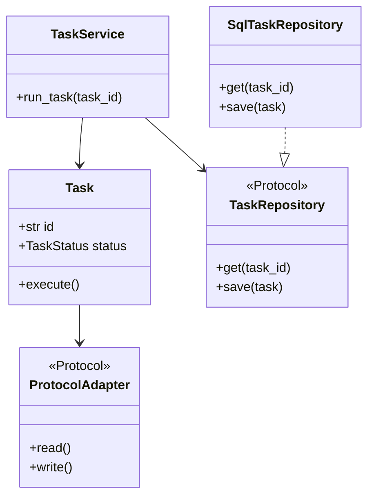

<p class="figure-caption">图 6-2 示例系统的运行时对象图（实例关系表达）</p>

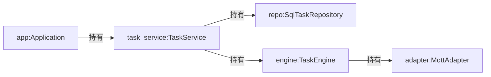

---

## 6.2 状态与生命周期视角

### 6.2.1 图形表达主旨

状态与生命周期视角回答：

> 一个对象在整个生命周期中有哪些合法状态？什么事件触发状态迁移？是否存在 Guard 和 Transition Action？

### 6.2.2 图形元素及使用规范

> 说明：下列表格中的“典型符号 / 写法”用于说明该元素在图中的视觉形态。对于 C4 和无统一标准的工程图，符号采用本文统一示意；对于 UML 等标准图，关系方向和端点符号按相应规范解释。凡表中使用箭头，均在“用法”列明确箭头的起点、终点及其语义。

#### 6.2.2.1 UML State Machine Diagram

<p class="table-caption">表 6-4 State Machine Diagram 元素及用法</p>

| 元素 | 典型符号 / 写法 | 含义 | 用法 |
|---|---|---|---|
| Initial Pseudostate | `● ──▶ State` | 状态机初始入口 | 指向初始稳定状态。初始伪状态只有出边；箭头从 `●` 指向对象进入状态机后的第一个稳定 State。 |
| State | `[ State ]` | 对象在一段时间内保持的稳定状态 | 状态名应表示业务/运行条件，如 RUNNING |
| Transition | `S1 ─event [guard] / effect──▶ S2` | 从 Source State 到 Target State 的迁移 | 一般写作 `event [guard] / effect`。箭头从 Source State 指向 Target State；标签按 `event [guard] / effect` 阅读。 |
| Event / Trigger | `event` | 触发 Transition 的事件 | 如 `start()`、`connection_lost` |
| Guard | `[condition]` | Transition 可发生的布尔条件 | 写在方括号中，如 `[retryable]` |
| Effect / Action | `/ action` | Transition 发生时执行的动作 | 用 `/ action` 表示 |
| Entry / Exit Action | `entry / action`、`exit / action` | 进入或离开 State 时执行的动作 | 当状态具有固定进入/退出行为时使用 |
| Final State | `State ──▶ ◎` | 状态机结束 | 表示对象生命周期完成。最后一个状态的 Transition 指向 Final State `◎`，表示该状态机生命周期终止。 |
| Composite State | `┌─ State ─┐ 子状态… └────────┘` | 内部还包含子状态的 State | 复杂生命周期按需使用 |

#### 6.2.2.2 UML Timing Diagram

<p class="table-caption">表 6-5 Timing Diagram 元素及用法</p>

| 元素 | 典型符号 / 写法 | 含义 | 用法 |
|---|---|---|---|
| Lifeline / Participant | `Participant : state(t)` | 随时间变化的对象或信号 | 可表示对象、状态变量、协议参与者 |
| Time Axis | `t ─────────▶` | 横向时间尺度 | Timing Diagram 的核心维度 |
| State / Value | `StateA ───── StateB` | 某时间区间内对象状态或信号值 | 用于展示状态持续时间 |
| State Change | `────┐ / └────` | 状态或值发生变化的时间点 | 可与消息/事件关联 |
| Duration Constraint | `<── Δt ──>` | 某状态必须持续的时间约束 | 如超时窗口、最小时长 |
| Time Constraint | `t2 - t1 ≤ T` | 两事件之间的时间限制 | 实时控制和通信协议中使用 |

### 6.2.3 范例

<p class="figure-caption">图 6-3 Task 生命周期状态机图</p>

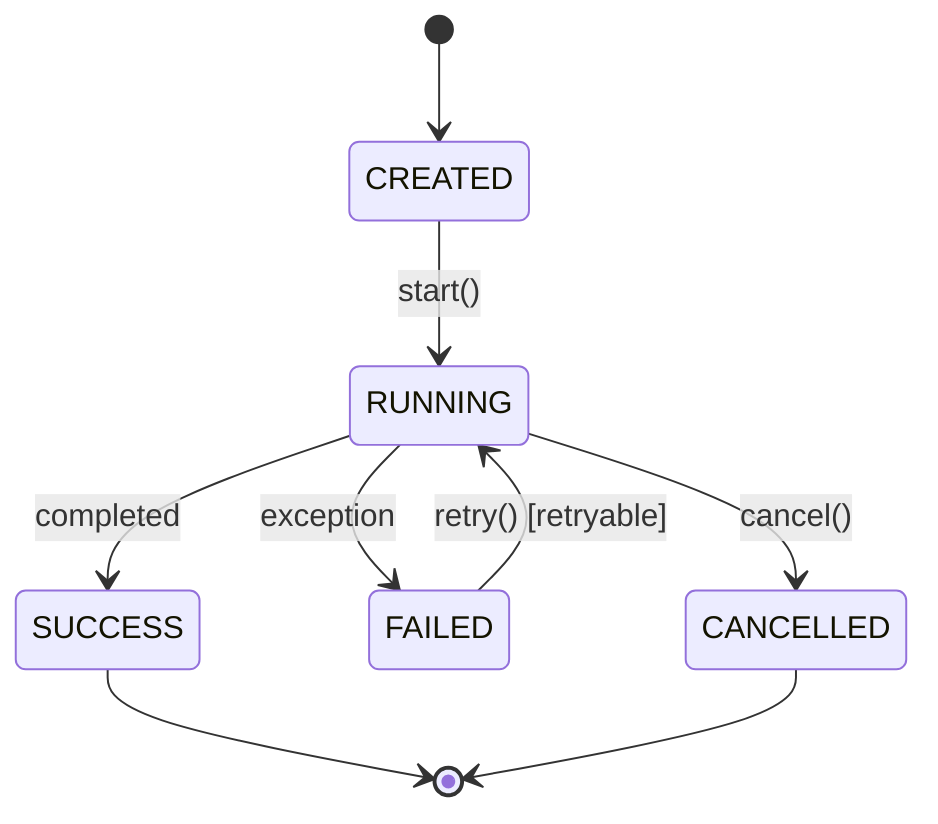

<p class="figure-caption">图 6-4 Connection 生命周期状态机图</p>

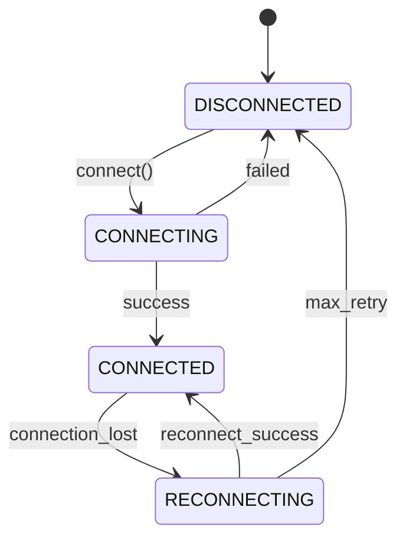

---

# 7. 数据

## 7.1 数据视角

### 7.1.1 图形表达主旨

数据视角回答：

> 数据从哪里产生？经过哪些处理？采用哪些数据结构？在哪里转换？在哪里持久化？最终流向哪里？

### 7.1.2 图形元素及使用规范

> 说明：下列表格中的“典型符号 / 写法”用于说明该元素在图中的视觉形态。对于 C4 和无统一标准的工程图，符号采用本文统一示意；对于 UML 等标准图，关系方向和端点符号按相应规范解释。凡表中使用箭头，均在“用法”列明确箭头的起点、终点及其语义。

#### 7.1.2.1 Data Flow Diagram（DFD）

<p class="table-caption">表 7-1 DFD 元素及用法</p>

| 元素 | 典型符号 / 写法 | 含义 | 用法 |
|---|---|---|---|
| External Entity | `[ External Entity ]` | 数据来源或去向，位于分析系统之外 | 如设备、外部服务、用户 |
| Process | `( Process )`（或圆角矩形） | 对输入数据进行转换的处理过程 | 名称应体现转换动作，如“解析协议帧”；同一张 DFD 应统一采用一种 DFD 记法，不混用不同符号体系 |
| Data Store | `[( Data Store )]` | 系统中的持久化或暂存数据集合 | 如数据库、文件、缓存 |
| Data Flow | `Source ──DataName──▶ Target` | 数据在元素之间的流动 | 连线应标数据名，如 `PointData`，而不是“调用”。箭头从数据产生/提供方指向数据接收/消费方；箭头名称必须是数据名，而不是动作名或函数名。 |
| Process Number | `1.0 ProcessName` | 分层 DFD 中 Process 的编号 | Level 1/2 下钻时用于保持上下层平衡 |

DFD 的箭头表示“数据流”，不表示函数调用顺序。

#### 7.1.2.2 ER Diagram（ERD）

<p class="table-caption">表 7-2 ERD 元素及用法</p>

| 元素 | 典型符号 / 写法 | 含义 | 用法 |
|---|---|---|---|
| Entity | `┌ Entity ┐` | 需要持久记录的业务对象类型 | 如 TASK、TASK_RESULT |
| Attribute | `attribute: Type` | Entity 的属性 | 概念模型可只保留关键属性 |
| Identifier / Key | `PK id` | 唯一标识 Entity 实例的属性 | 逻辑/物理模型中对应主键 |
| Relationship | `Entity A ─── Entity B` | Entity 之间的业务关系 | 应有明确语义名称。通常使用无方向关系线连接两个 Entity，端点的 Cardinality/Optionality 表示基数约束；它不是调用箭头。 |
| Cardinality | `1`、`0..1`、`1..*` | 关系基数 | 如 1:1、1:N、M:N |
| Optionality | `o`（可选端） | 关系是否必选 | 与基数共同表达约束 |

#### 7.1.2.3 Data Lineage Diagram

<p class="table-caption">表 7-3 Data Lineage Diagram 元素及用法</p>

| 元素 | 典型符号 / 写法 | 含义 | 用法 |
|---|---|---|---|
| Source Dataset / Field | `[ Source ]` | 原始数据源 | 可以是表、文件、Topic、字段 |
| Transformation | `( Transform )` | 数据转换过程 | 如解析、映射、过滤、聚合 |
| Derived Dataset / Field | `[ Derived Data ]` | 转换后得到的数据 | 需能够追溯其来源 |
| Sink / Consumer | `[ Sink ]` | 最终存储或消费方 | 如数据库表、API 输出、模型输入 |
| Lineage Edge | `Source ──▶ Derived` | 数据派生关系 | 与普通“调用”关系不同，强调来源与派生。箭头从上游 Source 指向由其派生得到的下游 Dataset/Field；表示血缘来源而不是调用关系。 |

### 7.1.3 范例

<p class="figure-caption">图 7-1 设备数据处理第 0 层 DFD</p>

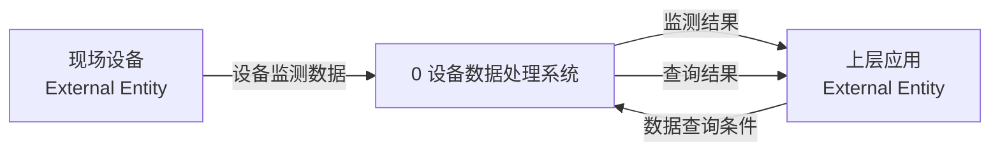

第 1 层 DFD 对系统内部处理过程进行分解，不再绘制外部实体框；第 0 层的边界输入输出通过无形边界端点保留。

<p class="figure-caption">图 7-2 设备数据处理第 1 层 DFD</p>

```mermaid
%%{init: {"flowchart": {"useMaxWidth": true}}}%%
flowchart LR
    IN1[""]
    IN2[""]
    OUT1[""]
    OUT2[""]
    P1["1.0 接收设备数据"]
    P2["2.0 解析与标准化"]
    P3["3.0 管理监测数据"]
    DB[("D1 监测数据")]

    IN1 -->|"设备监测数据"| P1
    P1 -->|"设备原始数据"| P2
    P2 -->|"标准化监测数据"| P3
    P3 -->|"监测数据"| DB
    IN2 -->|"数据查询条件"| P3
    DB -->|"历史监测数据"| P3
    P3 -->|"监测结果"| OUT1
    P3 -->|"查询结果"| OUT2

    style IN1 fill:transparent,stroke:transparent,color:transparent
    style IN2 fill:transparent,stroke:transparent,color:transparent
    style OUT1 fill:transparent,stroke:transparent,color:transparent
    style OUT2 fill:transparent,stroke:transparent,color:transparent
```

<p class="figure-caption">图 7-3 示例系统的 ERD</p>

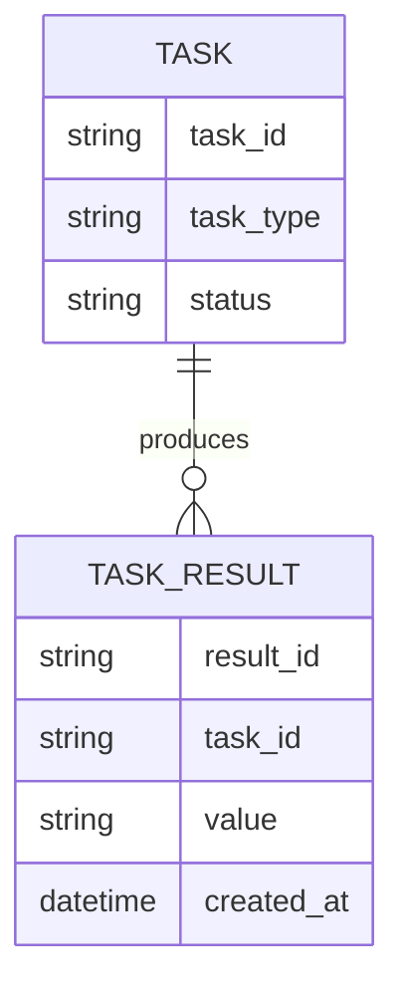

<p class="figure-caption">图 7-4 示例系统的数据血缘图</p>

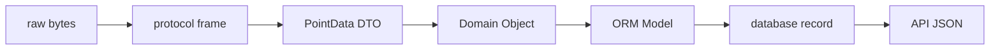

---

# 8. 算法

## 8.1 算法视角

### 8.1.1 图形表达主旨

算法视角回答：

> 一个算法究竟“怎么算”？有哪些阶段、循环、判断和收敛条件？中间结果依赖哪些输入？这些步骤最终落在哪些函数中？

算法理解至少要区分：

1. **控制关系**：哪一步先执行，有哪些判断、循环和退出路径；
2. **数据与计算关系**：某个变量由哪些变量和运算得到；
3. **文字化算法步骤**：输入是什么、循环体做什么、变量如何更新、何时终止。

### 8.1.2 图形元素及使用规范

> 说明：下列表格中的“典型符号 / 写法”用于说明该元素在图中的视觉形态。对于 C4 和无统一标准的工程图，符号采用本文统一示意；对于 UML 等标准图，关系方向和端点符号按相应规范解释。凡表中使用箭头，均在“用法”列明确箭头的起点、终点及其语义。

#### 8.1.2.1 Algorithm Flowchart

其元素与普通 Flowchart 相同，但节点语义应落在“算法步骤”而不是软件组件上。

<p class="table-caption">表 8-1 Algorithm Flowchart 元素及用法</p>

| 元素 | 典型符号 / 写法 | 含义 | 用法 |
|---|---|---|---|
| Start / Initialization | `( Start / Init )` | 算法入口和初始条件 | 明确初值、参数、预处理 |
| Computation Step | `[ Compute ]` | 一次数学/数值计算 | 节点应表达计算语义，如“组装刚度矩阵” |
| Decision | `◇ condition?` | 收敛、容差、边界等判断 | 条件必须明确 |
| Iteration Edge | `Later Step ──▶ Earlier Step` | 返回前面步骤形成循环 | 用于迭代算法。箭头从较后的迭代步骤返回到较前的循环入口/判断节点，表示下一轮迭代。 |
| Output / Failure | `( Output ) / ( Failure )` | 正常输出或失败出口 | 应明确收敛失败、异常终止等情况 |

#### 8.1.2.2 Data Flow Graph（DFG）

<p class="table-caption">表 8-2 DFG 元素及用法</p>

| 元素 | 典型符号 / 写法 | 含义 | 用法 |
|---|---|---|---|
| Input Variable | `[ x ]` | 算法输入量 | 如状态、参数、外部输入 |
| Operation Node | `( op )` | 对输入执行的运算 | 如 `+`、矩阵乘、求解、函数计算 |
| Intermediate Value | `[ v ]` | 中间计算结果 | 用于解释后续量如何得到 |
| Output Variable | `[ y ]` | 算法输出量 | 应能与函数输出对应 |
| Data Dependency Edge | `SourceValue ──▶ ConsumerOp` | Target 的计算依赖 Source | 箭头表示“值依赖”，不表示时间控制流。箭头从被依赖的值/输入指向使用该值的运算或结果；即 Target 的计算依赖 Source。 |

#### 8.1.2.3 Computational Graph

<p class="table-caption">表 8-3 Computational Graph 元素及用法</p>

| 元素 | 典型符号 / 写法 | 含义 | 用法 |
|---|---|---|---|
| Variable / Tensor Node | `[ x ] / [ X ]` | 标量、向量、矩阵或张量 | 可区分输入、参数、中间变量 |
| Operator Node | `( matmul / solve / sin )` | 明确的计算算子 | 如 matmul、sin、solve、reduce |
| Directed Edge | `Source ──▶ Target` | 数值从前一节点流入后一运算 | 构成有向计算依赖。前向计算时，箭头从输入变量/上游运算结果指向消费该值的下游 Operator/Variable。 |
| Parameter Node | `[ p ]` | 参与计算但通常独立维护的参数 | ML 或参数化数值模型中常用 |
| Gradient Edge / Backward Relation | `DownstreamGrad - -▶ UpstreamGrad` | 自动微分的反向依赖 | 只有分析 AD/ML 时才需要。若显式画反向传播，箭头方向与前向数据流相反：从下游梯度/算子指向其上游输入对应的梯度。 |

DFG 更偏程序分析的数据依赖；Computational Graph 更强调显式运算节点和数学计算结构。

#### 8.1.2.4 Call Graph

Call Graph 在算法视角中不解释算法数学关系，只用于把算法步骤映射到实际实现函数。元素定义见“业务交互与调用链视角”中的 Call Graph 规范。

#### 8.1.2.5 算法伪代码

算法伪代码不是图，但应作为算法章节的标准表达方式。

<p class="table-caption">表 8-4 算法伪代码元素及用法</p>

| 元素 | 典型符号 / 写法 | 含义 | 用法 |
|---|---|---|---|
| Input | `INPUT x, p` | 算法所需输入 | 明确变量、参数、初值 |
| Output | `OUTPUT y` | 算法返回结果 | 明确正常结果及必要的状态码 |
| Initialization | `x ← x0` | 初始状态建立 | 如 `x ← x0` |
| Sequential Step | `step k: ...` | 顺序执行的算法步骤 | 使用数学或算法语义，不拘泥于 Python 语法 |
| Condition | `IF condition THEN ... ELSE ...` | 条件分支 | 用 `if / else` 或自然语言条件 |
| Loop | `FOR / WHILE ...` | 迭代或遍历 | 明确循环范围或终止条件 |
| Update | `x ← x + Δx` | 状态或变量更新 | 例如 `x ← x + Δx` |
| Termination | `RETURN / BREAK / FAIL` | 正常或异常终止 | 明确收敛、失败、超限等出口 |
| Invariant / Constraint | `INVARIANT: ...` | 循环过程中应持续满足的约束 | 对复杂数值算法可显式说明 |

伪代码应比 Flowchart 更精确，但不应退化为某种具体编程语言的源码复制。

### 8.1.3 范例

<p class="figure-caption">图 8-1 迭代求解器流程图</p>

```mermaid
%%{init: {"flowchart": {"useMaxWidth": true}}}%%
flowchart TD
    A["读取输入 / 初始化 x0"]
    B["组装系统"]
    C["计算当前残差 r(x)"]
    D{"||r|| < tol ?"}
    E["求解增量 Δx"]
    F["更新 x ← x + Δx"]
    G{"迭代次数超限?"}
    H["输出收敛结果"]
    X["输出失败"]

    A --> B --> C --> D
    D -- Yes --> H
    D -- No --> E --> F --> G
    G -- No --> B
    G -- Yes --> X
```

<p class="figure-caption">图 8-2 迭代求解器的数据流图（DFG）</p>

```mermaid
%%{init: {"flowchart": {"useMaxWidth": true}}}%%
flowchart LR
    X["x_k"]
    P["parameters"]
    A["assemble(x_k, p)"]
    K["K_k"]
    R["r_k"]
    S["solve(K_k, r_k)"]
    DX["Δx_k"]
    U["update(x_k, Δx_k)"]
    XN["x_(k+1)"]

    X --> A
    P --> A
    A --> K
    A --> R
    K --> S
    R --> S
    S --> DX
    X --> U
    DX --> U
    U --> XN
```

算法 8-1 迭代求解器伪代码

```text
输入:
    初始值 x0
    参数 p
    收敛阈值 tol
    最大迭代次数 max_iter

输出:
    收敛解 x
    或失败状态

步骤:
1. 令 x ← x0
2. 对 iter 从 1 到 max_iter 执行:
   2.1 根据当前 x 和参数 p 组装系统
   2.2 计算残差 r(x)
   2.3 如果 ||r(x)|| < tol:
       返回 x，状态 = converged
   2.4 求解增量 Δx
   2.5 更新 x ← x + Δx
3. 若循环结束仍未满足收敛条件:
   返回 x，状态 = failed
```

---

## 8.2 数学与科学计算模型视角

### 8.2.1 图形表达主旨

科学计算、数值仿真、控制、空气动力学、多体动力学等项目不能只理解软件结构，还必须回答：

> 代码实现的物理模型和数学方程是什么？方程如何离散？采用什么数值算法？数学变量最终对应哪些代码变量和函数？

### 8.2.2 图形元素及使用规范

> 说明：下列表格中的“典型符号 / 写法”用于说明该元素在图中的视觉形态。对于 C4 和无统一标准的工程图，符号采用本文统一示意；对于 UML 等标准图，关系方向和端点符号按相应规范解释。凡表中使用箭头，均在“用法”列明确箭头的起点、终点及其语义。

该视角没有一套统一的 UML 图元，应按学科对象分别定义元素。

#### 8.2.2.1 Physical System Diagram

<p class="table-caption">表 8-5 Physical System Diagram 元素及用法</p>

| 元素 | 典型符号 / 写法 | 含义 | 用法 |
|---|---|---|---|
| Physical Object | `[ Physical Object ]` | 刚体、柔性体、流体域、控制对象等 | 对应真实物理组成 |
| Interface / Connection | `Object A ─── Object B` | 物理对象之间的连接关系 | 如铰链、约束、边界、耦合接口 |
| Input / Load | `Load ──▶ Object` | 外部作用或激励 | 如力、力矩、边界条件、控制输入。箭头从外部载荷/输入源指向受作用的 Physical Object；如 `F ──▶ Body`。 |
| State / Response | `Object ──▶ Response` | 物理响应量 | 如位移、速度、压力、温度。若用箭头表达输出关系，箭头从产生响应的 Physical Object 指向所观察的 Response 变量。 |
| Reference Frame / Domain | `O-xyz / Ω` | 坐标系或物理域 | 涉及空间关系时必须明确 |

#### 8.2.2.2 Equation / Variable Relation Diagram

<p class="table-caption">表 8-6 Equation / Variable Relation Diagram 元素及用法</p>

| 元素 | 典型符号 / 写法 | 含义 | 用法 |
|---|---|---|---|
| State Variable | `[ x ]` | 描述系统内部状态的变量 | 如 `x`、`q`、`v` |
| Input | `[ u ]` | 外部输入变量 | 如 `u`、载荷、边界条件 |
| Parameter | `[ p ]` | 模型参数 | 如材料参数、几何参数 |
| Equation / Operator | `( f / K / ∇ )` | 描述变量关系的方程或算子 | 必须与理论公式一致 |
| Output | `[ y ]` | 由状态和输入得到的观测量 | 应与代码输出对应 |
| Dependency Edge | `Source ──▶ Dependent` | 一个变量/方程依赖另一个量 | 表示数学依赖而非程序调用。箭头从自变量/上游变量指向依赖它的方程、算子或输出量；表示数学依赖，不表示函数调用。 |

#### 8.2.2.3 Discretization Diagram

<p class="table-caption">表 8-7 Discretization Diagram 元素及用法</p>

| 元素 | 典型符号 / 写法 | 含义 | 用法 |
|---|---|---|---|
| Continuous Model | `[ ODE / PDE ]` | 连续时间/空间方程 | 作为离散化起点 |
| Discretization Operator | `Continuous ──Δt/FEM──▶ Discrete` | 时间或空间离散方法 | 如 FEM、FDM、Newmark、RK4。箭头从 Continuous Model 指向离散后的 Discrete Model/Equation，并在箭头上标离散方法。 |
| Discrete State / DOF | `[ q_i ]` | 离散后的状态量或自由度 | 应能对应代码数据结构 |
| Discrete Equation | `[ Kq = f ]` | 离散后的代数/差分方程 | 必须能够推导回连续模型 |
| Solver / Integrator | `[ Solver / Integrator ]` | 求解离散方程的算法 | 与实际实现函数对应 |

### 8.2.3 范例

以一阶状态方程为例：

```text
连续模型:
    x_dot = f(x, u, p)

时间离散:
    x_(n+1) = x_n + Δt · f(x_n, u_n, p)

代码映射:
    derivative(x, u, p)
        ↓
    integrate_step(...)
        ↓
    x_next
```

<p class="figure-caption">图 8-3 一阶状态方程的变量关系图</p>

```mermaid
%%{init: {"flowchart": {"useMaxWidth": true}}}%%
flowchart LR
    X["状态 x_n"]
    U["输入 u_n"]
    P["参数 p"]
    F["f(x_n, u_n, p)"]
    DX["状态导数 x_dot_n"]
    DT["时间步 Δt"]
    INT["积分更新"]
    XN["状态 x_(n+1)"]

    X --> F
    U --> F
    P --> F
    F --> DX
    X --> INT
    DX --> INT
    DT --> INT
    INT --> XN
```

<p class="figure-caption">图 8-4 连续模型到离散实现的映射图</p>

```mermaid
%%{init: {"flowchart": {"useMaxWidth": true}}}%%
flowchart TD
    A["Physical Model"]
    B["Mathematical Model"]
    C["Discretization"]
    D["Numerical Algorithm"]
    E["Python Function"]

    A --> B --> C --> D --> E
```

---

# 9. 运行环境

## 9.1 并发与通信视角

### 9.1.1 图形表达主旨

并发与通信视角回答：

> Python 程序中有多少 Process、Thread、Event Loop、Task、Coroutine、Worker？它们之间如何同步和交换消息？消息 Broker 和外部通信参与者如何连接？

### 9.1.2 图形元素及使用规范

> 说明：下列表格中的“典型符号 / 写法”用于说明该元素在图中的视觉形态。对于 C4 和无统一标准的工程图，符号采用本文统一示意；对于 UML 等标准图，关系方向和端点符号按相应规范解释。凡表中使用箭头，均在“用法”列明确箭头的起点、终点及其语义。

#### 9.1.2.1 Runtime Concurrency Diagram

该图不是单一标准中的固定图型，因此需要在文档内部约定统一元素。

<p class="table-caption">表 9-1 Runtime Concurrency Diagram 元素及用法</p>

| 元素 | 典型符号 / 写法 | 含义 | 用法 |
|---|---|---|---|
| Process Boundary | `┌─ Process ─┐ … └─────────┘` | 独立操作系统进程 | 使用容器框表示地址空间边界 |
| Thread | `[ Thread ]`（位于 Process 内） | Process 内线程 | 必须位于所属 Process 内 |
| Event Loop | `[ Event Loop ]` | asyncio 等异步事件循环 | 应标明属于哪个 Process/Thread |
| Coroutine / Task | `[ Coroutine / Task ]` | Event Loop 调度的异步执行单元 | 不能与 OS Thread 混画为同级物理执行单元 |
| Worker | `[ Worker ]` | 工程上的工作单元 | 必须进一步说明其实际实现是 Process、Thread 还是 Coroutine |
| Shared Resource | `[( Shared Resource )]` | 多个执行单元共享的资源 | 如 DB Pool、Queue、Cache |
| Communication Edge | `Sender ──channel──▶ Receiver` | 执行单元之间的数据/消息通道 | 标出 queue、pipe、socket、async queue 等机制。箭头从发送/写入执行单元指向接收/读取执行单元；边上必须标明 queue、pipe、socket、async queue 等机制。 |

#### 9.1.2.2 Message / Event Topology

<p class="table-caption">表 9-2 Message / Event Topology 元素及用法</p>

| 元素 | 典型符号 / 写法 | 含义 | 用法 |
|---|---|---|---|
| Producer / Publisher | `[ Producer ]` | 产生消息或事件的组件 | 标明发送哪类消息 |
| Broker | `[ Broker ]` | 负责消息路由、持久化或分发的中间件 | 如 Kafka、MQTT Broker、RabbitMQ |
| Topic / Queue / Channel | `[ Topic / Queue ]` | 消息逻辑通道 | 必须区分 Topic 与 Queue 的语义 |
| Consumer / Subscriber | `[ Consumer ]` | 接收并处理消息的组件 | 可标消费组或订阅方式 |
| Message / Event Type | `«EventType»` | 在通道上传输的语义对象 | 如 `PointUpdated`、`device/data` |
| Delivery Direction | `Producer ─▶ Broker/Channel ─▶ Consumer` | 消息流向 | 箭头表示消息传播，不表示函数调用。箭头沿消息实际传播方向绘制：Producer/Publisher → Broker/Topic/Queue → Consumer/Subscriber。 |

### 9.1.3 范例

<p class="figure-caption">图 9-1 示例系统的运行时并发结构图</p>

```mermaid
%%{init: {"flowchart": {"useMaxWidth": true}}}%%
flowchart LR
    subgraph P1["API Process"]
        Loop["asyncio Event Loop"]
        Req["Request Coroutine"]
        Mqtt["MQTT Coroutine"]
        Loop --> Req
        Loop --> Mqtt
    end

    subgraph P2["Worker Process"]
        Worker["Background Worker"]
    end

    Broker["MQTT Broker"]
    DB[("PostgreSQL")]
    Device["Device"]

    Req --> DB
    Mqtt <--> Broker
    Worker --> DB
    Worker <--> Broker
    Broker <--> Device
```

<p class="figure-caption">图 9-2 示例系统的消息拓扑图</p>

```mermaid
%%{init: {"flowchart": {"useMaxWidth": true}}}%%
flowchart LR
    Producer["Worker / Adapter"]
    Broker["MQTT Broker"]
    Topic1["topic/device/data"]
    Topic2["topic/device/cmd"]
    Consumer1["Storage Service"]
    Consumer2["Control Service"]

    Producer --> Broker
    Broker --> Topic1
    Broker --> Topic2
    Topic1 --> Consumer1
    Topic2 --> Consumer2
```

---

## 9.2 部署与物理运行视角

### 9.2.1 图形表达主旨

部署与物理运行视角回答：

> 软件最终部署在哪些机器、容器、进程和执行环境中？源码形成哪些 Artifact？组件之间通过什么网络和协议通信？

### 9.2.2 图形元素及使用规范

> 说明：下列表格中的“典型符号 / 写法”用于说明该元素在图中的视觉形态。对于 C4 和无统一标准的工程图，符号采用本文统一示意；对于 UML 等标准图，关系方向和端点符号按相应规范解释。凡表中使用箭头，均在“用法”列明确箭头的起点、终点及其语义。

#### 9.2.2.1 UML Deployment Diagram

<p class="table-caption">表 9-3 UML Deployment Diagram 元素及用法</p>

| 元素 | 典型符号 / 写法 | 含义 | 用法 |
|---|---|---|---|
| Node | `node «device» / «executionEnvironment»` | 可承载软件的计算资源 | 可以是物理机、VM、设备等 |
| Device | `node «device» Name` | 具有计算能力的物理硬件节点 | 当需要区别物理硬件与软件执行环境时使用 |
| Execution Environment | `node «executionEnvironment» Name` | Node 内的软件运行环境 | 如 Docker Runtime、Python Runtime、JVM |
| Artifact | `«artifact» file.whl` | 可部署的软件制品 | 如 wheel、container image、配置文件 |
| Deployment Relationship | `Artifact - -▶ DeploymentTarget` | Artifact 被部署到某 Node/Environment | 表达“什么部署到哪里”。虚线部署箭头从 Artifact 指向承载它的 DeploymentTarget（Node 或 Execution Environment）。 |
| Communication Path | `Node A ─── Node B` | Node 之间的通信通道 | 可标协议、网络或端口。标准 Communication Path 表示 Node 之间的可通信连接，通常画无方向实线；如果还要表示请求/数据流方向，应另加有向关系或标注。 |
| Component Manifestation | `Artifact - -▶ Component  «manifest»` | Artifact 实现/承载某软件 Component | 需要把逻辑架构映射到物理部署时使用。带 `«manifest»` 的虚线箭头从 Artifact 指向其所实现/体现的 Component 或其他模型元素。 |

#### 9.2.2.2 Deployment Topology

<p class="table-caption">表 9-4 Deployment Topology 元素及用法</p>

| 元素 | 典型符号 / 写法 | 含义 | 用法 |
|---|---|---|---|
| Host / VM / Cluster | `[ Host / VM / Cluster ]` | 物理或虚拟运行节点 | 表示主要部署边界 |
| Container / Service Instance | `[ Service Instance ]` | 实际运行的软件实例 | 可表达多个副本 |
| Database / Broker | `[( Database / Broker )]` | 基础设施服务 | 标明其所在节点或外部服务属性 |
| Network Edge | `Client ──HTTPS/TCP──▶ Server` | 实际网络连接 | 建议标出 HTTPS、TCP、MQTT 等。若表示实际请求/数据流，箭头从发起端 Client/Producer 指向目标 Server/Consumer；若仅表示物理连通性，则可使用无方向线。 |
| Replica / Scale | `Service × N` | 同一服务的多个实例 | 需要解释负载均衡或高可用时使用 |

### 9.2.3 范例

<p class="figure-caption">图 9-3 示例系统的部署拓扑图</p>

```mermaid
%%{init: {"flowchart": {"useMaxWidth": true}}}%%
flowchart LR
    Browser["Browser"]

    subgraph Host1["Application Host"]
        Nginx["Nginx"]
        API1["Python API Worker 1"]
        API2["Python API Worker 2"]
        Worker["Background Worker"]
    end

    subgraph Host2["Data Host"]
        PG[("PostgreSQL")]
        Redis[("Redis")]
    end

    Broker["MQTT Broker"]
    Device["现场设备"]

    Browser -->|"HTTPS"| Nginx
    Nginx --> API1
    Nginx --> API2
    API1 --> PG
    API2 --> PG
    API1 --> Redis
    API2 --> Redis
    Worker --> PG
    Worker --> Broker
    Broker --> Device
```

---
